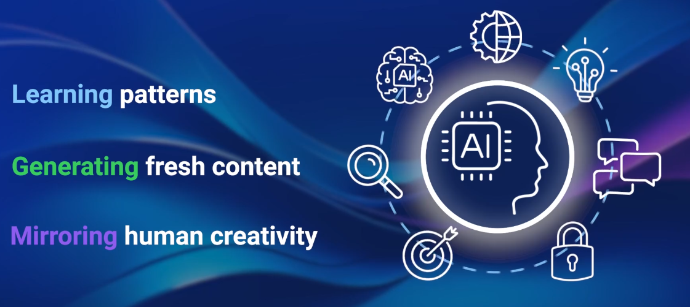
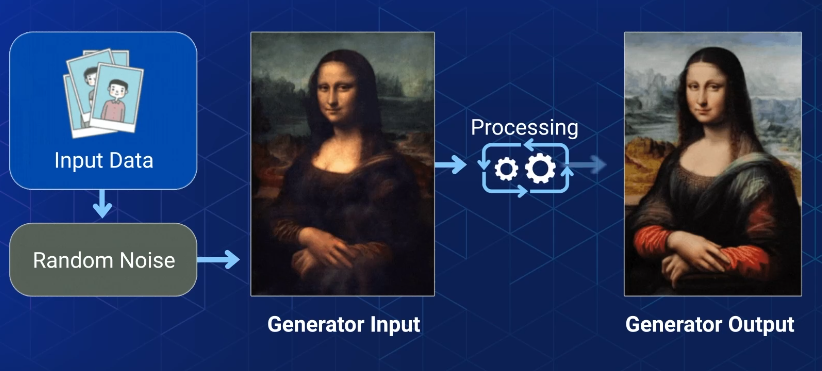
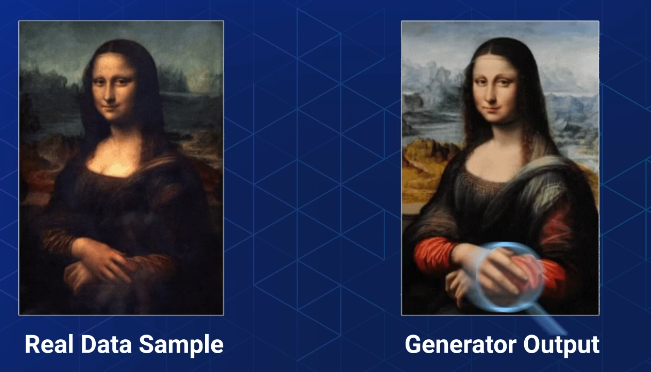
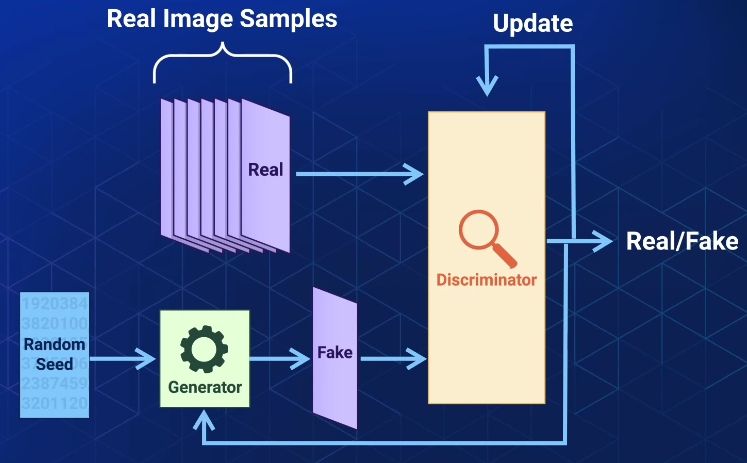
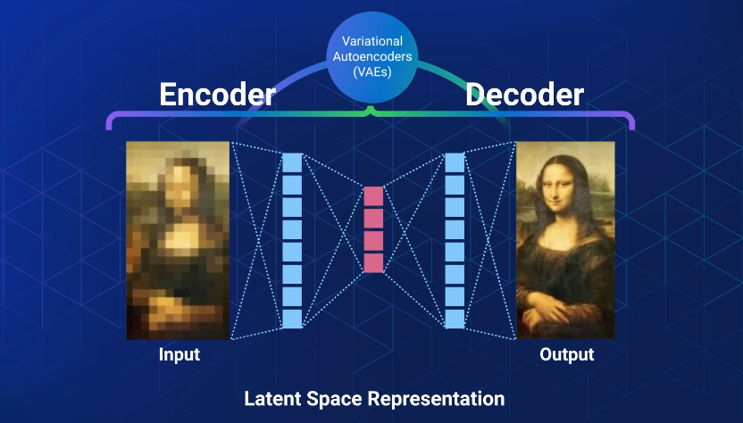
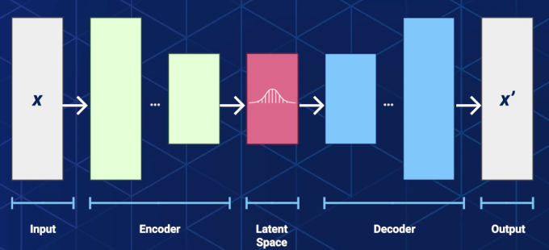
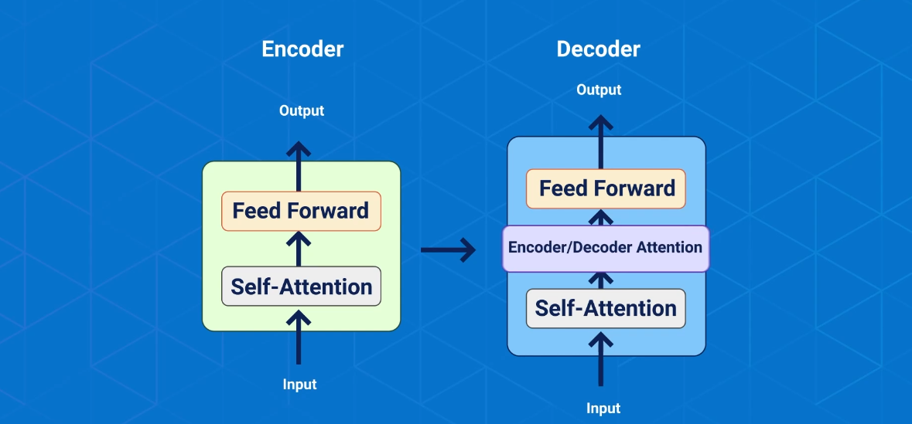

## Intro

> GenAI is a system designed to emulate and understand human creativity

> GenAI uses **deep-learning** models, specially **neural network**s to generate output that mimics or enhance the pattern found in it's training data.

**Uses Case(s)**

1. Text Generation
2. Image Systensis
3. Music Composition
4. Code Generation

Making it a powerful tool for creativity, automationa and problem solving accross various domains, in simple words GenAI boots your productivity unlike traditional AI which is great of data analysis and making descisions

> GenAI is all about generating new content

## Core Priciples

1. **Learning patterns**

GenAI designed to understand underlying patterns, structures and sematics of the data they are trained on.

2. **Generation of new context**

GenAI once trained, these models are capable of generating new content following the patterns and rules they have learned

eg. text generation model, can produce coherant sentences as well as entire article

3. **Creativity simulation**

GenAI can simulate human creativity, capable of composing music, writing poetry, creating artwork, generates realistic images

## Models

**Types models**

- Variational Auto Encoders (VAEs)
- Generative Adversarial Networks(GANs)
- Transformers

Each model has its unique ability to generate content

### GANs Models

> Innovative models that can generate new data by creating a competetive setting between two neural networks

#### Generators

Generators start by samples from initially random noise, as the training progresses these sample become more refined aiming to mimic the real data as closely as possible

#### Discriminators

It's role is to declare whether the the data is coming from original domain or fake

- Generator
- Both networks learn through adversarial training, generator tries to fool the system while discriminator distinguishes real from fake

- Job of discrimitor is to look at both real image sample and fake images created by generator and decide which is which?
- During training,the generator creates and the discriminator evaluates
  and both use feedback to improve till the point the generator creates images so convicing that the discriminator evaluates it to be real
- As the process iterates, both the generator and discriminator updates their method. Generator betters to create realistic images and discriminator becomes sharper at spotting the fakes

#### Application of GANs

1. Image to Image traslations -> Image in Summer to Image in Winter

### VAEs Models

> Models that create new data bU pUtting 2 neural networks against each other

#### Encoder

Takes the input data and compresses it into smaller dense representation, involed learning the underlying patterns and structure in the data

#### Decoder

Takes this compressed representation and reconstructs the original image/output data from it
The Goal is that reconstructed data to resemble the input data as closely as possible

#### Application VAEs

- Image Generation
- Data compression
- Anomoly Detection

### Transformers

> Processes input data, through a series of layer. These layers contain self-attention machanisms and feedforward neural networks

- Self-Attention mechanism - enables the model to
  - learn the contextual relationships between elements of input data sequence
  - Weighs the importance of words based on their context
- Transformers
  - process input in parallel, making it efficient in training and inference
  - overcome limitations in retaining context over long distances within the input - making them highly effective
- _Feedforward_ neural networks
  - capturing complex patterns
  - generating meaningful output

#### Application of Transformers

- Language Translations
- Text Generations
- Summarization

Transformers eg are BERT, GPT, Vision Transformers, etc

## GenAI Benefits

- **Improvements**
  - Automate **repetetive tasks**
  - Focus on **strategy**
  - Overall **productivity boost**

- **Enhanced customer experience**
  - Can be used to develop **conversartional interfaces** & **chatbots**
