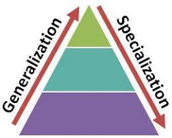
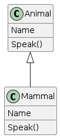
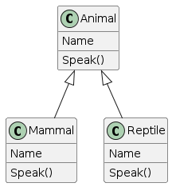
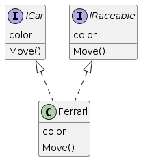
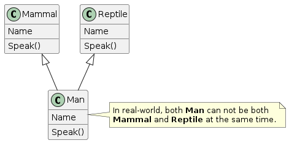
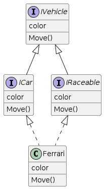

> Inheritance enables you to create new classes that _reuse_, _extend_, and modify the behavior defined in other classes.

- The class whose members are inherited is called the `base` class, and the class that inherits those members is called the `derived` class.
- A derived class can have _only one direct base class_.
- However, inheritance is transitive. If `ClassC` is derived from `ClassB`, and `ClassB` is derived from ClassA, `ClassC` inherits the members declared in `ClassB` and `ClassA`

✏️: Structs do not support inheritence, but they can implement interfaces.

#### Generalization & Specialization

Conceptually,



| When moving up the heirarchy                                 | When moving up the heirarchy                                 |
| ------------------------------------------------------------ | ------------------------------------------------------------ |
| a `base` class _is a generalization_ of the `derived` class. | a `derived` class _is a specialization_ of the `base` class. |
| Schema size reduces                                          | Schema size increases                                        |
| Combining entities                                           | Splitting entities                                           |


```csharp
class Animal
{
    public string Name {get; set;}
    public string Type {get; set;}
}

class Mammel : Animal
{
    // Name and Type are accessible here
}

class Reptile : Animal
{
    // Name and Type are accessible here
}
```

For example, if you have a base class `Animal`, you might have one `derived` class that is named `Mammal` and another derived class that is named `Reptile`. A `Mammal` is an Animal, and a `Reptile` is an `Animal`, but each derived class represents different specializations of the base class.

Interface declarations may define a default implementation for its members. These implementations are inherited by derived interfaces, and by classes that implement those interfaces. For more information on default interface methods, see the article on interfaces.

When you define a class to derive from another class, the derived class implicitly gains all the members of the base class, except for its constructors and finalizers. The derived class reuses the code in the base class without having to reimplement it. You can add more members in the derived class. The derived class extends the functionality of the base class.

The following illustration shows a class `WorkItem` that represents an item of work in some business process. Like all classes, it derives from [System.Object](https://learn.microsoft.com/en-us/dotnet/api/system.object) and inherits all its methods. `WorkItem` adds six members of its own. These members include a constructor, because constructors aren't inherited. Class `ChangeRequest` inherits from `WorkItem` and represents a particular kind of work item. `ChangeRequest` adds two more members to the members that it inherits from `WorkItem` and from `Object`. It must add its own constructor, and it also adds originalItemID. Property originalItemID enables the `ChangeRequest` instance to be associated with the original `WorkItem` to which the change request applies.


The following example shows how the class relationships demonstrated in the previous illustration are expressed in C#. The example also shows how `WorkItem` overrides the virtual method Object.ToString, and how the ChangeRequest class inherits the `WorkItem` implementation of the method. The first block defines the classes:

```csharp
// WorkItem implicitly inherits from the Object class.
public class WorkItem
{
    // Static field currentID stores the job ID of the last WorkItem that
    // has been created.
    private static int currentID;

    //Properties.
    protected int ID { get; set; }
    protected string Title { get; set; }
    protected string Description { get; set; }
    protected TimeSpan jobLength { get; set; }

    // Default constructor. If a derived class does not invoke a base-
    // class constructor explicitly, the default constructor is called
    // implicitly.
    public WorkItem()
    {
        ID = 0;
        Title = "Default title";
        Description = "Default description.";
        jobLength = new TimeSpan();
    }

    // Instance constructor that has three parameters.
    public WorkItem(string title, string desc, TimeSpan joblen)
    {
        this.ID = GetNextID();
        this.Title = title;
        this.Description = desc;
        this.jobLength = joblen;
    }

    // Static constructor to initialize the static member, currentID. This
    // constructor is called one time, automatically, before any instance
    // of WorkItem or ChangeRequest is created, or currentID is referenced.
    static WorkItem() => currentID = 0;

    // currentID is a static field. It is incremented each time a new
    // instance of WorkItem is created.
    protected int GetNextID() => ++currentID;

    // Method Update enables you to update the title and job length of an
    // existing WorkItem object.
    public void Update(string title, TimeSpan joblen)
    {
        this.Title = title;
        this.jobLength = joblen;
    }

    // Virtual method override of the ToString method that is inherited
    // from System.Object.
    public override string ToString() =>
        $"{this.ID} - {this.Title}";
}

// ChangeRequest derives from WorkItem and adds a property (originalItemID)
// and two constructors.
public class ChangeRequest : WorkItem
{
    protected int originalItemID { get; set; }

    // Constructors. Because neither constructor calls a base-class
    // constructor explicitly, the default constructor in the base class
    // is called implicitly. The base class must contain a default
    // constructor.

    // Default constructor for the derived class.
    public ChangeRequest() { }

    // Instance constructor that has four parameters.
    public ChangeRequest(string title, string desc, TimeSpan jobLen,
                         int originalID)
    {
        // The following properties and the GetNexID method are inherited
        // from WorkItem.
        this.ID = GetNextID();
        this.Title = title;
        this.Description = desc;
        this.jobLength = jobLen;

        // Property originalItemID is a member of ChangeRequest, but not
        // of WorkItem.
        this.originalItemID = originalID;
    }
}
```

This is how to use the base and derived classes:

```csharp
// Create an instance of WorkItem by using the constructor in the
// base class that takes three arguments.
WorkItem item = new WorkItem("Fix Bugs",
                            "Fix all bugs in my code branch",
                            new TimeSpan(3, 4, 0, 0));

// Create an instance of ChangeRequest by using the constructor in
// the derived class that takes four arguments.
ChangeRequest change = new ChangeRequest("Change Base Class Design",
                                        "Add members to the class",
                                        new TimeSpan(4, 0, 0),
                                        1);

// Use the ToString method defined in WorkItem.
Console.WriteLine(item.ToString());

// Use the inherited Update method to change the title of the
// ChangeRequest object.
change.Update("Change the Design of the Base Class",
    new TimeSpan(4, 0, 0));

// ChangeRequest inherits WorkItem's override of ToString.
Console.WriteLine(change.ToString());
/* Output:
    1 - Fix Bugs
    2 - Change the Design of the Base Class
*/
```

#### Types of inheritance:

- `Single inheritance:`

  A derived class that inherits from only one base class.



- `Multi-level inheritance:`

  A derived class that inherits from a base class and the derived class itself becomes the base class for another derived class.


- `Hierarchical inheritance:`

  A base class that serves as a parent class for two or more derived classes.



- `Multiple inheritance: Through Interfaces only`

  A derived class that inherits from two or more base classes.





- `Hybrid inheritance: Through Interfaces only`

  A derived class that inherits from two or more base classes.



✏️:


#### Advantages of Inheritance:

- `Code Reusability:` Inheritance allows us to reuse existing code by inheriting properties and methods from an existing class.
- `Code Maintenance:` Inheritance makes code maintenance easier by allowing us to modify the base class and have the changes automatically reflected in the derived classes.
- `Code Organization:` Inheritance improves code organization by grouping related classes together in a hierarchical structure.
  Disadvantages `of Inheritance:`
- `Tight Coupling:` Inheritance creates a tight coupling between the base class and the derived class, which can make the code more difficult to maintain.
- `Complexity:` Inheritance can increase the complexity of the code by introducing additional levels of abstraction.
- `Fragility:` Inheritance can make the code more fragile by creating dependencies between the base class and the derived class.

#### sealed

`How to prevent type from extending ❓`
`How to can you make a class as final definition ❓`

#### Abstract and virtual methods

When a base class declares a method as [virtual](https://learn.microsoft.com/en-us/dotnet/csharp/language-reference/keywords/virtual), a derived class can [override](https://learn.microsoft.com/en-us/dotnet/csharp/language-reference/keywords/override) the method with its own implementation. If a base class declares a member as abstract, that method must be overridden in any non-abstract class that directly inherits from that class. If a derived class is itself abstract, it inherits abstract members without implementing them. Abstract and virtual members are the basis for polymorphism, which is the second primary characteristic of object-oriented programming. For more information, see Polymorphism.

#### Abstract base classes

You can declare a class as [abstract](https://learn.microsoft.com/en-us/dotnet/csharp/language-reference/keywords/abstract) if you want to prevent direct instantiation by using the new operator. An abstract class can be used only if a new class is derived from it. An abstract class can contain one or more method signatures that themselves are declared as abstract. These signatures specify the parameters and return value but have no implementation (method body). An abstract class doesn't have to contain abstract members; however, if a class does contain an abstract member, the class itself must be declared as abstract. Derived classes that aren't abstract themselves must provide the implementation for any abstract methods from an abstract base class.

#### Interfaces

An interface is a reference type that defines a set of members. All classes and structs that implement that interface must implement that set of members. An interface may define a default implementation for any or all of these members. A class can implement multiple interfaces even though it can derive from only a single direct base class.

Interfaces are used to define specific capabilities for classes that don't necessarily have an "is a" relationship. For example, the System.IEquatable<T> interface can be implemented by any class or struct to determine whether two objects of the type are equivalent (however the type defines equivalence). IEquatable<T> doesn't imply the same kind of "is a" relationship that exists between a base class and a derived class (for example, a Mammal is an Animal). For more information, see Interfaces.
