## Overview

- Regardless of the formality of your development process, every project starts with some words.

- Can you build a customer management system to help us track our customers and orders? Or maybe just we need to change the system to track different types of products.

- This module shows you how to extract classes from words as a first step in building an object- oriented application.

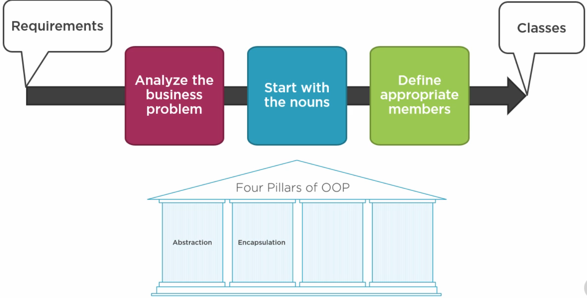

- This module takes you step by step from business requirements through to an initial set of classes that address those business requirements.
- We first analyze the business problem starting with the nouns to identify appropriate classes.
- Then, define an initial set of class members, that is, the set of properties and methods for each of those classes.

Along the way, we identify two of the four pillars, or key characteristics, of object-oriented programming, abstraction and encapsulation.

✏️: That some literature includes only three pillars of object-oriented programming, skipping abstraction.That's because abstraction is more of a concept, the way to think about your classes, and not a programming technique. This will become clear as we define our abstractions later in this module

Although the example used in this course builds a new application, all the principles, practices, and techniques we cover are equally applicable when implementing new features or making enhancements to existing applications. Now let's get to that imaginary meeting with the subject matter experts so we can collect our requirements and get started.

## Analyze Business Problem

You've been given a feature request, or a business problem statement, or a specification, or maybe just a brief email, and you are expected to turn those words into code, and not just any code, but code that is clean, defended, manageable, maintainable, extensible, and testable.

**Where do you start❓**
The first step to building an object- oriented application is to identify the classes. So let's start there.

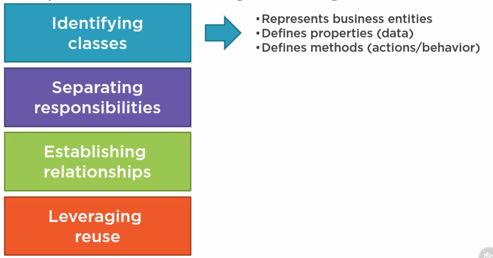

Let's take a look at the specification change request, or email, that we were given using it to identify the initial set of classes that represent the business entities, and then define the appropriate properties and methods.

You are called into a meeting with one of the department heads and her staff. They will be your subject matter experts for collecting the requirements. One of the subject matter experts says, thank you for meeting with us today.

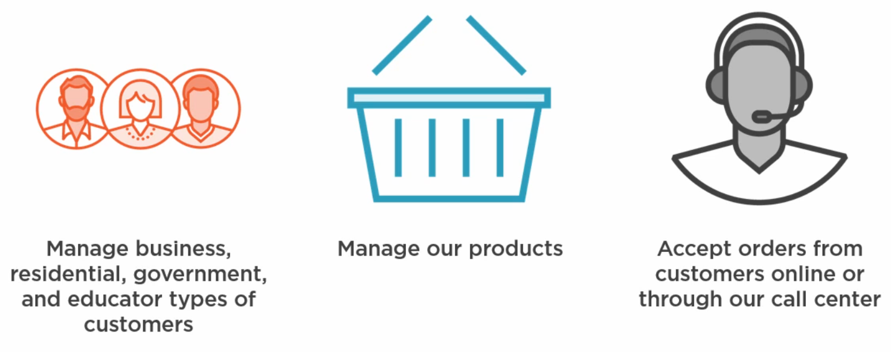

- Our current customer management system is not able to handle our increasing numbers of customers and orders, so we would like you to build a new system for us. The subject matter expert continues. We are calling it the Acme Customer Management System.
- The new system must manage business, residential, government, and educator types of customers. It must manage our products and accept orders from customers either online or through our call center. No problem, you say, or something to that effect.

Okay, this particular business problem is a little overly simplified, but it defines a business component that we can build within the timeframe of this course, and it is complex enough to demonstrate key object-oriented programming principles. Let's analyze the requirements we were given.

## Start with Nouns

When extracting classes from words, the easiest place to start is with the nouns. A noun is a person, place, thing, or process. Look at each noun defined in the requirements and determine whether it should be represented as a class.

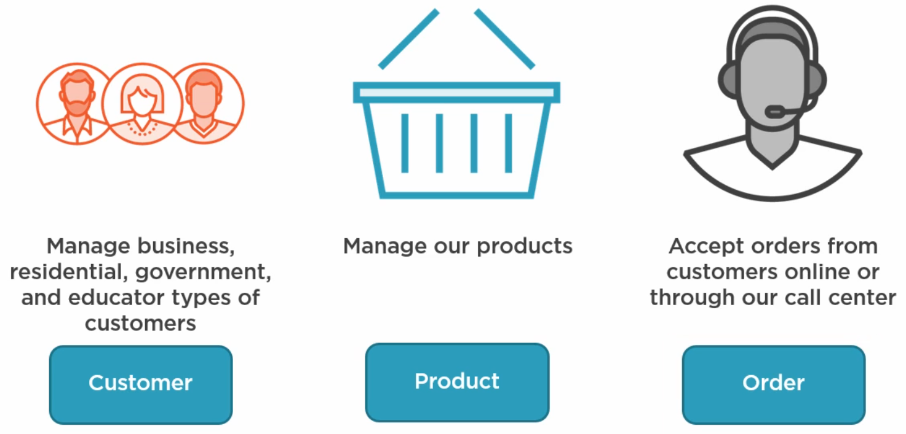

- Looking at the first requirement, manage business, residential, government, and educator types of customers, the noun that sticks out is customer.
- From the second requirement, manage our products, the noun is product.
- The third requirement, accept orders from customers online or through our call center, includes several nouns, but the important one for our purposes is order.

In this case, each requirement identified one class. That may not always be the case. Some requirements may identify multiple classes or no classes at all. This step results in our first cut of classes.

The Customer class manages the business, residential, government, and educator customers. The Product class manages our current products. And the Order class manages orders received online or from the call center.

Next, we identity appropriate properties and methods for each class.

## Define Appropriate Members

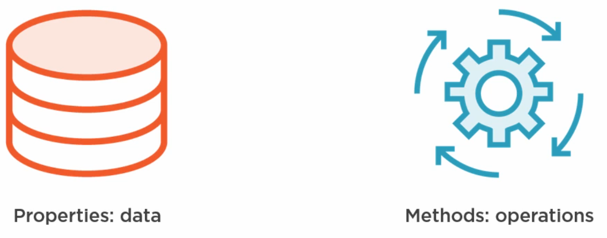

The members of a class define the properties, or data, the class requires and the methods, or operations, that an object from the class can perform. We again use the requirements as a starting point to define the appropriate members for each class.
Let's begin with the class properties.

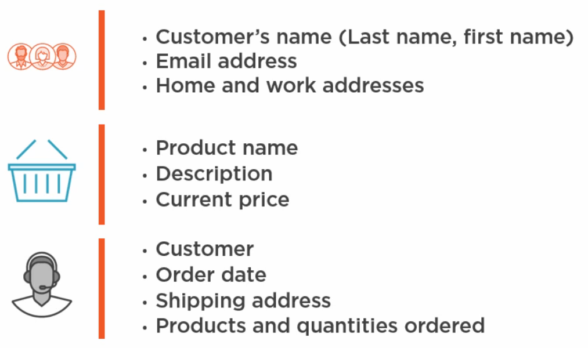

To manage the customers, we must minimally track the customer's name, last name, first name, email address, and home and work addresses. To manage products, we should track the product name, description, and current price. And to handle the orders, we must track the customer, order date, shipping address, and the products and quantities ordered. With the properties defined, here are our classes so far.

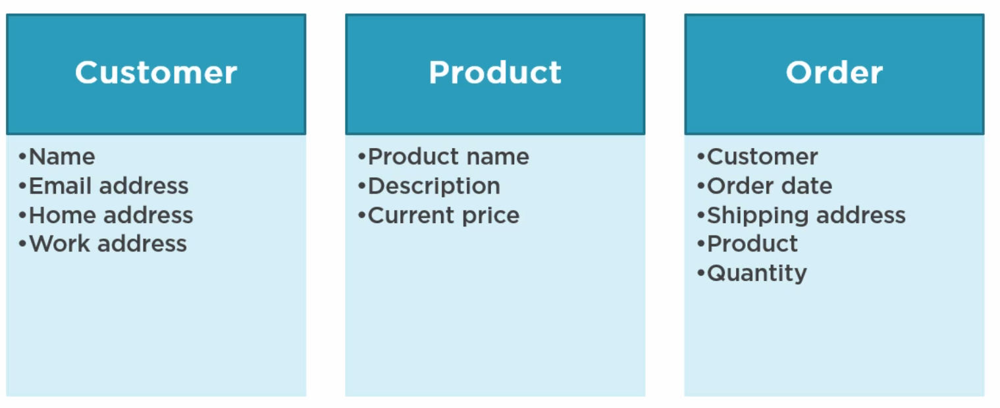

- Our customer class manages the customer properties. The product class defines the product properties, and the order class tracks the order properties. Wait, what? This isn't right. Using the nouns to determine the initial set of classes is helpful, but it only provides a starting point.

Looking at the properties and methods for each class helps clarify the design and often illustrates other potential classes. In this case, we need to track the customer, order date, and shipping address for the order, and then each product and quantity ordered. It wouldn't make sense to require a separate order for each ordered product. It sounds like we need another class, Order Item.

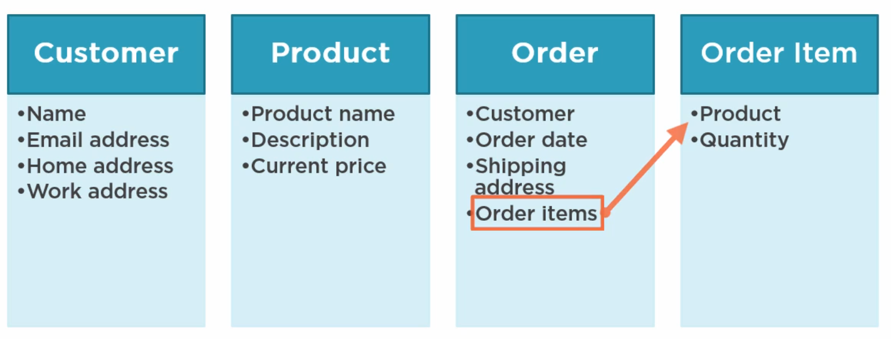

The order then has a set of order items specifying the product and quantity. Now that we have the properties, what about the methods?

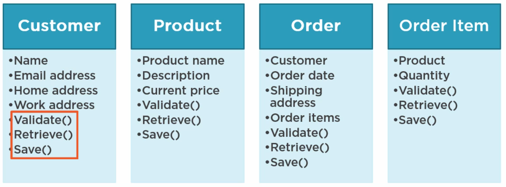

- We'll need some basic methods in each of the classes,

  - `Validate` to ensure valid information is entered,
  - `Retrieve` to retrieve existing data from a data store such as a database
  - `Save` to save entered or changed data back to that data store.

- The methods define the operation's actions and behaviors appropriate for the class, hence, **methods are named using a verb**.
- Each object instantiated from the class can perform the operations.

That's it. We have our initial set of classes along with their properties and methods. There is one more thing to think about at this stage. The fourth dimension, time.

## Consider Time

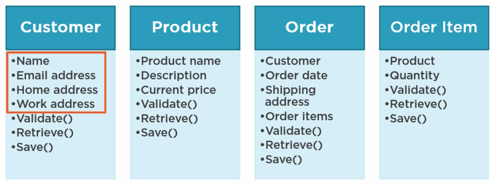

- It's easier to think about the list of classes and their members at one point in time. But the resulting application will need to work for several years or more. During that time, data will change. Customers move, product prices are updated, and so on.

- Let's take a moment to think about our classes and members over time. Over time, the customer's data may change. Their email address, their addresses, and even their name. It's important to think about whether the application cares about these changes or needs to track historical information.

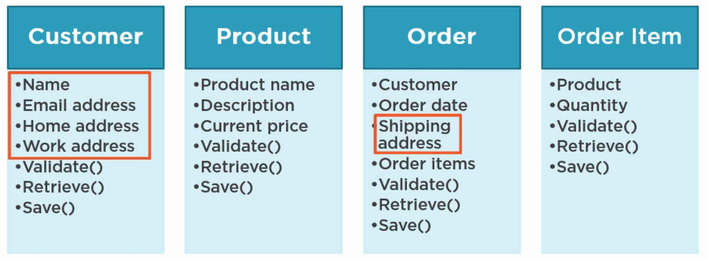

✏️: How the order has a property of its own for the shipping address. This ensures that the shipping address is retained over time, regardless of changes made to the customer's addresses. 

- If the customer has an updated address, the order retains the address the order was originally shipped to for historical reference.

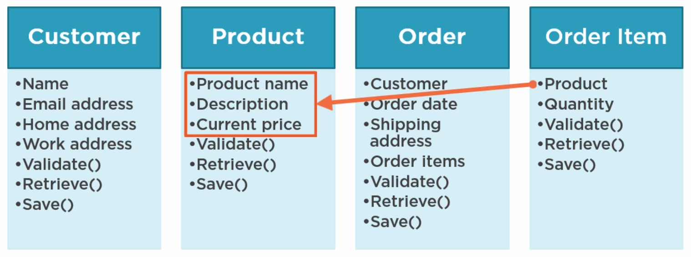

- Looking at the product, how will its data change over time, and how will that affect the order? Can the product price be updated? That would be problematic.

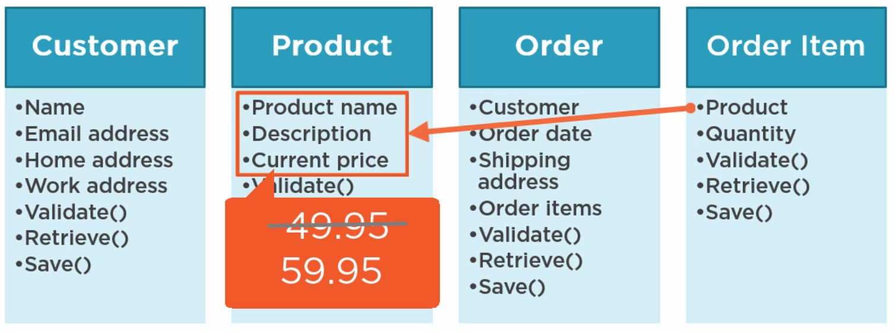

- Consider this scenario; customer Joe places an order for a new keyboard. His order comes to 49.95. The staff then changes the price to 59.95. Since the order item is simply referencing the product, when Joe gets an email of his order a few minutes later, the price is now 59.95. That would make for one unhappy customer.

**How do we deal with these data changes over time❓**

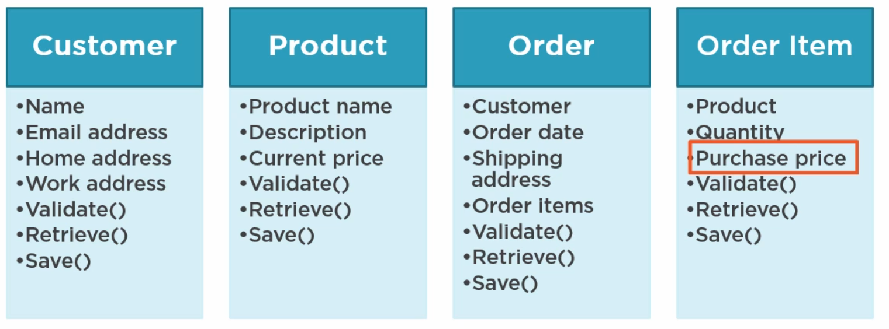

- One option is to track the purchase price in the order item. That ensures that the price given when the order is placed is the purchase price regardless of changes to the product data over time.

- It is always a good idea to take a moment and consider how time affects your classes and members, and add classes or members as needed to ensure your classes stand the test of time. Speaking of time, now is a good time to introduce two more terms; abstraction and encapsulation.

## Abstraction

From the list of requirements, we identified Customer as a class, but what is a customer in the context of our application?

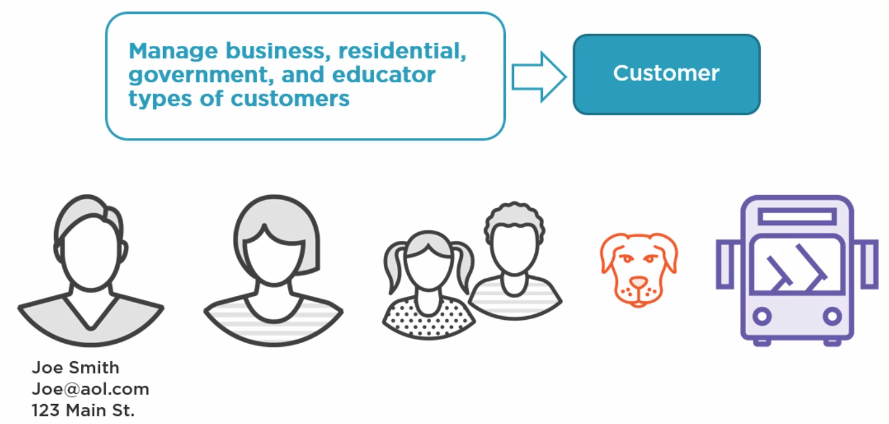

- Joe Smith is a customer. Joe is the CEO of Smith Incorporated. He's married, has two children, and a dog. He takes the metro to work every day and goes out to lunch on Fridays.
- For the purpose of this customer management system, the majority of this information is irrelevant.

We can abstract it away and focus only on the features of the customer appropriate for our application.

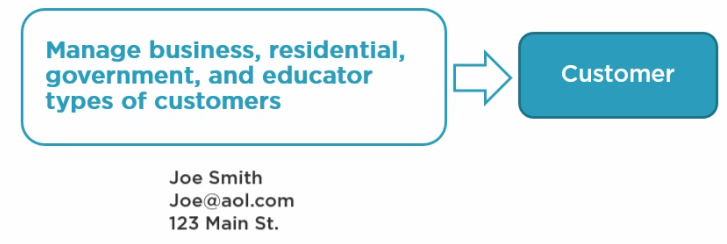

For our case,
- we only care about a customer's name and contact information. That helps us to simplify reality and think of customer just in terms of a contact.
- If we were building a system that sent emails about products that Joe might like, then we could define a different abstraction for our customer that included more personal information.
- Or if we were building a personal assistant, we might define an abstraction that included Joe's family and how he gets to work.

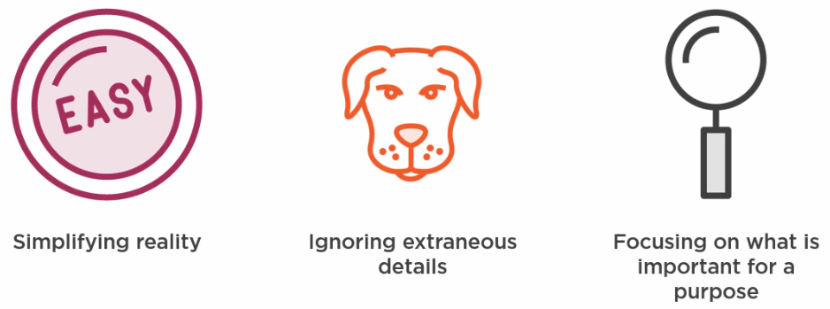

- The appropriate abstractions depend on the requirements of the application.

> Abstraction is the process of defining classes by simplifying reality, ignoring extraneous details, and focusing on what is important for a purpose.

- It involves abstracting away the extraneous details in order to focus on what is relevant for the particular application. Defining appropriate abstractions is considered one of the pillars, or key characteristics, of object-oriented programming.

## Encapsulation

- Another pillar of object-oriented programming is encapsulation.
- `Unlike abstraction, which is a concept, i.e. a way to think, encapsulation is a technique`.

> Encapsulation is a way to hide or encapsulate the data and implementation details within a class, thus hiding complexity.

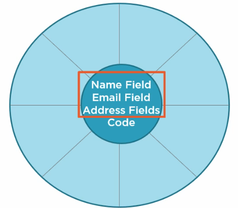

- This large circle represents a class, specifically the customer class. The data field's name, email, home address, and work address are all hidden within the class. No other code can access these data fields. The code for the operations such as the validate, retrieve, and save is also hidden within the class. No other code can just jump into this code.

✏️: The benefit of hiding this data and implementation is that no other code in the application needs to know about these details.
In C#, the object data is exposed to the application through property getters and setters. The operations are exposed to the application through methods.

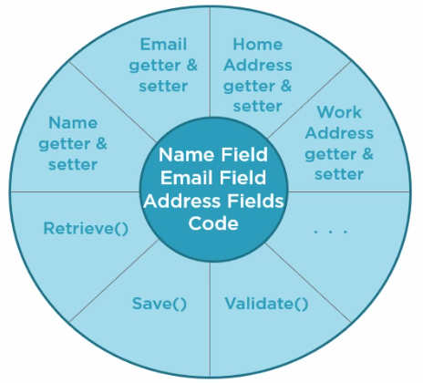

- The exposed set of methods and property getters and setters define the class interface to the rest of the application. We'll talk more about interfaces later in this course.

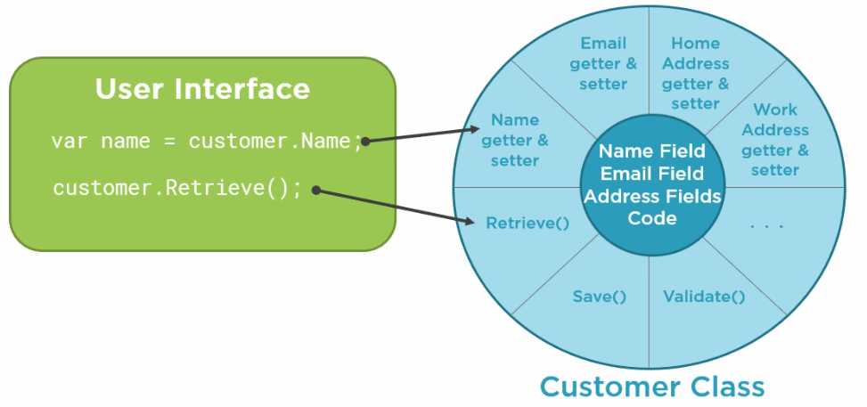

If the UI, for example, wants to access the property such as the name, it must call the getter or setter.

- The getter retrieves the value of the private data, optionally manipulates that data, and returns it.
- The setter optionally validates the incoming value, and if valid, updates the private data. We'll see this in action in the next module.
- Any code that wants to perform an operation using the code within the class, must call the methods.

1. Encapsulation is a key underlying principle that makes it possible to build large, full-featured systems by breaking complex operations into encapsulated units.
2. These encapsulated units are classes.
3. Encapsulation allows the objects in an application to work together without each object knowing the details of other object's implementation.

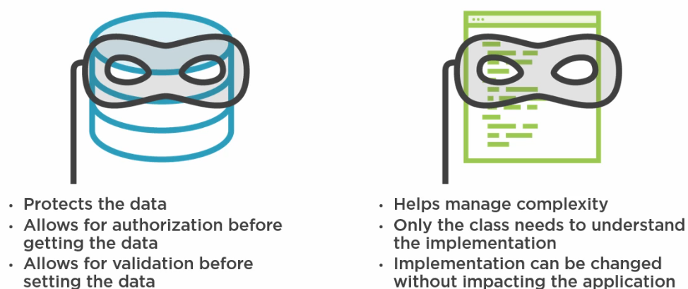

- Encapsulation hides both the data and implementation within the class.
- This `data hiding` has many benefits.
    - It protects the data. No other code can modify the underlying data except through the getters and setters. This prevents an object's values from being corrupted by other objects.
    - We can add code to the getter to perform operations before the data is provided. For example, we could ensure the user has access to the specific data element.
    - We can add code to the setter to perform operations before the data is set. For example, we could provide validation so that the data is never set to an invalid value.
- `Hiding` the `method implementation` details also has benefits.
    - It helps to manage the complexity of the application by breaking it down into manageable units. It shields the other objects from having to know the implementation details.
    - Only the class needs to understand the implementation. The code is easier to modify and test because the implementation is encapsulated in one place.
    - Because of this, the implementation can be changed, as needed, without impacting the rest of the application.

- The real world works like this as well. For example, if you go to Amazon and order a product, you don't need to know anything about where or how your product is stored or how your order is processed. By building classes with properties and methods, we encapsulate the logic for each entity within one unit of code.

## Summary

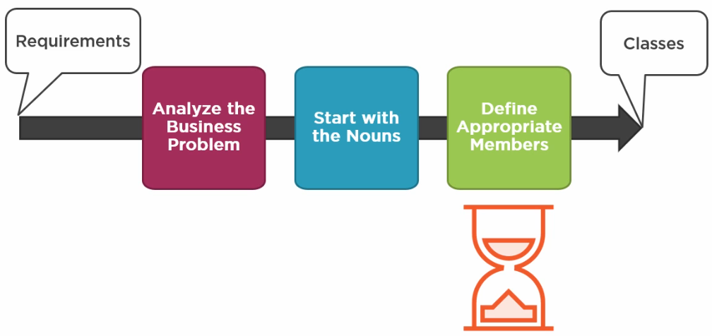

Along the way, we define two of the four pillars of object-oriented programming.

> Abstraction describes an entity in simple terms, ignoring the irrelevant details. It reduces complexity by focusing only on what is important for the purpose of this specific application.

> And encapsulation, which allows for hiding the data and the implementation within the class.

We'll see encapsulation in action in the next module. We've taken the first step in the journey toward an object-oriented application by using the requirements to identify the initial set of classes, their properties, and their methods. Before moving on, let's see how to implement what we have so far in C#.
