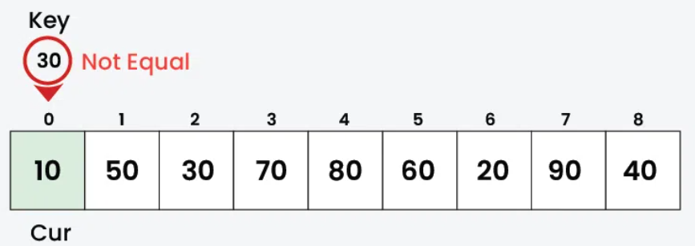
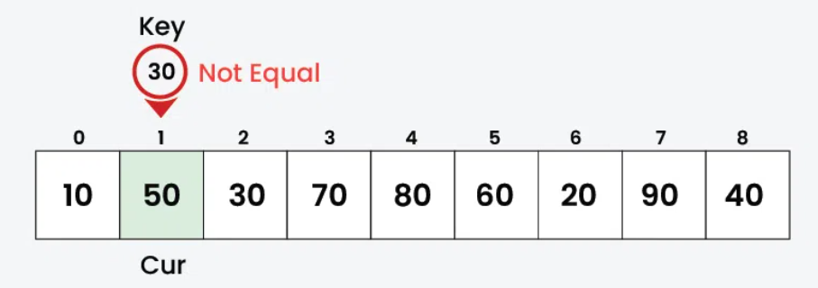
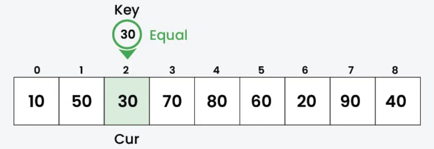
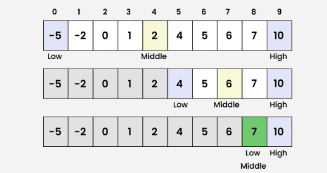

## Searching

### Linear Search

This has a time complexity of `O(N)` where **N** is the length of the array







- It traverses the array one element at a time and compares each element with the target value.
- If a match is found, it returns the index of the element.
- If the element is not found, the search continues until the end of the array.

```js
class MyArray {
  constructor() {
    this.data = {};
    this.length = 0;
  }

  add(element) {
    // add element to data property with current index
    this.data[this.length] = element;
    // increment current index by 1'
    this.length++;
  }

  find(x) {
    // repeat on every data
    for (let i = 0; i < this.length; i++) {
      // return index if match
      if (this.data[i] === x) return i;
    }
    // return -1 if no match
    return -1;
  }

  traverse() {
    // start of array literal
    var out = "[";
    var index = " ";
    // repeat on every data
    for (let i = 0; i < this.length; i++) {
      out += `${this.data[i]}, `;
      index += `${i}  `;
    }
    // slice last 2 char
    out = out.slice(0, -2);
    // end of array literal
    out += "]";
    console.log(`Array -> ${out}`);
    console.log(`Index -> ${index}`);
  }
}

//=================Test
var myArr = new MyArray();
myArr.add(1);
myArr.add(4);
myArr.add(3);
myArr.add(2);
myArr.add(5);
myArr.traverse();
let result = myArr.find(5);
if (result >= 0) {
  console.log(`Element '5' found at index ${result}`);
} else {
  console.log(`Element not found in given array`);
}
///// output /////
// Array -> [1, 4, 3, 2, 5]
// Index ->  0  1  2  3  4
// Element '5' found at index 4
```

#### Analysis

1. **n**: Number of sorted elements in the dataset.

- Space Complexity
  | Best Case | Average Case | Worst Case |
  | --------- | ------------ | ----------- |
  | O(1) | O(1) | **O(1)** |

- Time Complexity
  | Best Case | Average Case | Worst Case |
  | --------- | ------------ | ----------- |
  | O(1) | O(n) | **O(n)** |

2. **n**: Number of unsorted elements in the dataset.

- Space Complexity
  | Best Case | Average Case | Worst Case |
  | --------- | ------------ | ----------- |
  | O(1) | O(1) | **O(1)** |

- Time Complexity
  | Best Case | Average Case | Worst Case |
  | --------- | ------------ | ----------- |
  | O(1) | O(n) | **O(n)** |

```js
var myArr = new MyArray();
myArr.add(2);
myArr.add(4);
myArr.add(1);
myArr.add(5);
myArr.add(3);
myArr.traverse();

let result = myArr.find(5);
if (result >= 0) {
  console.log(`Element '3' found at index ${result}`);
} else {
  console.log(`Element not found in given array`);
}
///// output /////
// Array -> [2, 4, 1, 5, 3]
// Index ->  0  1  2  3  4
// Element '3' found at index 4
```

### Binary Search

- Works **only on sorted arrays** (in increasing or decreasing order).
- Uses a **divide and conquer** approach.
- It repeatedly divides the search space in half until the target element is found.



**Algorithm**

1. Find the middle element of the array.
2. If the target is equal to the middle element, return its index.
3. If the target is less than the middle element, search the left half.
4. If the target is greater than the middle element, search the right half.
5. Repeat until the element is found or the search space is empty.

```js
class MyArray {
  constructor() {
    this.data = {};
    this.length = 0;
  }

  add(element) {
    // add element to data property with current index
    this.data[this.length] = element;
    // increment current index by 1'
    this.length++;
  }

  find(x) {
    // repeat on every data
    for (let i = 0; i < this.length; i++) {
      // return index if match
      if (this.data[i] === x) return i;
    }
    // return -1 if no match
    return -1;
  }

  binarySearch(target) {
    let low = 0, high = this.length - 1
    while(low <= high){
        let mid = let mid = Math.floor((low + high) / 2);
        if (this.data[mid] == target) return mid;
        if (this.data[mid] < target) {
            // set new low
            low = mid + 1;
        }else{
            // set new high
            high = mid - 1;
        }
    };
    return -1;
  }

  traverse() {
    // start of array literal
    var out = "[";
    var index = " ";
    // repeat on every data
    for (let i = 0; i < this.length; i++) {
      out += `${this.data[i]}, `;
      index += `${i}  `;
    }
    // slice last 2 char
    out = out.slice(0, -2);
    // end of array literal
    out += "]";
    console.log(`Array -> ${out}`);
    console.log(`Index -> ${index}`);
  }
}

// test code
var myArr = new MyArray();
myArr.add(-5);
myArr.add(-2);
myArr.add(0);
myArr.add(1);
myArr.add(2);
myArr.add(4);
myArr.add(5);
myArr.add(6);
myArr.add(7);
myArr.add(10);
myArr.traverse();

//
let result = myArr.binarySearch(7);
if (result >= 0) {
  console.log(`Element '3' found at index ${result}`);
} else {
  console.log(`Element not found in given array`);
}
///// output /////
// Array -> [-5,-2, 0, 1, 2, 4, 5, 6, 7, 10]
// Index ->   0  1  2  3  4, 5, 6, 7, 8, 9
// Element '7' found at index 8
```

✏️: binarySearch using recursion

```js
  binarySearch(target, low = 0, high = this.length - 1) {
    // edge case for early return
    if (high < low) return -1;
    // declare mid using Math.floor
    let mid = Math.floor((low + high) / 2);
    // base case
    if (target == this.data[mid]) return mid;
    // call itself with new low and return the result
    if (target > this.data[mid]) return binarySearch(target, mid + 1, high);
    // call iself with new high and return the result
    return binarySearch(target, low, mid - 1);
  }
```

#### Analysis

1. n: Number of elements in the dataset.

- Space Complexity
  | Interative 🟢 | Recursion 🟡 |
  | --------- | ------------ |
  | O(1) | **O(log n)** |

- Time Complexity
  | Best Case | Average Case | Worst Case |
  | --------- | ------------ | ----------- |
  | O(1) | O(log n) | **O(log n)** |

### Fibonacci Search

- Works only on sorted arrays (in increasing or decreasing order).
- Uses a **divide and conquer** approach.
- It repeatedly divides the search space in half until the target element is found.

```js
/* Returns the index of x if present, else returns -1 */
function fibonacciSearch(arr, x, n) {
  // Initialize Fibonacci numbers
  let fibMMm2 = 0; // (m-2)'th Fibonacci No.
  let fibMMm1 = 1; // (m-1)'th Fibonacci No.
  let fibM = fibMMm2 + fibMMm1; // m'th Fibonacci

  // fibM is going to store the smallest Fibonacci
  // Number greater than or equal to n
  while (fibM < n) {
    fibMMm2 = fibMMm1;
    fibMMm1 = fibM;
    fibM = fibMMm2 + fibMMm1;
  }

  // Marks the eliminated range from the front
  let offset = -1;

  // While there are elements to be inspected.
  // Note that we compare arr[fibMm2] with x.
  // When fibM becomes 1, fibMm2 becomes 0
  while (fibM > 1) {
    // Check if fibMm2 is a valid location
    let i = Math.min(offset + fibMMm2, n - 1);

    // If x is greater than the value at
    // index fibMm2, cut the subarray array
    // from offset to i
    if (arr[i] < x) {
      fibM = fibMMm1;
      fibMMm1 = fibMMm2;
      fibMMm2 = fibM - fibMMm1;
      offset = i;
    } else if (arr[i] > x) {
      // If x is less than the value at index fibMm2,
      // cut the subarray after i+1
      fibM = fibMMm2;
      fibMMm1 = fibMMm1 - fibMMm2;
      fibMMm2 = fibM - fibMMm1;
    } else return i;

    // Element found. Return index
  }

  // Comparing the last element with x
  if (fibMMm1 && arr[n - 1] == x) {
    return n - 1;
  }

  // Element not found. Return -1
  return -1;
}

/* Driver code */
let arr = [10, 22, 35, 40, 45, 50, 80, 82, 85, 90, 100, 235];
let n = arr.length;
let x = 235;
let index = fibonacciSearch(arr, x, n);
if (index >= 0) {
  console.log("Element found at index: " + index);
} else {
  console.log(x + " isn't present in the array");
}
```

#### Analysis

1. n: Number of elements in the dataset.

- Space Complexity
  | Worst Case |
  | --------- |
  | O(1) |

- Time Complexity
  | Best Case | Average Case | Worst Case |
  | --------- | ------------ | ----------- |
  | O(1) | O(log n) | **O(log n)** |
