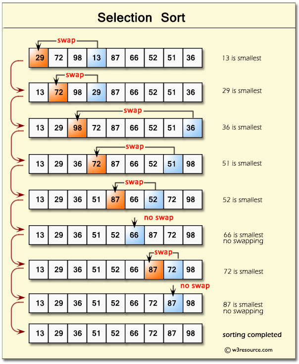
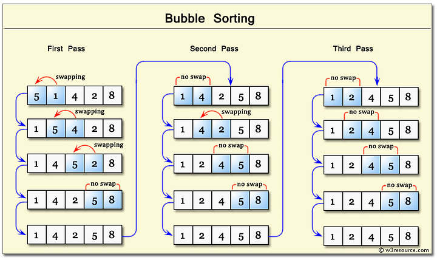
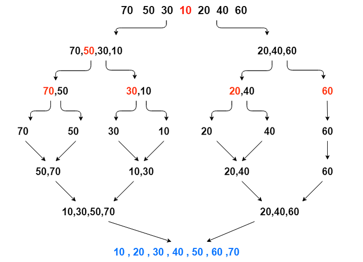

## Sorting Complexity Analyis

| Algorithm      | Time                                               |                                                    |                                                    | Space                                        |
| -------------- | -------------------------------------------------- | -------------------------------------------------- | -------------------------------------------------- | -------------------------------------------- |
|                | Best Case                                          | Average Case                                       | Worst Case                                         | Worst Case                                   |
| Selection Sort | <span style="background:#e799a0">O(n^2)</span>     | <span style="background:#e799a0">O(n^2)</span>     | <span style="background:#e799a0">O(n^2)</span>     | <span style="background:#55AD9B">O(1)</span> |
| Bubble Sort    | <span style="background:#B0D9B1">O(n)</span>       | <span style="background:#e799a0">O(n^2)</span>     | <span style="background:#e799a0">O(n^2)</span>     | <span style="background:#55AD9B">O(1)</span> |
| Insertion Sort | <span style="background:#B0D9B1">O(n)</span>       | <span style="background:#e799a0">O(n^2)</span>     | <span style="background:#e799a0">O(n^2)</span>     | <span style="background:#55AD9B">O(1)</span> |
| Merge Sort     | <span style="background:#e9bc95">O(n log n)</span> | <span style="background:#e9bc95">O(n log n)</span> | <span style="background:#e9bc95">O(n log n)</span> | <span style="background:#B0D9B1">O(n)</span> |
| Heap Sort      | <span style="background:#e9bc95">O(n log n)</span> | <span style="background:#e9bc95">O(n log n)</span> | <span style="background:#e9bc95">O(n log n)</span> | <span style="background:#55AD9B">O(1)</span> |

## Selection Sort

- Selection Sort is a comparison-based sorting algorithm.
- It sorts an array by repeatedly selecting the smallest (or largest) element from the unsorted portion and swapping it with the first unsorted element.
- This process continues until the entire array is sorted.

### How does it work ❓



- First we find the smallest element and swap it with the first element. This way we get the smallest element at its correct position.
- Then we find the smallest among remaining elements (or second smallest) and swap it with the second element.
- We keep doing this until we get all elements moved to correct position.

### Implementation

```js{14-31, 51-73}
class MyArray {
  constructor() {
    this.data = {};
    this.length = 0;
  }

  add(element) {
    // add element to data property with current index
    this.data[this.length] = element;
    // increment current index by 1'
    this.length++;
  }

  selectionSort() {
    for (let i = 0; i < this.length - 1; i++) {

        // Assume the current position holds the minimum element
        let min_idx = i;
        // Iterate through the unsorted portion to find the actual minimum
        for (let j = i + 1; j < this.length; j++) {
            if (this.data[j] < this.data[min_idx]) {
                // Update min_idx if a smaller element is found
                min_idx = j;
            }
        }
        // Move minimum element to its correct position
        let temp = this.data[i];
        this.data[i] = this.data[min_idx];
        this.data[min_idx] = temp;
    }
  }

  traverse() {
    // start of array literal
    var out = "[";
    var index = " ";
    // repeat on every data
    for (let i = 0; i < this.length; i++) {
      out += `${this.data[i]}, `;
      index += `${i}  `;
    }
    // slice last 2 char
    out = out.slice(0, -2);
    // end of array literal
    out += "]";
    console.log(`Array -> ${out}`);
    console.log(`Index -> ${index}`);
  }
}

//=================Test
var myArr = new MyArray();
myArr.add(29);
myArr.add(72);
myArr.add(98);
myArr.add(13);
myArr.add(87);
myArr.add(66);
myArr.add(52);
myArr.add(51);
myArr.add(36);
console.log("Before");
myArr.traverse();
myArr.selectionSort();
console.log("After");
myArr.traverse();
///// output /////
// Before
// Array -> [29, 72, 98, 13, 87, 66, 52, 51, 36]
// Index ->   0   1   2   3   4   5   6   7   8
// After
// Array -> [13, 29, 36, 51, 52, 66, 72, 87, 98]
// Index ->   0   1   2   3   4   5   6   7   8
```

[Read more about selection sort at w3schools](https://www.w3schools.com/dsa/dsa_algo_selectionsort.php)

## Bubble Sort

- Simplest sorting algorithm that works by repeatedly swapping the adjacent elements if they are in the wrong order.
- This algorithm is **not suitable for large data sets** as its average and **worst-case time complexity is quadratic**.

### How does it work ❓



- We sort the array using multiple passes. After the first pass, the maximum element goes to end (its correct position). Same way, after second pass, the second largest element goes to second last position and so on.
- In every pass, we process only those elements that have already not moved to correct position. After `k` passes, the largest `k` elements must have been moved to the last `k` positions.
- In a pass, we consider remaining elements and compare all adjacent and swap if larger element is before a smaller element. If we keep doing this, we get the largest (among the remaining elements) at its correct position.

### Implementation

```js{14-35, 55-73}
class MyArray {
  constructor() {
    this.data = {};
    this.length = 0;
  }

  add(element) {
    // add element to data property with current index
    this.data[this.length] = element;
    // increment current index by 1'
    this.length++;
  }

  bubbleSort() {
    var i, j, temp;
    var swapped;
    // outer loop
    for (i = 0; i < this.length - 1; i++) {
      swapped = false;
      // inner loop
      for (j = 0; j < this.length - i - 1; j++) {
        if (this.data[j] > this.data[j + 1]) {
          // Swap this.data[j] and this.data[j+1]
          temp = this.data[j];
          this.data[j] = this.data[j + 1];
          this.data[j + 1] = temp;
          swapped = true;
        }
      }

      // IF no two elements were
      // swapped by inner loop, then break
      if (swapped == false) break;
    }
  }

  traverse() {
    // start of array literal
    var out = "[";
    var index = " ";
    // repeat on every data
    for (let i = 0; i < this.length; i++) {
      out += `${this.data[i]}, `;
      index += `${i}  `;
    }
    // slice last 2 char
    out = out.slice(0, -2);
    // end of array literal
    out += "]";
    console.log(`Array -> ${out}`);
    console.log(`Index -> ${index}`);
  }
}

//=================Test
var myArr = new MyArray();
myArr.add(5);
myArr.add(1);
myArr.add(4);
myArr.add(2);
myArr.add(8);
console.log("Before")
myArr.traverse();
myArr.bubbleSort();
console.log("After")
myArr.traverse();
///// output /////
// Before
// Array -> [5, 1, 4, 2, 8]
// Index ->  0  1  2  3  4
// After
// Array -> [1, 2, 4, 5, 8]
// Index ->  0  1  2  3  4
```

[Read more about bubble sort at w3schools](https://www.w3schools.com/dsa/dsa_algo_bubblesort.php)

## Insertion Sort

- Insertion sort is a simple sorting algorithm that works by iteratively inserting each element of an unsorted list into its correct position in a sorted portion of the list. 
- It is like sorting playing cards in your hands. 
- You split the cards into two groups: the sorted cards and the unsorted cards. 
- Then, you pick a card from the unsorted group and put it in the right place in the sorted group.

### How does it work ❓


- We start with the second element of the array as the first element is assumed to be sorted.
- Compare the second element with the first element if the second element is smaller then swap them.
- Move to the third element, compare it with the first two elements, and put it in its correct position
- Repeat until the entire array is sorted.

### Implementation

```js{14-26, 47-64}
class MyArray {
  constructor() {
    this.data = {};
    this.length = 0;
  }

  add(element) {
    // add element to data property with current index
    this.data[this.length] = element;
    // increment current index by 1'
    this.length++;
  }

  insertionSort() {
    for (let i = 1; i < this.length; i++) {
        let key = this.data[i];
        let j = i - 1;

        // Move elements of this.data[0..i-1], that are greater than key, to one position ahead of their current position
        while (j >= 0 && this.data[j] > key) {
            this.data[j + 1] = this.data[j];
            j = j - 1;
        }
        this.data[j + 1] = key;
    }
}

  traverse() {
    // start of array literal
    var out = "[";
    var index = " ";
    // repeat on every data
    for (let i = 0; i < this.length; i++) {
      out += `${this.data[i]}, `;
      index += `${i}  `;
    }
    // slice last 2 char
    out = out.slice(0, -2);
    // end of array literal
    out += "]";
    console.log(`Array -> ${out}`);
    console.log(`Index -> ${index}`);
  }
}

//=================Test
var myArr = new MyArray();
myArr.add(5);
myArr.add(1);
myArr.add(4);
myArr.add(2);
myArr.add(8);
console.log("Before")
myArr.traverse();
myArr.insertionSort();
console.log("After")
myArr.traverse();
///// output /////
// Before
// Array -> [5, 1, 4, 2, 8]
// Index ->  0  1  2  3  4
// After
// Array -> [1, 2, 4, 5, 8]
// Index ->  0  1  2  3  4
```
### Advantages

- Simple and easy to implement.
- Stable sorting algorithm.
- Efficient for small lists and nearly sorted lists.
- Space-efficient as it is an in-place algorithm.
- Adoptive. the number of [inversions](https://www.geeksforgeeks.org/inversion-count-in-array-using-merge-sort/) is directly proportional to number of swaps. For example, no swapping happens for a sorted array and it takes O(n) time only.

### Disadvantages

- Inefficient for large lists.
- Not as efficient as other sorting algorithms (e.g., merge sort, quick sort) for most cases.

### Applications of Insertion Sort

Insertion sort is commonly used in situations where:

- The list is small or nearly sorted.
- Simplicity and stability are important.
- Used as a subroutine in [Bucket Sort](https://www.geeksforgeeks.org/bucket-sort-2/)
- Can be useful when array is already almost sorted (very few [inversions](https://www.geeksforgeeks.org/inversion-count-in-array-using-merge-sort/))
- Since Insertion sort is suitable for small sized arrays, it is used in [Hybrid Sorting](https://www.geeksforgeeks.org/advanced-quick-sort-hybrid-algorithm/) algorithms along with other efficient algorithms like Quick Sort and Merge Sort. When the subarray size becomes small, we switch to insertion sort in these recursive algorithms. For example [IntroSort](https://www.geeksforgeeks.org/introsort-or-introspective-sort/) and [TimSort](https://www.geeksforgeeks.org/timsort/) use insertions sort.

❓ **What are the Boundary Cases of the Insertion Sort algorithm**

 Insertion sort takes the maximum time to sort if elements are sorted in reverse order. And it takes minimum time (Order of n) when elements are already sorted. 


❓ **What is the Algorithmic Paradigm of the Insertion Sort algorithm**

 The Insertion Sort algorithm follows an incremental approach. 


❓ **Is Insertion Sort an in-place sorting algorithm**

 Yes, insertion sort is an in-place sorting algorithm. 


❓ **Is Insertion Sort a stable algorithm**

 Yes, insertion sort is a stable sorting algorithm. 


❓ **When is the Insertion Sort algorithm used**

 Insertion sort is used when number of elements is small. It can also be useful when the input array is almost sorted, and only a few elements are misplaced in a complete big array. 


## Merge Sort

Merge sort is a sorting algorithm that follows the divide-and-conquer approach. It works by recursively dividing the input array into smaller subarrays and sorting those subarrays then merging them back together to obtain the sorted array.

### How does it work


Merge sort is a popular sorting algorithm known for its efficiency and stability. It follows the divide-and-conquer approach to sort a given array of elements.

Here’s a step-by-step explanation of how merge sort works:

- **Divide**:  Divide the list or array recursively into two halves until it can no more be divided. 
- **Conquer**:  Each subarray is sorted individually using the merge sort algorithm. 
- **Merge**:  The sorted subarrays are merged back together in sorted order. The process continues until all elements from both subarrays have been merged. 

### Implementation

```js{14-26, 47-64}
class MyArray {
  constructor() {
    this.data = {};
    this.length = 0;
  }

  add(element) {
    // add element to data property with current index
    this.data[this.length] = element;
    // increment current index by 1'
    this.length++;
  }

  slice(start = 0, end = array.length) {
    const newArray = [];

    // Handle negative start and end indices
    const startIndex = start < 0 ? Math.max(this.length + start, 0) : start;
    const endIndex = end < 0 ? Math.max(this.length + end, 0) : Math.min(end, this.length);

    for (let i = startIndex; i < endIndex; i++) {
      newArray.push(this.data[i]);
    }
    return newArray;
  }

  mergeSort(input) {
    const {length:arraySize} = input;
    if (arraySize < 2) return input;
    const mid = Math.floor(arraySize/2);
    const sortedLeftArray = mergeSort(input.slice(0,mid));
    const sortedRightArray = mergeSort(input.slice(mid, arraySize));
    return merge(sortedLeftArray, sortedRightArray);
  }

  merge (left, right){
    let result = []
    while(left.length && right.length){
      if(left[0]< right[0]){
        result.push(left.shift())
      }else{
        result.push(right.shift())
      }
    }
    /* Either left/right array will be empty or both */
    return [...result, ...left, ...right];
  }

  traverse() {
    // start of array literal
    var out = "[";
    var index = " ";
    // repeat on every data
    for (let i = 0; i < this.length; i++) {
      out += `${this.data[i]}, `;
      index += `${i}  `;
    }
    // slice last 2 char
    out = out.slice(0, -2);
    // end of array literal
    out += "]";
    console.log(`Array -> ${out}`);
    console.log(`Index -> ${index}`);
  }
}

//=================Test
var myArr = new MyArray();
myArr.add(5);
myArr.add(1);
myArr.add(4);
myArr.add(2);
myArr.add(8);
console.log("Before")
myArr.traverse();
myArr.mergeSort([5,1,4,2,8]);
console.log("After")
myArr.traverse();
///// output /////
// Before
// Array -> [5, 1, 4, 2, 8]
// Index ->  0  1  2  3  4
// After
// Array -> [1, 2, 4, 5, 8]
// Index ->  0  1  2  3  4
```


## Heap Sort

