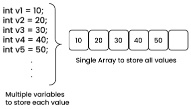
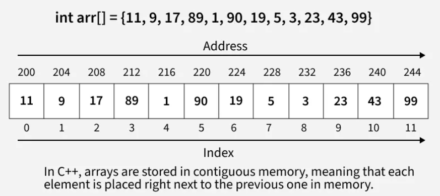
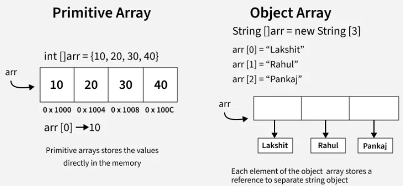
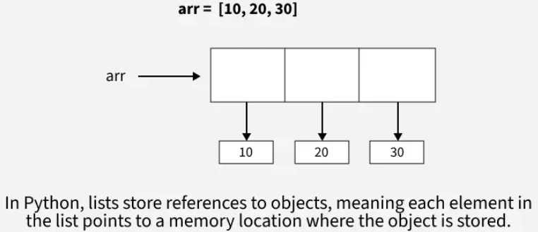
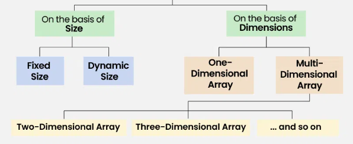
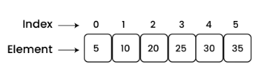
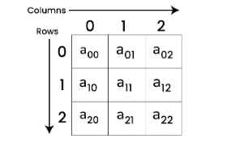
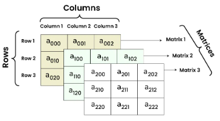

## Basics

- An array stores items or their references at `contiguous locations`.
- It offers mainly the following advantages over other data structures:
  - `Random Access` : **i<sup>th</sup>** item can be accessed in `O(1)` Time as we have the base address and every item or reference is of same size.
  - `Cache Friendliness` : Since items / references are stored at contiguous locations, we get the advantage of locality of reference.
- It is **not useful** in places where we have operations like **insert in the middle**, **delete from middle** and **search in a unsorted data**.
- It is a `fundamental` and `linear data structure` using which we build other data structures like Stack Queue, Deque, Graph, Hash Table, etc.

> Array is a collection of items of the same variable type that are stored at contiguous memory locations. It is one of the most popular and simple data structures used in programming.

### Why Array ?

> The idea of an array is to represent many instances in one variable.



### Terminology

- Array `Index`: In an array, elements are identified by their indexes. Array index starts from 0.
- Array `element`: Elements are items stored in an array and can be accessed by their index.
- Array `Length`: The length of an array is determined by the number of elements it can contain.
- `subarray`: contiguous part of array, i.e., an array that is inside another array

  - In general, for an array of size **n**, there are **n\*(n+1)/2** non-empty subarrays.
  - For example, Consider the array [1, 2, 3, 4], There are 10 non-empty sub-arrays. The subarrays are:
    ![Subarray of Array [1,2,3,4]](./../../../../src/images/dsa/a-12.png)

- `subsequence`: is a sequence that can be derived from another sequence by removing zero or more elements, without changing the order of the remaining elements.
  - In general, for an array of size **n**, we can have **(2n – 1)** non-empty sub-sequences in total.
  - For the same above example, there are 15 sub-sequences. They are:
    ![Subsequence of Array [1,2,3,4]](./../../../../src/images/dsa/a-13.png)
- `Subset`: If a Set has all its elements belonging to other sets, this set will be known as a subset of the other set.
  - A Subset is denoted as “⊆“. If set A is a subset of set B, it is represented as A ⊆ B.
  - For example, Let Set*A = {m, n, o, p, q}, Set* B = {k, l, m, n, o, p, q, r}
    ![Subset of Array [1,2,3,4]](./../../../../src/images/dsa/a-14.png)

Practice 👉 [Subarray, SubSequence and Subset Problems](https://www.geeksforgeeks.org/array-subarray-subsequence-and-subset)

### Memory Representation

In an array, all the elements are stored in contiguous memory locations. So, if we initialize an array, the elements will be allocated sequentially in memory. This allows for efficient access and manipulation of elements.







### Declaration of Array

```js
// Declaration in JS
let arr = [];
```

```csharp
// Declaration in JS
// This array will store integer type element
int[] arr;

// This array will store char type element
char[] arr2;

// This array will store float type element
float[] arr3;
```

```py
# Declaration in Python
arr = []
```

### Initialization of Array

```js
// Initialization in JS
let arr = [1, 2, 3, 4, 5];
let arr = ["a", "b", "c", "d", "e"];
let arr = [1.4, 2.0, 24, 5.0, 0.0];
```

```csharp
// Initialization in C#
int[] arr = { 1, 2, 3, 4, 5 };
char[] arr = { 'a', 'b', 'c', 'd', 'e' };
float[] arr = { 1.4f, 2.0f, 24f, 5.0f, 0.0f };
```

```py
# Initialization in python
# This list will store integer type elements
arr = [1, 2, 3, 4, 5]

# This list will store character type elements (strings in Python)
arr = ['a', 'b', 'c', 'd', 'e']

# This list will store float type elements
arr = [1.4, 2.0, 24.0, 5.0, 0.0]  # All float values
```

### Applications

- `Storing and accessing data`: Arrays store elements in a specific order and allow constant-time O(1) access to any element.
- `Searching`: If data in array is sorted, we can search an item in O(log n) time. We can also find floor(), ceiling(), kth smallest, kth largest, etc efficiently.
- `Matrices`: Two-dimensional arrays are used for matrices in computations like graph algorithms and image processing.
- `Implementing other data structures`: Arrays are used as the underlying data structure for implementing stacks and queues.
- `Dynamic programming`: Dynamic programming algorithms often use arrays to store intermediate results of subproblems in order to solve a larger problem.
- `Data Buffers`: Arrays serve as data buffers and queues, temporarily storing incoming data like network packets, file streams, and database results before processing.

### Advantages

- `Efficient and Fast Access`: Arrays allow direct and efficient access to any element in the collection with constant access time, as the data is stored in contiguous memory locations.
- `Memory Efficiency`: Arrays store elements in contiguous memory, allowing efficient allocation in a single block and reducing memory fragmentation. -` Versatility`: Arrays can be used to store a wide range of data types, including integers, floating-point numbers, characters, and even complex data structures such as objects and pointers.
- `Compatibility with hardware`: The array data structure is compatible with most hardware architectures, making it a versatile tool for programming in a wide range of environments.

### Disadvantages

- `Fixed Size`: Arrays have a fixed size set at creation. Expanding an array requires creating a new one and copying elements, which is time-consuming and memory-intensive.
- `Memory Allocation Issues`: Allocating large arrays can cause memory exhaustion, leading to crashes, especially on systems with limited resources.
- `Insertion and Deletion Challenges`: Adding or removing elements requires shifting subsequent elements, making these operations inefficient.
- `Limited Data Type Support`: Arrays support only elements of the same type, limiting their use with complex data types.
- `Lack of Flexibility`: Fixed size and limited type support make arrays less adaptable than structures like linked lists or trees.

## Types of Array



### By Size

#### Fixed Sized Array

We cannot alter or update the size of this array. Here only a fixed size (i,e. the size that is mentioned in square brackets []) of memory will be allocated for storage. In case, we don’t know the size of the array then if we declare a larger size and store a lesser number of elements will result in a wastage of memory or we declare a lesser size than the number of elements then we won’t get enough memory to store all the elements. In such cases, static memory allocation is not preferred.

```csharp
// Fixed sized array examples
int[] arr1 = new int [5];

// Another way (Array creation and
// initialization both)
int[] arr2 = {1, 2, 3, 4, 5};
```

#### Dynamic Sized Array

The size of the array changes as per user requirements during execution of code so the coders do not have to worry about sizes. They can add and removed the elements as per the need. The memory is mostly dynamically allocated and de-allocated in these arrays.

```js
// Dynamic Sized Array
let arr = new Array();
```

### By Dimension

#### 1D Array

You can imagine a 1d array as a row, where elements are stored one after another.



#### 2D Array

> aka **Matrix**

2-D Multidimensional arrays can be considered as an array of arrays or as a matrix consisting of rows and columns.


#### 3D Array

A 3-D Multidimensional array contains three dimensions, so it can be considered an array of two-dimensional arrays.


## Operations

### Create an array

```js
//using literal
const a = [5]; // creates an array of length 1, single element 5
// [ 5 ]

// using new keyword
const a = new Array(5); // creates an array of length 5, 5 empty elements
// [ <5 empty items> ]
```

### Accessing elements in an array

- Any element in the array can be accessed using the `index` number. The index in the arrays **starts with 0**

```js
// Creating an Array and Initializing with Values
let a = ["HTML", "CSS", "JS"];

// Accessing Array Elements
console.log(a[0]); // HTML
console.log(a[1]); // CSS
```

#### first element

The array indexing starts from 0, so we can access first element of array using the index number.

```js
// Creating an Array and Initializing with Values
let a = ["HTML", "CSS", "JS"];

// Accessing First Array Elements
let fst = a[0];

console.log("First Item: ", fst); // Last Item: HTML
```

#### last element

We can access the last array element using [array.length – 1] index number.

```js
// Creating an Array and Initializing with Values
let a = ["HTML", "CSS", "JS"];

// Accessing Last Array Elements
let lst = a[a.length - 1];

console.log("Last Item: ", lst); // Last Item: JS
```

### Modifying the Array Elements

Elements in an array can be modified by assigning a new value to their corresponding index.

```js
// Creating an Array and Initializing with Values
let a = ["HTML", "CSS", "JS"];
console.log(a); // ["HTML", "CSS", "JS"]

a[1] = "Bootstrap";
console.log(a); // ["HTML", "Bootstrap", "JS"]
```

### Adding Elements to the Array

- Elements can be added to the array using methods like [push()](https://www.geeksforgeeks.org/javascript-array-push-method/) and [unshift()](https://www.geeksforgeeks.org/javascript-array-unshift-method/).

- The `push()` method add the element to the end of the array.
- The `unshift()` method add the element to the starting of the array.

```js
// Creating an Array and Initializing with Values
let a = ["HTML", "CSS", "JS"];

// Add Element to the end of Array
a.push("Node.js");

// Add Element to the beginning
a.unshift("Web Development");

console.log(a); // [ 'Web Development', 'HTML', 'CSS', 'JS', 'Node.js' ]
```

### Removing Elements from an Array

- To remove the elements from an array we have different methods like [pop()](https://www.geeksforgeeks.org/javascript-array-pop-method/), [shift()](https://www.geeksforgeeks.org/javascript-array-shift-method/), or [splice()](https://www.geeksforgeeks.org/javascript-array-splice-method/).
  - The `pop()` method removes an element from the last index of the array.
  - The `shift()` method removes the element from the first index of the array.
  - The `splice()` method removes or replaces the element from the array.

```js
// Creating an Array and Initializing with Values
let a = ["HTML", "CSS", "JS"];
console.log("Original Array: " + a);
// Original Array: HTML,CSS,JS

// Removes and returns the last element
let lst = a.pop();
console.log("After Removing the last: " + a);
// After Removing the last: HTML,CSS

// Removes and returns the first element
let fst = a.shift();
console.log("After Removing the First: " + a);
// After Removing the First: CSS

// Removes 2 elements starting from index 1
a.splice(1, 2);
console.log("After Removing 2 elements starting from index 1: " + a);
// After Removing 2 elements starting from index 1: CSS
```

### Array Length

- We can get the length of the array using the array [length](https://www.geeksforgeeks.org/javascript-array-length-property/) property.

```js
// Creating an Array and Initializing with Values
let a = ["HTML", "CSS", "JS"];

let len = a.length;

console.log("Array Length: " + len);
```

#### Increase and Decrease the Array Length

We can increase and decrease the array length using the JavaScript `length` property.

```js
// Creating an Array and Initializing with Values
let a = ["HTML", "CSS", "JS"];

// Increase the array length to 7
a.length = 7;

console.log("After Increasing Length: ", a);
// After Increasing Length:  [ 'HTML', 'CSS', 'JS', <4 empty items> ]

// Decrease the array length to 2
a.length = 2;
console.log("After Decreasing Length: ", a);
// After Decreasing Length:  [ 'HTML', 'CSS' ]
```

### Iterating Through Array Elements

> process of accessing and processing each element of an array sequentially

#### Linear Traversal

> process of visiting each element of an array sequentially, starting from the first element and moving to the last element.

During this traversal, each element is processed (printed, modified, or checked) one after the other, in the order they are stored in the array.
This is the most common and straightforward way of accessing the elements of an array.

```js
const arr = [1, 2, 3, 4, 5];
console.log("Linear Traversal: ");
arr.forEach((i) => {
  process.stdout.write(i + " ");
});
console.log();
// Linear Traversal:
// 1 2 3 4 5
```

Time Complexity: **O(n)**
Auxiliary Space: **O(1)**

#### Reverse Traversal

> process of visiting each element of an array starting from the last element and moving towards the first element.

This method is useful when you need to process the elements of an array in reverse order. In this type of traversal, you begin from the last index (the rightmost element) and work your way to the first index (the leftmost element).

```js
let arr = [1, 2, 3, 4, 5];

console.log("Reverse Traversal: ");
for (let i = arr.length - 1; i >= 0; i--) {
  process.stdout.write(arr[i] + " ");
}
console.log();
// Reverse Traversal:
// 5 4 3 2 1
```

Time Complexity: **O(n)**
Auxiliary Space: **O(1)**

✏️: when index is not significant we can leverage [Array.forEach()](https://www.geeksforgeeks.org/javascript-for-loop/)

```js
// Creating an Array and Initializing with Values
let a = ["HTML", "CSS", "JS"];

// Iterating through forEach loop
a.forEach(function myfunc(x) {
  console.log(x);
});
// HTML
// CSS
// JS
```

### Array Concatenation

- Combine two or more arrays using the [concat()](https://www.w3schools.com/jsref/jsref_concat_array.asp) method. It returns new array containing joined arrays elements.

```js
// Creating an Array and Initializing with Values
let a = ["HTML", "CSS", "JS", "React"];
let b = ["Node.js", "Expess.js"];

// Concatenate both arrays
let concateArray = a.concat(b);

console.log("Concatenated Array: ", concateArray);
// Concatenated Array:  [ 'HTML', 'CSS', 'JS', 'React', 'Node.js', 'Expess.js' ]
```

### Conversion of an Array to String

- We have a builtin method [toString()](https://www.geeksforgeeks.org/javascript-array-tostring-method/) to converts an array to a string.

```js
// Creating an Array and Initializing with Values
let a = ["HTML", "CSS", "JS"];

// Convert array ot String
console.log(a.toString());
// HTML,CSS,JS
```

### Check the Type of an Arrays

- The JavaScript [typeof](https://www.geeksforgeeks.org/javascript-typeof-operator/) operator is used ot check the type of an array. It returns `“object”` for arrays.

### Recognizing a JS Array

- By using [Array.isArray()](https://www.geeksforgeeks.org/javascript-array-isarray-method/) method
- By using [instanceof](https://www.geeksforgeeks.org/instanceof-operator-in-javascript/) method

```js
const courses = ["HTML", "CSS", "Javascript"];
console.log("Using Array.isArray() method: ", Array.isArray(courses)); // Using Array.isArray() method:  true
console.log("Using instanceof method: ", courses instanceof Array); // Using instanceof method:  true
```

### Insertion

> process of adding a new element at a specific position while maintaining the order of the existing elements

- When inserting a new element, the following happens:
  - Identify the Position: Determine where the new element should be inserted.
  - Shift Elements: Move the existing elements one position forward to create space for the new element.
  - Insert the New Element: Place the new value in the correct position.
  - Update the Size (if applicable): If the array is dynamic, its size is increased.

#### At Begin

#### At End

#### At Position

### Deletion

> process of removing an element from a specific position while maintaining the order of the remaining elements

- Since arrays have contiguous memory allocation, deleting an element does not reduce the allocated memory size. Instead, it involves:
  - Identify the Position: Find the index of the element to be deleted.
  - Shift Elements: Move the elements after the deleted element one position to the left.
  - Update the Size (if applicable): If using a dynamic array, the size might be reduced.

#### At Begin

#### At End

#### At Position

