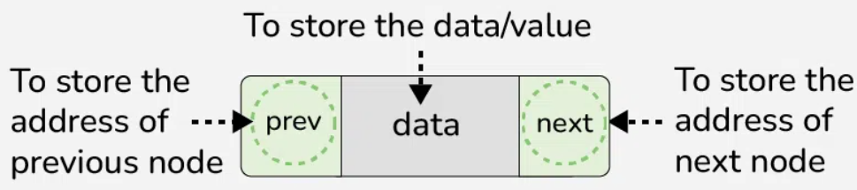
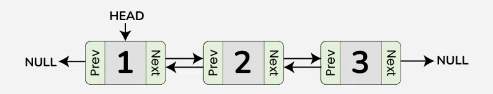

## Node Class and Constructor

Let’s implement a doubly linked list in JavaScript. A doubly linked list is a sequential chain of nodes, just like a linked list. The nodes we used for our linked lists contained two elements:

In a data structure, a doubly linked list is represented using nodes that have three fields:


1. Data
2. A pointer to the next node `next`
3. A pointer to the previous node `prev`



Depending on the end-use of the doubly linked list, there are a variety of methods that we can define.

For our use, we want to be able to:

add a new node to the beginning (head) of the list
add a new node to the end (tail) of the list
remove a node from the beginning (head) of the list
remove a node from the end (tail) of the list
find and remove a specific node by its data
print out the nodes in the list in order from head to tail
We will reuse the .printList() method from our LinkedList class, but the rest will either be edited or new.

To start, we are going to look at the updated Node class and create the constructor.

Ready? Let’s get started!

1. We are going to use a provided `Node` class, which you can find in **Node.js**. We’ve added a `previous` property to the class, as well as `.setPreviousNode()` and `.getPreviousNode()` methods. Take a look at it to see the changes.

```js
class Node {
  constructor(data) {
    this.data = data;
    this.next = null;
    this.previous = null;
  }

  setNextNode(node) {
    if (node instanceof Node || node === null) {
      this.next = node;
    } else {
      throw new Error('Next node must be a member of the Node class')
    }
  }

  setPreviousNode(node) {
    if (node instanceof Node || node === null) {
      this.previous = node;
    } else {
      throw new Error('Previous node must be a member of the Node class')
    }
  }

  getNextNode() {
    return this.next;
  }

  getPreviousNode() {
    return this.previous;
  }
}
```
2. In your DoublyLinkedList class, create a constructor that has no parameters.
3. Inside your DoublyLinkedList constructor:

- Set the list’s head to null
- Set the list’s tail to null

```js{4-7}
const Node = require("./Node");

class DoublyLinkedList {
  constructor() {
    this.head = null;
    this.tail = null;
  }

  printList() {
    let currentNode = this.head;
    let output = "<head> ";
    while (currentNode !== null) {
      output += currentNode.data + " ";
      currentNode = currentNode.getNextNode();
    }
    output += "<tail>";
    console.log(output);
  }
}

module.exports = DoublyLinkedList;
```

## Add To Head

In a linked list, we add to the head of the list by checking to see if there is already a head. We then either set the new node as the head (if there was no head) or update the head property, and link the past head to the new head.

Since a doubly linked list has an additional tail property and is built with nodes that each have two pointers, there are a few more steps:

- Start by checking to see if there is a current head to the list
- If there is (meaning the list is not empty), then we want to reset the pointers at the head of the list:
- Set the current head’s previous node to the new head
- Set the new head’s next node to the current head
- Update the head property to be the new head
- Finally, if there isn’t a current tail to the list (meaning the list was empty):
- Update the tail property to be the new head since that node will be both the head and tail

1. Define an `.addToHead()` method that takes one parameter called `data`. Inside, create:

- A `Node` **const** variable named `newHead` that takes `data` as an argument
- A **const** variable named `currentHead` that’s set to the list’s head

2. If there is a current head to the list:

- Set `currentHead‘s` previous node to `newHead`
- Set `newHead‘s` next node to `currentHead`

Remember to use the `Node` class’s .`setNextNode()` and .`setPreviousNode()` methods.

3. Outside of the `if`, set the list’s head to the new head.
4. Lastly, if the list doesn’t have a tail, set the list’s tail to the new head.

```js{9-20}
const Node = require("./Node");

class DoublyLinkedList {
  constructor() {
    this.head = null;
    this.tail = null;
  }

  addToHead(data) {
    const newHead = new Node(data);
    const currentHead = this.head;
    if (currentHead) {
      currentHead.setPreviousNode(newHead);
      newHead.setNextNode(currentHead);
    }
    this.head = newHead;
    if (!this.tail) {
      this.tail = newHead;
    }
  }

  printList() {
    let currentNode = this.head;
    let output = "<head> ";
    while (currentNode !== null) {
      output += currentNode.data + " ";
      currentNode = currentNode.getNextNode();
    }
    output += "<tail>";
    console.log(output);
  }
}

module.exports = DoublyLinkedList;
```

## Add To Tail

Since doubly linked lists have a tail property, we don’t have to iterate through the entire list to add to the tail like we did with a singly linked list. The new method will mirror what we did in our .addToHead() method:

- Start by checking to see if there is a current tail to the list
- If there is (meaning the list is not empty), then we want to reset the pointers at the tail of the list:
- Set the current tail’s next node to the new tail
- Set the new tail’s previous node to the current tail
- Update the tail property to be the new tail
- Finally, if there isn’t a current head to the list (meaning the list was empty):
- Update the head property to be the new tail since that node will be both the head and tail

1. Define an `.addToTail()` method that takes one parameter called `data`. Inside, create:

- A `Node` **const** variable named `newTail` that takes `data` as an argument
- A **const** variable named `currentTail`, and set it equal to the list’s tail

2. If there is a current tail to the list:

- Set the current tail’s next node to `newTail`
- Set `newTail`'s previous node to the current tail

Remember to use the `Node` class’s `.setNextNode()` and `.setPreviousNode()` methods.

3. Outside your if, set the list’s tail to the new tail.
4. Lastly, if the list doesn’t have a head, set the list’s head to the new tail.

```js{22-34}
const Node = require("./Node");

class DoublyLinkedList {
  constructor() {
    this.head = null;
    this.tail = null;
  }

  addToHead(data) {
    const newHead = new Node(data);
    const currentHead = this.head;
    if (currentHead) {
      currentHead.setPreviousNode(newHead);
      newHead.setNextNode(currentHead);
    }
    this.head = newHead;
    if (!this.tail) {
      this.tail = newHead;
    }
  }

  addToTail(data) {
    const newTail = new Node(data);
    const currentTail = this.tail;

    if (currentTail) {
      currentTail.setNextNode(newTail);
      newTail.setPreviousNode(currentTail);
    }
    this.tail = newTail;
    if (!this.head) {
      this.head = newTail;
    }
  }

  printList() {
    let currentNode = this.head;
    let output = "<head> ";
    while (currentNode !== null) {
      output += currentNode.data + " ";
      currentNode = currentNode.getNextNode();
    }
    output += "<tail>";
    console.log(output);
  }
}

module.exports = DoublyLinkedList;
```

## Remove Head

Due to the added tail property, removing the head of the list in a doubly linked list is a little more complicated than doing so in a singly linked list:

- Start by checking if there’s a current head to the list. If there isn’t:
- The list is empty, so there’s nothing to return, and the method ends
- Otherwise, update the list’s head to be the current head’s next node
- If there is still a head to the list (meaning the list had more than one element when we started):
- Set the head’s previous node to `null` since there should be no node before the head of the list
- If the removed head was also the tail of the list (meaning there was only one element in the list), call `.removeTail()` to make the necessary changes to the tail of the list. (We will create this method in the next exercise!)
- Finally, return the old head

1. Define a `.removeHead()` method that has no parameters. Inside it, create a const variable named `removedHead` and set it equal to the list’s head.
2. Check if `removedHead` has value. If not, that means there's nothing to remove, so return to end the method.
3. Outside of your `if`, set the list’s head to `removedHead`'s next node.

- If the head has value, set the head’s previous node to null, since the head of the list shouldn’t have a previous node.

4. If `removedHead` is equal to the list’s tail, call the `.removeTail()` method (we will create this in the next exercise).
5. Finally, return `removedHead`'s data.

```js{35-48}
const Node = require("./Node");

class DoublyLinkedList {
  constructor() {
    this.head = null;
    this.tail = null;
  }

  addToHead(data) {
    const newHead = new Node(data);
    const currentHead = this.head;
    if (currentHead) {
      currentHead.setPreviousNode(newHead);
      newHead.setNextNode(currentHead);
    }
    this.head = newHead;
    if (!this.tail) {
      this.tail = newHead;
    }
  }

  addToTail(data) {
    const newTail = new Node(data);
    const currentTail = this.tail;
    if (currentTail) {
      currentTail.setNextNode(newTail);
      newTail.setPreviousNode(currentTail);
    }
    this.tail = newTail;
    if (!this.head) {
      this.head = newTail;
    }
  }

  removeHead() {
    const removedHead = this.head;
    if (!removedHead) {
      return;
    }
    this.head = removedHead.getNextNode();
    if (this.head) {
      this.head.setPreviousNode(null);
    }
    if (removedHead === this.tail) {
      this.removeTail();
    }
    return removedHead.data;
  }

  printList() {
    let currentNode = this.head;
    let output = "<head> ";
    while (currentNode !== null) {
      output += currentNode.data + " ";
      currentNode = currentNode.getNextNode();
    }
    output += "<tail>";
    console.log(output);
  }
}

module.exports = DoublyLinkedList;
```

## Remove Tail

In addition to being able to add to the head of the list, a doubly linked list’s tail property allows us to add to the tail just as easily. In fact, like the .addToHead() and .addToTail() methods, the .removeTail() method will closely mirror the .removeHead() method:

- Start by checking if there’s a current tail to the list. If there isn’t:
- The list is empty, so there’s nothing to return, and the method ends
- Otherwise, update the list’s tail to be the current tail’s previous node
- If there is still a tail to the list (meaning the list had more than one element when we started):
- Set the tail’s next node to null since there should be no node after the tail of the list
- If the removed tail was also the head of the list (meaning there was only one element in the list), call .removeHead() to make the necessary changes to the head of the list
- Finally, return the old tail

1. Define a `.removeTail()` method that has no parameters. Inside it, create a **const** variable named `removedTail` and set it equal to the list’s tail.
2. Check if `removedTail` has value. If not, that means there’s nothing to remove, so return to end the method.
3. Outside of your `if`, set the list’s tail to `removedTail`'s previous node.

- If the tail has value, set the tail’s next node to null, since the tail of the list shouldn’t have a next node.

4. If `removedTail` is equal to the list’s head, call the `.removeHead()` method.
5. Finally, return `removedTail`'s data.

```js{50-63}
const Node = require("./Node");

class DoublyLinkedList {
  constructor() {
    this.head = null;
    this.tail = null;
  }

  addToHead(data) {
    const newHead = new Node(data);
    const currentHead = this.head;
    if (currentHead) {
      currentHead.setPreviousNode(newHead);
      newHead.setNextNode(currentHead);
    }
    this.head = newHead;
    if (!this.tail) {
      this.tail = newHead;
    }
  }

  addToTail(data) {
    const newTail = new Node(data);
    const currentTail = this.tail;
    if (currentTail) {
      currentTail.setNextNode(newTail);
      newTail.setPreviousNode(currentTail);
    }
    this.tail = newTail;
    if (!this.head) {
      this.head = newTail;
    }
  }

  removeHead() {
    const removedHead = this.head;
    if (!removedHead) {
      return;
    }
    this.head = removedHead.getNextNode();
    if (this.head) {
      this.head.setPreviousNode(null);
    }
    if (removedHead === this.tail) {
      this.removeTail();
    }
    return removedHead.data;
  }

  removeTail() {
    const removedTail = this.tail;
    if (!removedTail) {
      return;
    }
    this.tail = removedTail.getPreviousNode();
    if (this.tail) {
      this.tail.setNextNode(null);
    }
    if (removedTail === this.head) {
      this.removeHead();
    }
    return removedTail.data;
  }

  printList() {
    let currentNode = this.head;
    let output = "<head> ";
    while (currentNode !== null) {
      output += currentNode.data + " ";
      currentNode = currentNode.getNextNode();
    }
    output += "<tail>";
    console.log(output);
  }
}

module.exports = DoublyLinkedList;
```

## Remove By Data

In addition to removing the head and the tail of the list, it would also be useful to remove a specific element that could be anywhere in the list. Imagine that you have a list of errands to run. You don’t always do your errands in order, so when you finish doing your laundry, that could be somewhere in the middle of the list. We are going to build a .removeByData() method that will allow you to cross off (remove) that errand no matter where it is in the list.

In order to do this:

- Iterate through the list to find the matching node
- If there is no matching element in the list:
- Return null
- If there is a matching node, we will then check to see if it is the head or tail of the list:
- If so, call the corresponding .removeHead() or .removeTail() method
- If not, that means the node was somewhere in the middle of the list. In that case:
- Remove it by resetting the pointers of its previous and next nodes
- Finally, return the node

1. Define a .removeByData() method that takes data as a parameter. Inside it, create a let variable named nodeToRemove. We don’t know what it is yet, so don’t give it any value.
2. Create a `let` variable named `currentNode` and set it equal to the list’s head.

- Then create a `while` loop that runs while `currentNode` isn’t `null`.
- Inside the loop, update `currentNode` to be its next node. This is how we will iterate through the list as we look for the matching node.

✏️:If you accidentally create an infinite loop and your code won’t stop running, you can reload the page to stop it.

3. Inside the `while` loop, but before you updated `currentNode` to be its next node, create an `if` statement that checks if `currentNode`'s data matches data. If it does, that means we have found the matching node. Inside the `if`:

- Set `nodeToRemove` to `currentNode`
- break to leave the while loop, since we don’t need to keep looking through the list

4. Outside your `while` loop, check if `nodeToRemove` has any value. If it doesn’t, that means there was no matching node in the list, so return `null`.
5. Still in your `.removeByData()` method, check if `nodeToRemove` is the list’s head. If so, call `.removeHead()`.
6. Else, if `nodeToRemove` is the list’s tail, call `.removeTail()`.
7. Else, we know that the node is somewhere in the middle of the list. To remove it, we will need to reset the pointers for the nodes around it. In an else block, create:

- A const variable named `nextNode` that is equal to `nodeToRemove`‘s next node
- A const variable named `previousNode` that is equal to `nodeToRemove`‘s previous node.

8. Now that we have our nodes, we can remove the pointers to and from `nodeToRemove` and have `nextNode` and `previousNode` point to each other. Still in the else block:

- Set `nextNode`‘s previous node to `previousNode`
- Set `previousNode`‘s next node to `nextNode`

9. Finally, outside of the else block, return `nodeToRemove`.

```js{65-89}
const Node = require("./Node");

class DoublyLinkedList {
  constructor() {
    this.head = null;
    this.tail = null;
  }

  addToHead(data) {
    const newHead = new Node(data);
    const currentHead = this.head;
    if (currentHead) {
      currentHead.setPreviousNode(newHead);
      newHead.setNextNode(currentHead);
    }
    this.head = newHead;
    if (!this.tail) {
      this.tail = newHead;
    }
  }

  addToTail(data) {
    const newTail = new Node(data);
    const currentTail = this.tail;
    if (currentTail) {
      currentTail.setNextNode(newTail);
      newTail.setPreviousNode(currentTail);
    }
    this.tail = newTail;
    if (!this.head) {
      this.head = newTail;
    }
  }

  removeHead() {
    const removedHead = this.head;
    if (!removedHead) {
      return;
    }
    this.head = removedHead.getNextNode();
    if (this.head) {
      this.head.setPreviousNode(null);
    }
    if (removedHead === this.tail) {
      this.removeTail();
    }
    return removedHead.data;
  }

  removeTail() {
    const removedTail = this.tail;
    if (!removedTail) {
      return;
    }
    this.tail = removedTail.getPreviousNode();
    if (this.tail) {
      this.tail.setNextNode(null);
    }
    if (removedTail === this.head) {
      this.removeHead();
    }
    return removedTail.data;
  }

  removeByData(data) {
    let nodeToRemove;
    let currentNode = this.head;
    while (currentNode !== null) {
      if (currentNode.data === data) {
        nodeToRemove = currentNode;
        break;
      }
      currentNode = currentNode.getNextNode();
    }
    if (!nodeToRemove) {
      return null;
    }
    if (nodeToRemove === this.head) {
      this.removeHead();
    } else if (nodeToRemove === this.tail) {
      this.removeTail();
    } else {
      const nextNode = nodeToRemove.getNextNode();
      const previousNode = nodeToRemove.getPreviousNode();
      nextNode.setPreviousNode(previousNode);
      previousNode.setNextNode(nextNode);
    }
    return nodeToRemove;
  }

  printList() {
    let currentNode = this.head;
    let output = "<head> ";
    while (currentNode !== null) {
      output += currentNode.data + " ";
      currentNode = currentNode.getNextNode();
    }
    output += "<tail>";
    console.log(output);
  }
}

module.exports = DoublyLinkedList;
```

## Using the Doubly Linked List

You finished your `DoublyLinkedList` class! Now we’re going to use that class to model a subway line. A doubly linked list is a great data structure to use to model a subway line, as both have a first and last element, and are comprised of nodes (or stops) with links to the elements before and after them.

We will add to and remove stops from our subway line, and print it out to see what we’ve done. The `.printList()` method is the same as the one from the `LinkedList` class and has been provided.

1. We’re going to model a (fictional) subway line that will travel from Central Park to the Brooklyn Bridge. In subway.js create a new DoublyLinkedList named subway.

2. The subway starts at Central Park and winds its way downtown. In the following order:

- add 'TimesSquare' to the head of the list
- add 'GrandCentral' to the head of the list
- add 'CentralPark' to the head of the list

Then print the list.

3. The subway continues from Times Square down to the Brooklyn Bridge. In the following order:

- Add 'PennStation' to the tail of the list
- Add 'WallStreet' to the tail of the list
- Add 'BrooklynBridge' to the tail of the list

Then print the list again.

4. Oh no! There’s construction happening on the subway line: the **CentralPark** and **BrooklynBridge** stops will temporarily be closed. Remove them from your list without iterating through the entire list.

Then print the list again.

5. It turns out that the `TimesSquare` station is under construction as well. Remove it from the list, and then print the list for the last time.

```js
const DoublyLinkedList = require("./DoublyLinkedList.js");

const subway = new DoublyLinkedList();
subway.addToHead("TimesSquare");
subway.addToHead("GrandCentral");
subway.addToHead("CentralPark");
subway.printList();
// <head> CentralPark GrandCentral TimesSquare <tail>

subway.addToTail("PennStation");
subway.addToTail("WallStreet");
subway.addToTail("BrooklynBridge");
subway.printList();
// <head> CentralPark GrandCentral TimesSquare <tail>
// <head> CentralPark GrandCentral TimesSquare PennStation WallStreet BrooklynBridge <tail>

subway.removeHead();
subway.removeTail();
subway.printList();
// <head> CentralPark GrandCentral TimesSquare <tail>
// <head> CentralPark GrandCentral TimesSquare PennStation WallStreet BrooklynBridge <tail>
// <head> GrandCentral TimesSquare PennStation WallStreet <tail>

subway.removeByData("TimesSquare");
subway.printList();
// <head> CentralPark GrandCentral TimesSquare <tail>
// <head> CentralPark GrandCentral TimesSquare PennStation WallStreet BrooklynBridge <tail>
// <head> GrandCentral TimesSquare PennStation WallStreet <tail>
// <head> GrandCentral PennStation WallStreet <tail>
```

## Doubly Linked List Review

Congratulations, you have created and implemented a doubly linked list class in JavaScript!

We did this by:

- Using our Node class to hold the data and links between nodes
- Implementing a DoublyLinkedList class to handle external operations on the list, like adding and removing nodes
- Creating an instance of our list, and using the `.printList()` method to track the changes we made

Feel free to play around a bit with your code. Here are some ideas:

- Create a few nodes and add them to both ends of a new doubly linked list
- Print your doubly linked list out using your .printList() method
- Remove your doubly linked list’s head or tail node
- Print your list again — were the right nodes removed?
- Remove a specific node from somewhere in the middle of the list, then print the list again. Did it work?
- We created our .removeByData() method by iterating from the head of the list to the tail. Do you think you could start at the tail and iterate backward? Try it!
