## Basics

> aka **Singly Linked List**

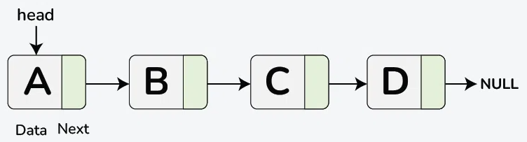

Linked lists are one of the basic data structures used in computer science. They have many direct applications and serve as the foundation for more complex data structures.

The list is comprised of a series of nodes as shown in the diagram. The head node is the node at the beginning of the list. Each node contains data and a link (or pointer) to the next node in the list. The list is terminated when a node’s link is null. This is called the tail node.

Consider a one-way air travel itinerary. The trip could involve traveling through several airports (nodes) connected by air travel segments (links). In this example, the initial departure city is the head node and the final arrival city is the tail node.

Since the nodes use links to denote the next node in the sequence, the nodes are not required to be sequentially located in memory. These links also allow for quick insertion and removal of nodes as you will see in future exercises.

Common operations on a linked list may include:

- adding nodes
- removing nodes
- finding a node
- traversing (or traveling through) the linked list

Linked lists typically contain unidirectional links (next node), but some implementations make use of bidirectional links (next and previous nodes).

Linked Lists:

- Are comprised of nodes
- The nodes contain a link to the next node (and also the previous node for bidirectional linked lists)
- Can be unidirectional or bidirectional
- Are a basic data structure, and form the basis for many other data structures
- Have a single head node, which serves as the first node in the list
- Require some maintenance in order to add or remove nodes
- The methods we used are an example and depend on the exact use case and/or programming language being used

### Constructor

Let’s implement a linked list in JavaScript. As you might recall, a linked list is a sequential chain of nodes. Remember that a node contains two elements:

**data**
a link to the next node
We are going to use a provided Node class, which you can find in Node.js. Make sure to use the proper Node methods throughout the lesson instead of accessing properties directly (ex. use someNode.getNextNode() instead of someNode.next).

Depending on the end-use of the linked list, there are a variety of methods that we can define. For our use, we want to be able to:

- add a new node to the beginning (head) of the list
- add a new node to the end (tail) of the list
- remove a node from the beginning (head) of the list
- print out the nodes in the list in order from head to tail

To start, we are going to create the LinkedList‘s constructor and `.addToHead()` method.

```js
//node.js
class Node {
  constructor(data) {
    this.data = data;
    this.next = null;
  }

  setNextNode(node) {
    if (!(node instanceof Node)) {
      throw new Error("Next node must be a member of the Node class");
    }
    this.next = node;
  }

  getNextNode() {
    return this.next;
  }
}

module.exports = Node;
```

```js
//linkedlist.js
const Node = require("./Node");

class LinkedList {}

module.exports = LinkedList;
```

1. The only property we need our linked list to have is a head, which we will add in our constructor. Inside the `LinkedList` class, define the constructor. It should take no parameters, and should set the list’s head to `null`.

```js{5-7}
//linkedlist.js
const Node = require("./Node");

class LinkedList {
  constructor() {
    this.head = null;
  }
}

module.exports = LinkedList;
```

## Operations

### Add To Head

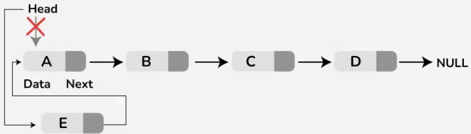

1. Define an `.addToHead()` method that takes one parameter called `data`. Inside the method, create a `Node` const variable named `newHead`, and pass `data` as an argument.
2. Inside your `.addToHead()` method, create a `const` variable named `currentHead`, and set it equal to the list’s head. Then change the list’s head to equal `newHead`.
3. Finally, still in your `.addToHead()` method, check if there is a current head to the list. If there is, set the list’s head’s next node to `currentHead`.

```js{5-7, 9-16}
//linkedlist.js
const Node = require("./Node");

class LinkedList {
  constructor() {
    this.head = null;
  }

  addToHead(data) {
    const newHead = new Node(data);
    const currentHead = this.head;
    this.head = newHead;
    if (currentHead) {
      this.head.setNextNode(currentHead);
    }
  }
}

module.exports = LinkedList;
```

### Add To Tail

Now that we can add to the head of the linked list, the next step is to be able to add to the tail. This will require a few more steps since we don’t have a `tail` property in our linked list data structure.

To do this, we are going to start with a temporary tail variable that will be set equal to the list’s head. If there is no head, that means that the list is empty, and we will add the node to the head of the list. Otherwise, we will iterate through the list until we find the last node. Once we’ve found the current tail, we will add a pointer from that node to our new tail.

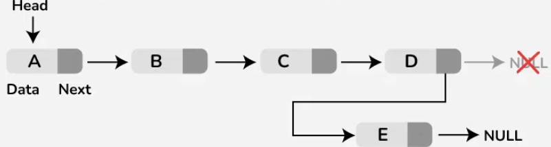

1. Define an `.addToTail()` method for the `LinkedList` that has one parameter called `data`. Create a variable named `tail`, and set it equal to the list’s head. `tail` is going to change throughout the method, so make it a `let` variable.

2. Now that `tail` is equal to the head of the list, we want to check if it has any value. If `tail` has no value, then that means the list was empty, and we will be creating the head and `tail` with the `data` passed in. To do this, check if `tail` has no value. If so, set the list’s head equal to a new `Node` that takes `data` as an argument.

3. If `tail` does have a value, that means the list is not empty. In that case, we want to iterate through the list until we find the end, so we can add `tail` to the end of the list. To do this, create an else after your if statement. Inside it, make a while loop that runs while `tail` has a next node. Inside the loop, set `tail` equal to its next node. (If you accidentally create an infinite loop and your code won’t stop running, you can reload the page to stop it.)

4. Finally, inside the same `else` block, but outside the `while` loop, set `tail‘s` next node equal to a new `Node` that takes `data` as an argument.

```js{17-25}
// linkedlist.js
const Node = require("./Node");

class LinkedList {
  constructor() {
    this.head = null;
  }

  addToHead(data) {
    const newHead = new Node(data);
    const currentHead = this.head;
    this.head = newHead;
    if (currentHead) {
      this.head.setNextNode(currentHead);
    }
  }
  addToTail(data) {
    let tail = this.head;
    if (!tail) {
      this.head = new Node(data);
    } else {
      while (tail.getNextNode() !== null) {
        tail = tail.getNextNode();
      }
      tail.setNextNode(new Node(data));
    }
  }
}

module.exports = LinkedList;
```

### Add By Position

To insert a node at a specific position, traverse the list to the desired position, link the new node to the next node, and update the links accordingly.

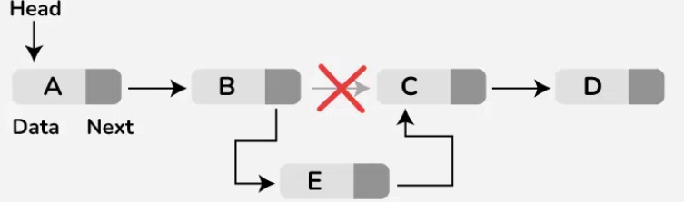

1. Create a new node and assign it a value.
2. If inserting at the beginning (position = 1):

- Point the new node’s next to the current head.
- Update the head to the new node.
- Return (Insertion done).

6. Otherwise, traverse the list:

- Start from the head and move to the (position - 1)ᵗʰ node (just before the desired position).
- If the position is beyond the list length, return an error or append at the end.

9. Insert the new node:

- Point the new node’s next to the next node of the current position.
- Update the previous node’s next to the new node.
  Return the updated list.

```js{28-46}
// linkedlist.js
const Node = require("./Node");

class LinkedList {
  constructor() {
    this.head = null;
  }

  addToHead(data) {
    const newHead = new Node(data);
    const currentHead = this.head;
    this.head = newHead;
    if (currentHead) {
      this.head.setNextNode(currentHead);
    }
  }
  addToTail(data) {
    let tail = this.head;
    if (!tail) {
      this.head = new Node(data);
    } else {
      while (tail.getNextNode() !== null) {
        tail = tail.getNextNode();
      }
      tail.setNextNode(new Node(data));
    }
  }
  addAt(pos, data) {
    if (pos < 1)
        return this.head;
    if (pos === 1) {
        let newNode = new Node(data);
        newNode.setNextNode(this.head);
        return newNode;
    }
    let curr = this.head;
    for (let i = 1; i < pos - 1 && curr != null; i++) {
        curr = curr.getNextNode();
    }
    if (curr == null)
        return this.head;
    let newNode = new Node(data);
    newNode.setNextNode(curr.getNextNode);
    curr.setNextNode(newNode);
    return this.head;
  }
}

module.exports = LinkedList;
```

### Remove Head

Now we’re going to learn how to remove from the head of the list. To do this, we are first going to check to see if the list has a head. If it doesn’t, there is nothing to return. If there is a head, we will remove it by setting the list’s head equal to the original head’s next node, and then return that original head.

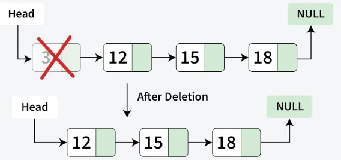

1. Define a `.removeHead()` method that takes no parameters. Inside the method, create a **const** variable named `removedHead` and set it equal to the list’s head. We will use this to keep track of the original head of the list.
2. If `removedHead` has no value, return to end execution of the `.removeHead()` method.
3. Outside the if statement, set the list’s head equal to `removedHead`'s next node.
4. Finally, return `removedHead`’s data.

```js{48-55}
// linkedlist.js
const Node = require("./Node");

class LinkedList {
  constructor() {
    this.head = null;
  }

  addToHead(data) {
    const newHead = new Node(data);
    const currentHead = this.head;
    this.head = newHead;
    if (currentHead) {
      this.head.setNextNode(currentHead);
    }
  }

  addToTail(data) {
    let tail = this.head;
    if (!tail) {
      this.head = new Node(data);
    } else {
      while (tail.getNextNode() !== null) {
        tail = tail.getNextNode();
      }
      tail.setNextNode(new Node(data));
    }
  }
  addAt(pos, data) {
    if (pos < 1)
        return this.head;
    if (pos === 1) {
        let newNode = new Node(data);
        newNode.setNextNode(this.head);
        return newNode;
    }
    let curr = this.head;
    for (let i = 1; i < pos - 1 && curr != null; i++) {
        curr = curr.getNextNode();
    }
    if (curr == null)
        return this.head;
    let newNode = new Node(data);
    newNode.setNextNode(curr.getNextNode);
    curr.setNextNode(newNode);
    return this.head;
  }
  removeHead() {
    const removedHead = this.head;
    if (!removedHead) {
      return;
    }
    this.head = removedHead.getNextNode();
    return removedHead.data;
  }
}

module.exports = LinkedList;
```

### Remove Tail

Now we’re going to learn how to remove from the tail of the list. To do this, we are first going to check to see if the list has a tail. If it doesn’t, there is nothing to return. If there is a tail, we will remove it by setting the list’s tail equal to the original tail’s next node, and then return that original tail.

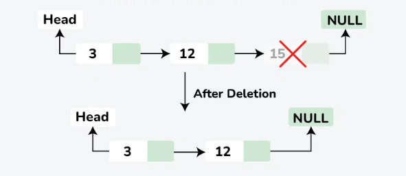

1. Define a `.removeTail()` method that takes head parameters. Inside the method, If the list is empty, return null
2. If the list has only one node, delete it and return null
3. Find the second last node.
4. Delete the last node.
5. return head

```js{55-68}
// linkedlist.js
const Node = require("./Node");

class LinkedList {
  constructor() {
    this.head = null;
  }

  addToHead(data) {
    const newHead = new Node(data);
    const currentHead = this.head;
    this.head = newHead;
    if (currentHead) {
      this.head.setNextNode(currentHead);
    }
  }
  addToTail(data) {
    let tail = this.head;
    if (!tail) {
      this.head = new Node(data);
    } else {
      while (tail.getNextNode() !== null) {
        tail = tail.getNextNode();
      }
      tail.setNextNode(new Node(data));
    }
  }
  addAt(pos, data) {
    if (pos < 1)
        return this.head;
    if (pos === 1) {
        let newNode = new Node(data);
        newNode.setNextNode(this.head);
        return newNode;
    }
    let curr = this.head;
    for (let i = 1; i < pos - 1 && curr != null; i++) {
        curr = curr.getNextNode();
    }
    if (curr == null)
        return this.head;
    let newNode = new Node(data);
    newNode.setNextNode(curr.getNextNode);
    curr.setNextNode(newNode);
    return this.head;
  }
  removeHead() {
    const removedHead = this.head;
    if (!removedHead) {
      return;
    }
    this.head = removedHead.getNextNode();
    return removedHead.data;
  }
  removeTail() {
    if (!this.head) {
        return null;
    }
    if (!this.head.next) {
        return null;
    }
    let secondLast = this.head;
    while (secondLast.next.next) {
        secondLast = secondLast.next;
    }
    secondLast.next = null;
    return this.head;
  }
}

module.exports = LinkedList;
```

### Remove By Position

To delete a node at a specific position, traverse the list to the desired position, update the links to bypass the node to be deleted.

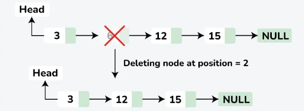

1. If list is empty (`head` == `NULL`), returns the `head`.
2. If the position to delete is 1 (the `head` node):

- Update `head` = `temp`->`next`

3. Traverse the list until reaching the desired position:

- Initialize `prev` to keep track of the `previous` node.
- Move `temp` through the list until the position is reached.

4. Check for Valid Position:

- If `temp` becomes `NULL`, it means the position exceeds the number of nodes in the list. Print a message and return the head.

5. If the node to delete is found:

- Set `prev`->`next` to `temp`->`next`, effectively skipping over the node to be deleted.

```js{69-90}
// linkedlist.js
const Node = require("./Node");

class LinkedList {
  constructor() {
    this.head = null;
  }

  addToHead(data) {
    const newHead = new Node(data);
    const currentHead = this.head;
    this.head = newHead;
    if (currentHead) {
      this.head.setNextNode(currentHead);
    }
  }
  addToTail(data) {
    let tail = this.head;
    if (!tail) {
      this.head = new Node(data);
    } else {
      while (tail.getNextNode() !== null) {
        tail = tail.getNextNode();
      }
      tail.setNextNode(new Node(data));
    }
  }
  addAt(pos, data) {
    if (pos < 1)
        return this.head;
    if (pos === 1) {
        let newNode = new Node(data);
        newNode.setNextNode(this.head);
        return newNode;
    }
    let curr = this.head;
    for (let i = 1; i < pos - 1 && curr != null; i++) {
        curr = curr.getNextNode();
    }
    if (curr == null)
        return this.head;
    let newNode = new Node(data);
    newNode.setNextNode(curr.getNextNode);
    curr.setNextNode(newNode);
    return this.head;
  }
  removeHead() {
    const removedHead = this.head;
    if (!removedHead) {
      return;
    }
    this.head = removedHead.getNextNode();
    return removedHead.data;
  }
  removeTail() {
    if (!this.head) {
        return null;
    }
    if (!this.head.next) {
        return null;
    }
    let secondLast = this.head;
    while (secondLast.next.next) {
        secondLast = secondLast.next;
    }
    secondLast.next = null;
    return this.head;
  }
  removeAt(pos)
  {
    let temp = this.head;
    let prev = null;
    if (temp === null)
        return this.head;
    if (pos === 1) {
        this.head = temp.next;
        return this.head;
    }
    for (let i = 1; temp !== null && i < pos; i++) {
        prev = temp;
        temp = temp.next;
    }
    if (temp !== null) {
        prev.next = temp.next;
    }
    else {
        console.log("Data not present");-
    }
    return this.head;
  }
}

module.exports = LinkedList;
```

### Reverse

to reverse the linked list by changing the links between nodes

- Input Linked list having 4 nodes
  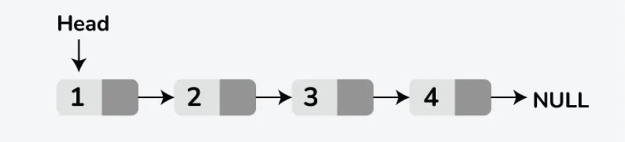
- Initialize prev pointer = null
- Store next = curr.next
- update curr.next = prev
  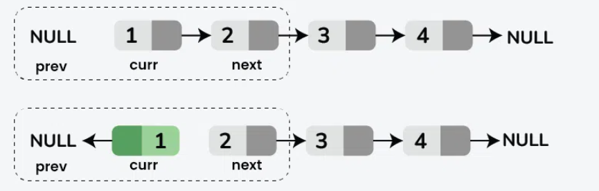

3.

- Update prev = curr and curr = next
- Store next node 3 as next
- update next pointer of current node 2 to prev node 1
  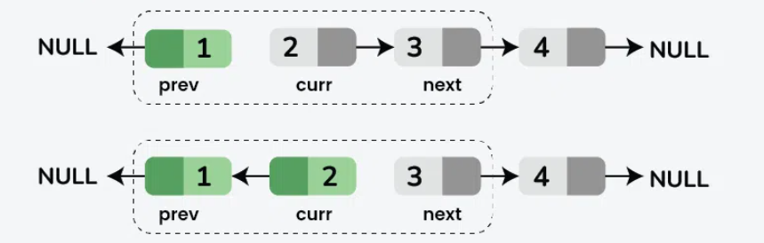
- Update prev = curr and curr = next
- Store next node 4 as next
- Update next pointer of current node 3 to prev node 2
  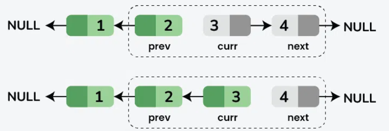

- Update prev = curr and curr = next
- next pointer points to null
- Update next pointer of current node 4 to prev node 3
  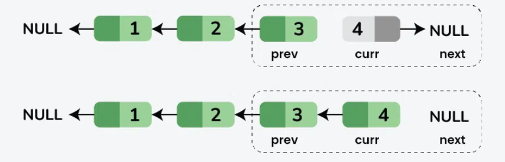

- Update prev = curr and curr = next
- Finally, curr becomes null and prec stoeres the head of current linked list

  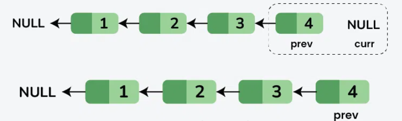

```js{91-102}
// linkedlist.js
const Node = require("./Node");

class LinkedList {
  constructor() {
    this.head = null;
  }

  addToHead(data) {
    const newHead = new Node(data);
    const currentHead = this.head;
    this.head = newHead;
    if (currentHead) {
      this.head.setNextNode(currentHead);
    }
  }
  addToTail(data) {
    let tail = this.head;
    if (!tail) {
      this.head = new Node(data);
    } else {
      while (tail.getNextNode() !== null) {
        tail = tail.getNextNode();
      }
      tail.setNextNode(new Node(data));
    }
  }
  addAt(pos, data) {
    if (pos < 1)
        return this.head;
    if (pos === 1) {
        let newNode = new Node(data);
        newNode.setNextNode(this.head);
        return newNode;
    }
    let curr = this.head;
    for (let i = 1; i < pos - 1 && curr != null; i++) {
        curr = curr.getNextNode();
    }
    if (curr == null)
        return this.head;
    let newNode = new Node(data);
    newNode.setNextNode(curr.getNextNode);
    curr.setNextNode(newNode);
    return this.head;
  }
  removeHead() {
    const removedHead = this.head;
    if (!removedHead) {
      return;
    }
    this.head = removedHead.getNextNode();
    return removedHead.data;
  }
  removeTail() {
    if (!this.head) {
        return null;
    }
    if (!this.head.next) {
        return null;
    }
    let secondLast = this.head;
    while (secondLast.next.next) {
        secondLast = secondLast.next;
    }
    secondLast.next = null;
    return this.head;
  }
  removeAt(pos)
  {
    let temp = this.head;
    let prev = null;
    if (temp === null)
        return this.head;
    if (pos === 1) {
        this.head = temp.next;
        return this.head;
    }
    for (let i = 1; temp !== null && i < pos; i++) {
        prev = temp;
        temp = temp.next;
    }
    if (temp !== null) {
        prev.next = temp.next;
    }
    else {
        console.log("Data not present");
    }
    return this.head;
  }
  reverse() {
    let curr = this.head;
    let prev = null;
    let next;
    while (curr !== null) {
        next = curr.next;
        curr.next = prev;
        prev = curr;
        curr = next;
    }
    return prev;
  }
}

module.exports = LinkedList;
```

### Printing

Nice! Now we have a bunch of helpful LinkedList methods under our belt. Our next step is to create a .printList() method so we can see our list as it changes.

While it’s possible to just use console.log() on the list (try it!), we want to print it in a more understandable and readable way. console.log() will print the pointers of each node as well as the data, but we’re just going to print the data while maintaining the order of the list.

To do this, we will create a String that holds the data from every node in the list. We’ll start at the list’s head and iterate through the list, adding to our String as we go.

For example, if we had a list for the days of the week, starting with Sunday, .printList() would print it as follows:

```py
<head>Sunday Monday Tuesday Wednesday Thursday Friday Saturday<tail>

```

1. Define a method named `.printList()`. Inside it, create:

- A let variable named `currentNode`, and set it equal to the list’s head
- Another let variable named `output`, and set it equal to `'<head> '`
  Then, log `output` to the console

2. While `currentNode` doesn’t equal `null`, add its `data` and a `' '` to `output`. Then update `currentNode` to be its next node. Do this above your `console.log()` statement.

3. Finally, outside of the `while` loop, but before your `console.log()`, set `output` equal to itself concatenated with `'<tail>'`.

```js{103-113}
// linkedlist.js
const Node = require("./Node");

class LinkedList {
  constructor() {
    this.head = null;
  }

  addToHead(data) {
    const newHead = new Node(data);
    const currentHead = this.head;
    this.head = newHead;
    if (currentHead) {
      this.head.setNextNode(currentHead);
    }
  }
  addToTail(data) {
    let tail = this.head;
    if (!tail) {
      this.head = new Node(data);
    } else {
      while (tail.getNextNode() !== null) {
        tail = tail.getNextNode();
      }
      tail.setNextNode(new Node(data));
    }
  }
  addAt(pos, data) {
    if (pos < 1)
        return this.head;
    if (pos === 1) {
        let newNode = new Node(data);
        newNode.setNextNode(this.head);
        return newNode;
    }
    let curr = this.head;
    for (let i = 1; i < pos - 1 && curr != null; i++) {
        curr = curr.getNextNode();
    }
    if (curr == null)
        return this.head;
    let newNode = new Node(data);
    newNode.setNextNode(curr.getNextNode);
    curr.setNextNode(newNode);
    return this.head;
  }
  removeHead() {
    const removedHead = this.head;
    if (!removedHead) {
      return;
    }
    this.head = removedHead.getNextNode();
    return removedHead.data;
  }
  removeTail() {
    if (!this.head) {
        return null;
    }
    if (!this.head.next) {
        return null;
    }
    let secondLast = this.head;
    while (secondLast.next.next) {
        secondLast = secondLast.next;
    }
    secondLast.next = null;
    return this.head;
  }
  removeAt(pos)
  {
    let temp = this.head;
    let prev = null;
    if (temp === null)
        return this.head;
    if (pos === 1) {
        this.head = temp.next;
        return this.head;
    }
    for (let i = 1; temp !== null && i < pos; i++) {
        prev = temp;
        temp = temp.next;
    }
    if (temp !== null) {
        prev.next = temp.next;
    }
    else {
        console.log("Data not present");
    }
    return this.head;
  }
  reverse() {
    let curr = this.head;
    let prev = null;
    let next;
    while (curr !== null) {
        next = curr.next;
        curr.next = prev;
        prev = curr;
        curr = next;
    }
    return prev;
  }
  printList() {
    let currentNode = this.head;
    let output = "<head> ";
    while (currentNode != null) {
      output += currentNode.data + " ";
      currentNode = currentNode.getNextNode();
    }
    output += "<tail>";
    console.log(output);
  }
}

module.exports = LinkedList;
```

### Using the Linked List

You finished your LinkedList class! Now we’re going to create an instance of that class and create a linked list of the seasons. We will add to it, remove from it, and finally print it out to check what we’ve done.

1. In seasons.js, define a LinkedList named seasons. Print it out – what do you expect to see?

```js
// season.js
const LinkedList = require("./LinkedList");

const seasons = new LinkedList();
seasons.printList(); //<head> <tail>
```

2. Add **'summer'** to the head of the `seasons`, then add **'spring'** to the `head`. Print the list again.

```js{6-7}
// season.js
const LinkedList = require("./LinkedList");

const seasons = new LinkedList();

seasons.addToHead("summer");
seasons.addToHead("spring");
seasons.printList(); //<head> spring summer <tail>
```

3. Add **'fall'** to the `tail` of `seasons`. Then add **'winter'** to the `tail` and print the list again.

```js
// season.js
const LinkedList = require("./LinkedList");

const seasons = new LinkedList();

seasons.addToHead("summer");
seasons.addToHead("spring");
seasons.addToTail("fall");
seasons.addToTail("winter");
seasons.printList(); //<head> spring summer fall winter <tail>
```

4. Finally, remove the element at the head of the list. Print the list to check that the correct element was removed.

```js
// season.js
const LinkedList = require("./LinkedList");

const seasons = new LinkedList();

seasons.addToHead("summer");
seasons.addToHead("spring");
seasons.addToTail("fall");
seasons.addToTail("winter");
seasons.removeHead();
seasons.printList(); //<head> summer fall winter <tail>
```

## Review

Congratulations, you have created and implemented a linked list class in JavaScript!

We did this by:

- Using our Node class to hold the data and links between nodes
- Implementing a LinkedList class to handle external operations on the list, like adding and removing nodes
- Creating an instance of our list, and using our .printList() method to track the changes we made

👉 [Top 50 Linked List Interview Questions](https://www.geeksforgeeks.org/top-50-linked-list-interview-question/)
