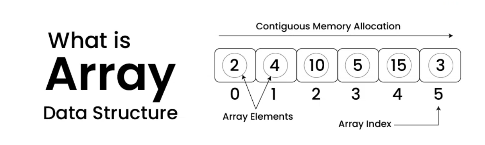
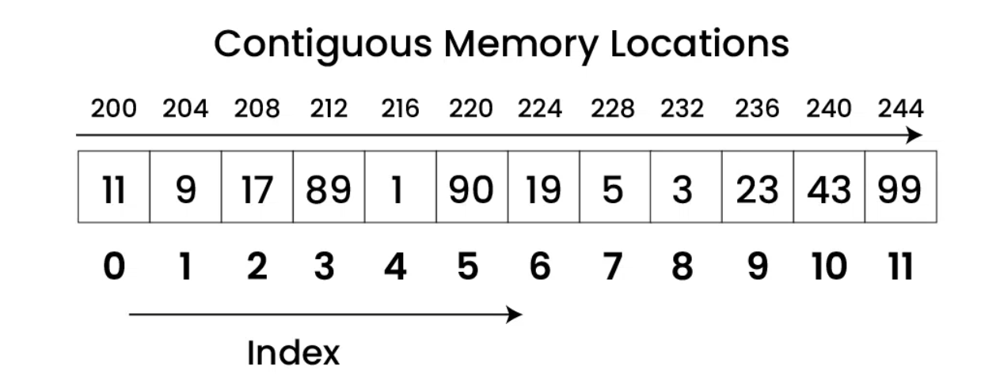

> **Array** is a collection of elements of **same data type** stored at _contiguous memory locations_

- The idea is to store _multiple items of the same type together_ in one place.
- It allows the processing of a large amount of data in a relatively short period.

✏️ Location of next index depends on the data type we use.

## Characteristics

- Arrays are index-based DS i.e. each element can be identified by index thus _faster lookups/search_
- Arrays can handle complex data structures by storing data in a two-dimensional array, aka `matrix`
- Array is used to implement other DB liks `stack`, `queue`, `heaps`, `hashtable`, etc

✏️ The base value of index is **0** and the difference between the two indexes is the **offset**

## Operations

There are different operations possible in an array, like

- _Initialization_ - can be initialized with values at the time of _declaration_ or later using an _assignment statement_.
- _Searching_ - Arrays can be searched for a specific element using `linear search` or `binary search` algorithms
- _Sorting_ - Elements in an array can be sorted in ascending or descending order using algorithms like `bubble sort`, `insertion sort`, or `quick sort`
- _Inserting_ - Elements can be inserted into an array at a specific location, but this operation can be time-consuming because it requires shifting existing elements in the array
- _Traversing_ - The elements in an array can be traversed in order, visiting each element once
- _Updating_ - Elements in an array can be updated or modified by assigning a new value to a specific index.
- _Deleting_ - Elements can be deleted from an array by shifting the elements that come after it to fill the gap.

These are some of the most common operations performed on arrays. The specific operations and algorithms used may vary based on the requirements of the problem and the programming language used.

❓ **Is the array always of a fixed size**

The array has a fixed size meaning once the size is given to it, it cannot be changed i.e. you can’t shrink it nor can you expand it.

- The reason was that for expanding if we change the size we can’t be sure ( it’s not possible every time) that we get the next memory location to us for free.
- The shrinking will not work because the array, when declared, gets memory statically allocated, and thus compiler is the only one that can destroy it.

## Applications

- Used in **solving matrix problems**.
- It helps in implementing a **sorting algorithm**.
- It is also used to implement other data structures like `Stacks`, `Queues`, `Heaps`, `Hash tables`, etc.
- As a lookup table in computers.
- The array is used in many management systems like a library, students, parliament, etc.

## Real-Life Applications of Array:

An array is frequently used to store data for mathematical computations.

- It is used in **image processing** and **record management**.
- **Book pages** are also real-life examples of an array.
- It is used in ordering boxes as well.
