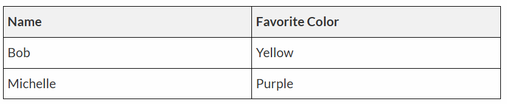
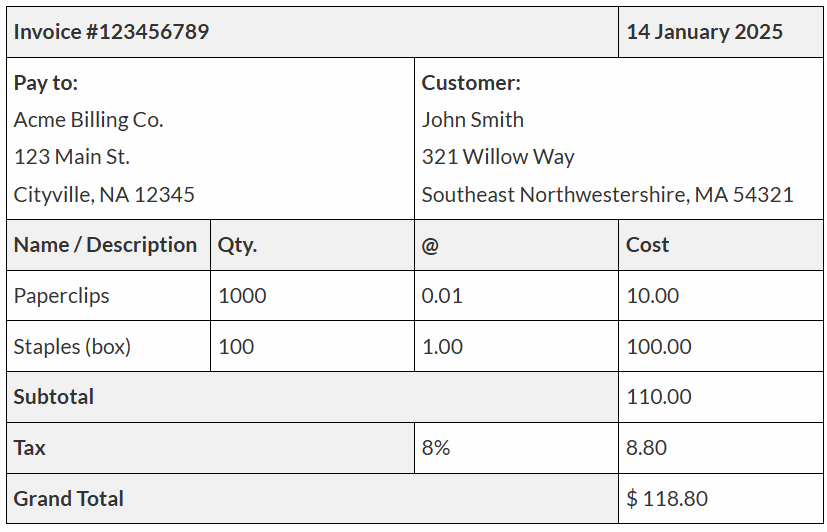

> Tables are used in HTML documents (web pages) to present tabular data.

## Using Tables

- A table is defined using the `<table>` element, and contains a number of table cells ( `<td>`, for “table data” ) which are organized into table rows ( `<tr>`). The markup (HTML code) for a table is always based on rows, never columns.
- Table cells which act as column headers or row headers should use the `<th>` (table header) element.
- Table cells can be merged using the colspan and rowspan attributes.
- Tables can be broken into sections using the following elements:

1. `<thead>` — Table header. The `<thead>` element is used to identify one or more rows of a table that contain column labels rather than table data.
2. `<tbody>` — Table body. The `<tbody>` element must be a direct descendant of a `<table>` element and is used to identify `<tr>` elements that comprise the body of the table. The `<tbody>` element should always come after a `<thead>` element and may come before or after a `<tfoot>` element. `tbody` contains the body, or primary content, of an HTML table.
3. `<tfoot>` — Table footer. The `<tfoot>` element identifies one or more `<tr>` elements as containing summary contents of a table's columns. The `<tfoot>` element must be the direct descendant of a `<table>` element. In HTML5, `<tfoot>` can be placed either before or after `<tbody>` and `<tr>` elements, but must appear after any `<caption>`, `<colgroup>`, and `<thead>` elements.

- A caption can be added to a table using the `<caption>` element.
- You can use `<col>` and `<colgroup>` to define table columns for styling. However, there are a number of limitations with this practice.

### Simple Table

```html
<table>
  <tr>
    <th>Name</th>
    <th>Favorite Color</th>
  </tr>
  <tr>
    <td>Bob</td>
    <td>Yellow</td>
  </tr>
  <tr>
    <td>Michelle</td>
    <td>Purple</td>
  </tr>
</table>
```



### Complex Table

```html
<table>
  <caption>
    A complex table
  </caption>
  <thead>
    <tr>
      <th colspan="3">Invoice #123456789</th>
      <th>14 January 2025</th>
    </tr>
    <tr>
      <td colspan="2">
        <strong>Pay to:</strong><br />
        Acme Billing Co.<br />
        123 Main St.<br />
        Cityville, NA 12345
      </td>
      <td colspan="2">
        <strong>Customer:</strong><br />
        John Smith<br />
        321 Willow Way<br />
        Southeast Northwestershire, MA 54321
      </td>
    </tr>
  </thead>
  <tbody>
    <tr>
      <th>Name / Description</th>
      <th>Qty.</th>
      <th>@</th>
      <th>Cost</th>
    </tr>
    <tr>
      <td>Paperclips</td>
      <td>1000</td>
      <td>0.01</td>
      <td>10.00</td>
    </tr>
    <tr>
      <td>Staples (box)</td>
      <td>100</td>
      <td>1.00</td>
      <td>100.00</td>
    </tr>
  </tbody>
  <tfoot>
    <tr>
      <th colspan="3">Subtotal</th>
      <td>110.00</td>
    </tr>
    <tr>
      <th colspan="2">Tax</th>
      <td>8%</td>
      <td>8.80</td>
    </tr>
    <tr>
      <th colspan="3">Grand Total</th>
      <td>$ 118.80</td>
    </tr>
  </tfoot>
</table>
```



### About Table-Based Layout

It was common in the early days of the web to use tables as a layout device. Before the advent of modern standards-based browsers, this was the easiest way to make sure that page elements were arranged properly on the screen.

This design pattern is now considered very bad. It is bad for the user experience, bad for SEO, and bad for developers who have to maintain pages.

You should not use table-based layout under any circumstances. Instead, check out our CSS Tutorials to start learning about modern web site layout.

However, that doesn’t mean you should avoid tables — tables should be used whenever you need to present information in a tabular format.

## Table tags

| Tag          | Attributes                           | Notes                                                                   |
| ------------ | ------------------------------------ | ----------------------------------------------------------------------- |
| `<table>`    |                                      | Defines a table                                                         |
| `<thead>`    |                                      | Groups the header content in a table                                    |
| `<th>`       |                                      | Defines a header cell in a table                                        |
| `<td>`       |                                      | Defines a cell in a table                                               |
| `<tfoot>`    |                                      | Groups the footer content in a table                                    |
| `<tbody>`    |                                      | Groups the body content in a table                                      |
| `<caption>`  | align<br/>valign                     | Defines a table caption                                                 |
| `<col>`      | span<br/>align<br/>bgcolor<br/>width | Specifies column properties for each column within a <colgroup> element |
| `<colgroup>` | align<br/>span<br/>width             | Specifies a group of one or more columns in a table for formatting      |
