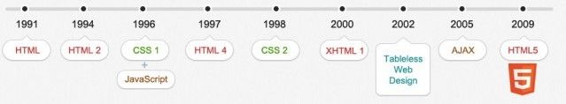
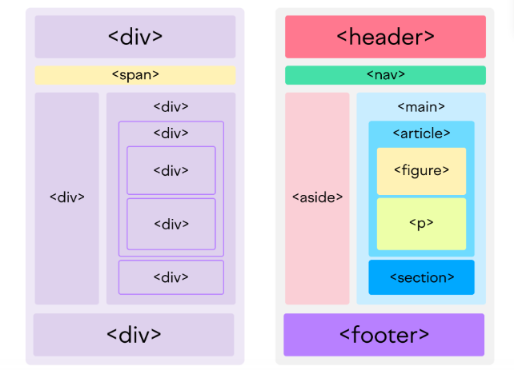
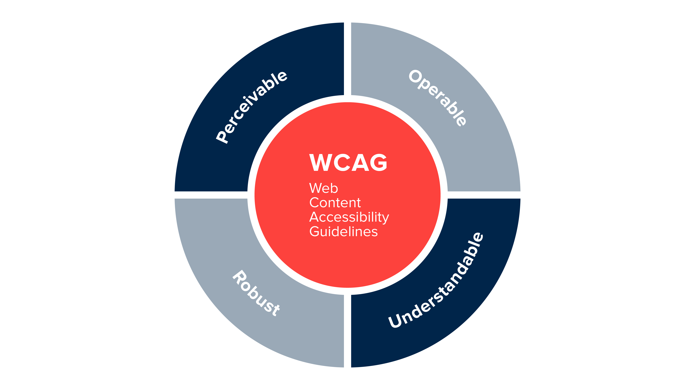

## What is HTML ?

- **H**yper**T**ext **M**arkup **L**anguage, is the language used for web documents(aka web page).
- `Hypertext` means texts that contains links to other texts.
- not a programming language, but rather a language that identifies the meaning, purpose, and structure of text within a document.

### History of HTML



- `HTML` has been in constant development. The specification is managed by the [World Wide Web Consortium](https://www.w3.org/).
- A web page is no longer just a document; it is likely to be a full-scale web application. And even when it is **“just a document”**, we want search engines and other tools to understand the content of the website

❓**Why did HTML have to change?**

Because the web has changed.

## What is `HTML5`?

- `HTML5` is the latest specification of the HTML language
- Most of the individual changes are a result of larger objectives in the design of the language. These objectives primarily include:
  - Encouraging semantic (meaningful) markup
  - Separating design from content
  - Promoting accessibility and design responsiveness
  - Reducing the overlap between HTML, CSS, and JavaScript
  - Supporting rich media experiences while eliminating the need for plugins such as Flash or Java

### Encouraging Semantic Markup



- Semantic markup means markup which has meaning, rather than markup which simply looks a certain way. For example, the `<h1>` tag implies that the content of the element is the title or headline of the entire document. That semantic meaning would be lost if we just made the text bold and large without using the appropriate tag
- In previous versions of the language, common structural elements like page headers, navigation menus, and main content sections were all indicated with the same HTML element, the `<div>` tag. In HTML, there are a host of new semantic elements intended to indicate the basic structure of a page:
  - `<header>`
  - `<nav>`
  - `<main>`
  - `<article>`
  - `<aside>`
  - `<section>`
  - `<footer>`
- New text-level (inline) elements have also been introduced, such as `<address>` and `<time>`. These help search engines and other services to easily find information on a page, for display in other contexts. At the same time, existing inline elements which produce various effects like bold, italic, and underline have been refined or redefined to imply specific semantic meaning.

### Separating Design From Content

- Along with strongly encouraging semantic (meaningful) markup, the HTML5 specification strongly discourages non-meaningful markup — markup intended only to tell the browser how to display things. This includes things like:

  - declaring fonts and text colors
  - setting text alignment or justification
  - placing borders on tables
  - defining how text wraps around images

- primarily two reasons to prefer this separation:

  - It is easier to maintain and redesign a site if the style declarations are confined to CSS
  - Users view web content in a lot of different contexts — desktops, laptops, tablets, mobile phones, RSS readers, and many others. Styles and design decisions that make sense in one environment don’t always make sense in another. So it is much better to provide semantic information and let the content be adapted to the context

### Promoting Accessibility and Design Responsiveness

> Not everyone interacts with the web the same way you do.



- **“Conventional”** devices — desktops, laptops, tablets, and phones — present a wide range of screen sizes, screen aspect ratios, display resolutions, and user interaction experiences. This variety alone should be enough to encourage semantic and responsive design practices. But not everyone uses a **“conventional”** browser.
- Blind and visually impaired persons browse the web also, and they use a variety of assistive technologies to do so. Screen readers that translate a site’s content into speech, specialized browsers that strip out styling and present highly magnified or high-contrast text, braille interpreters, and keyboard-based navigation all allow those with non-standard vision to interact with websites.
- And all of these technologies are hindered by markup which tries to “hard-code” design and styling into the content of a page.

- You should always include the lang attribute inside the `<html>` tag, to declare the language of the Web page. This is meant to assist search engines and browsers.

```html{2}
<!DOCTYPE html>
<html lang="en">
  <body>
    ...
  </body>
</html>
```

### Reducing the Overlap Between HTML, CSS, and JavaScript

> Three languages define front-end web development — `HTML`, `CSS`, and `JavaScript`.

- No one sat down at the beginning of the internet and figured what types of things belong to each language. They each evolved in parallel to each other, often overlapping in functionality and scope.

- Besides the practical considerations enumerated above, there has also been a focus on defining the nature and purpose of these languages, and limiting them (or expanding them) so that they do what is in their nature to do:
  - `HTML` — Content
  - `CSS` — Design
  - `JS` — Interactivity
- Remembering this can help one determine which language to use, especially in cases where it is possible to do something in more than one way. For example, if you want to change the color of something, your very first thought should be to use CSS. On the other hand, if you want to change the color of something in response to a user input, you probably want to use JavaScript.

### Supporting Rich Media Experiences While Eliminating the Need for Plugins Such as Flash or Java

- As bandwidth and internet speed have increased, we have moved more and more toward using the internet as a media platform. HTML was originally created for (hyper-)text documents, with perhaps a few images, not rich media pages with audio and video.

- When people first started adding these types of experiences to web pages, they required users to add special plugins to their browsers. These performed poorly, limited user options, and opened up security holes. They required developers to write core web page functionality in other languages like Flash or Java. The content was hidden from search engines and screen readers.

**It was a mess.**

- Now, HTML5 provides support for media with elements like `<video>` and `<audio>,` while `<canvas>` provides a defined space for JavaScript-created drawing and graphics. New form elements, along with better integration between HTML5, CSS, and JavaScript has made it possible to create full-scale web applications using the three languages that are native to the web browser, without plugins or add-ons.

## Why Use HTML5?

> The most straight-forward answer to that question is simply that it is the **current, “right” version of the language**.

- But some people seem unconvinced by this fact. Older markup practices still work in most browsers — if you type `` onto your web page, the text will flow around the image just the way you’d expect. Why not just do that? It’s easier!

- There are a number of reasons to prefer `HTML5`, and to avoid using any of the deprecated features. Some are practical, while others are more philosophical. Some are altruistic, while others are selfish.

  - Easier to write
  - Easier to maintain
  - Easier to redesign
  - Better for Search Engine Optimization
  - Better for the blind and visually impaired
  - Better for content aggregators and feed readers
  - Better for users on mobile devices
  - Better for users on slower internet connections
  - Fewer chances of design breaks
  - Easier to add media
  - Easier to create interactive applications
  - Deprecated features will likely stop being supported at some point, breaking your page

## How Use HTML5?

### Avoid Deprecated Features

- You don’t have to memorize the list, though. All you really have to remember is that if you want to affect the way something looks on a page

| TAGS            | DESCRIPTION                               | Alternate Tags                  |
| --------------- | ----------------------------------------- | ------------------------------- |
| `applet` tag    | Specify an applet                         | `object` tag                    |
| `basefont` tag  | Specify a basefont                        | _font style sheets_             |
| `center` tag    | Use to specify a centered Text            | _text-align:center_             |
| `dir` tag       | Specify a directory list                  | `ul` tag                        |
| `embed` tag     | Embed an application to HTML document     | `object` tag                    |
| `font` tag      | Used to specify font text, size and color | _font-family, font-size, color_ |
| `isindex` tag   | Specify a single-line input field         | `form` tag                      |
| `menu` tag      | Specify a menu list                       | `ul` tag                        |
| `plaintext` tag | Specify a plaintext                       | `pre` tag                       |
| `xmp` tag       | Specify preformatted text                 | `pre` tag                       |
| `s` tag         | Specify a strike through text             | **text-decoration**             |
| `strike` tag    | Specify a strike through text             | **text-decoration**             |
| `u` tag         | Specify underlined text                   | **text-decoration**             |

### Learn to Use the New Features

- It’s a good idea to spend some time browsing the new Features so that you are aware of what’s available.

### Get Comfortable With CSS

- Many of the deprecated features were used to achieve design and styling effects. These are now properly the domain of CSS. If you want to be a modern web front-end developer, you’ll spend some time getting good at using CSS.

### Use the HTML5 <!DOCTYPE> Declaration

- All HTML5 documents should begin with a tag that indicated the document is, in fact, supposed to be valid HTML5. That looks like:

`<!DOCTYPE html>`

- This should be the very first thing in a document, before the `<html>` tag, and before any whitespace.

### Don’t Close Null Tags

- A **“null”** or **“empty”** element is an element that has no content. These include:
  - ``
  - `<br>`
  - `<hr>`
- Surprised that an `` element has no content? The image itself is an attribute of the tag, not the content.

- In some previous versions, `HTML` (those based on the `XML` standard) required these elements to be closed with a slash.

```html
<!-- Self-closing null elements -->


<br />
<hr />
```

This is no longer required.

```html
<!-- The HTML5 way -->


<br />
<hr />
```

### Validate Your Pages

- Finally, you should make it a habit to validate your HTML documents against the specification. This means using an automated tool to check whether the markup adheres to the standard or not.

- The W3C provides an official [Markup Validation Service](https://validator.w3.org/), which allows you to quickly check your pages against the HTML5 specification (and older specs too, if you like).

## What are Tags and Attributes?

- Tags and attributes are the basis of HTML.
- They work together but perform different functions – it is worth investing 2 minutes in differentiating the two.

### What Are HTML Tags?

Tags are used to mark up the start of an HTML element and they are usually enclosed in angle brackets. An example of a tag is: `<h1>`.

Most tags must be opened `<h1>` and closed `</h1>` in order to function.

### What are HTML Attributes?

Attributes contain additional pieces of information. Attributes take the form of an opening tag and additional info is placed inside.

An example of an attribute is:

```html

```

In this instance, the image source (`src`) and the alt text (`alt`) are attributes of the  tag.

### Golden Rules To Remember

The vast majority of tags must be opened (<tag>) and closed (</tag>) with the element information such as a title or text resting between the tags.
When using multiple tags, the tags must be closed in the order in which they were opened. For example:

```html
<strong><em>This is really important!</em></strong>
```

[Learn](https://html.com/#other-tutorials)

[tag cheetsheet](https://html.com/wp-content/uploads/html-cheat-sheet.pdf)
