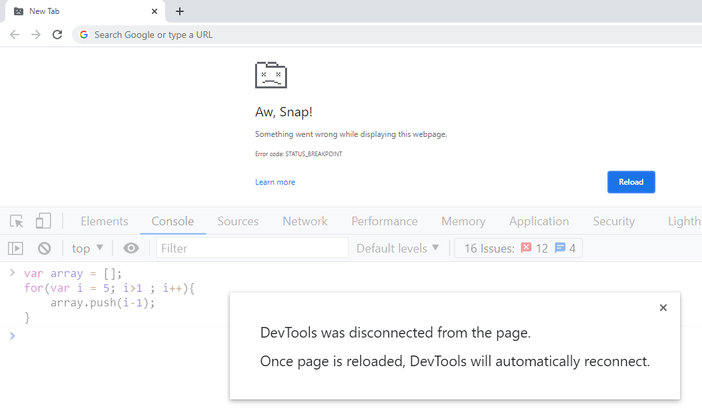
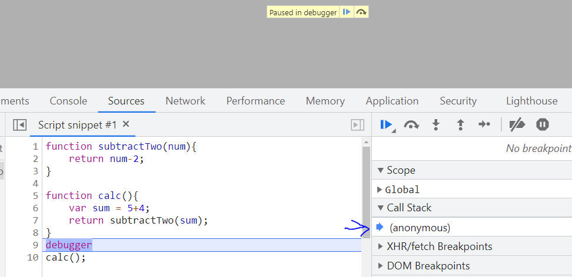
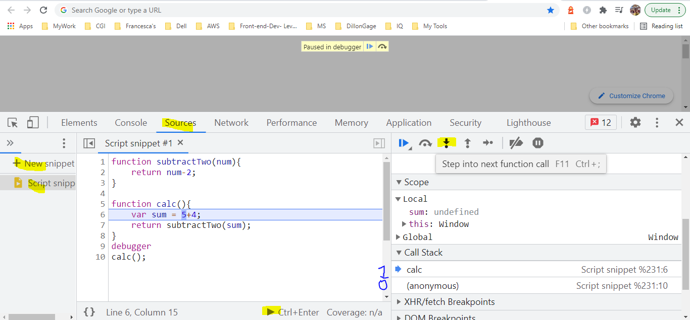
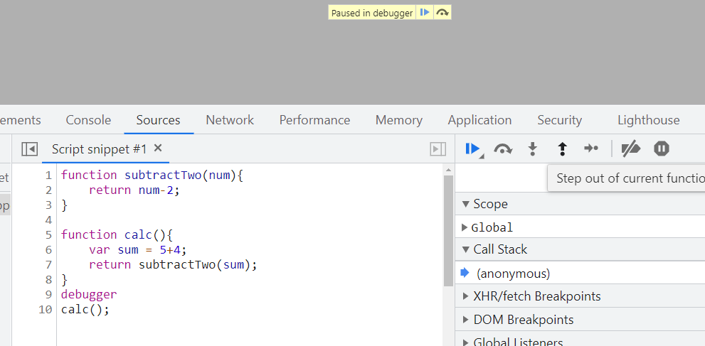
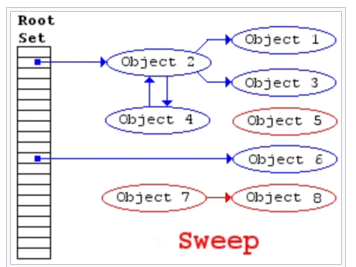
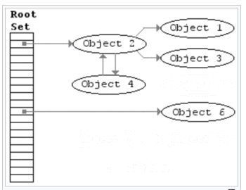
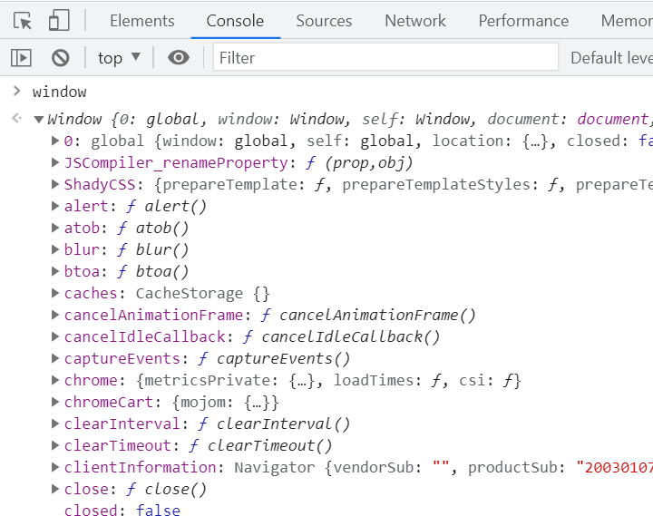

 

Almost everyone who has worked with JS, has heard about JS Engine

- JS is a single-threaded language that uses callbacks or Callback-Queue
- JS is interpreted or compiled?


So if you write some English-like statement/code in your JS file. And if you directly provide this JS file as input to your computer, it might raise a flag that it does understand JS language.


JS engine is going to take it as input and convert it to output that is more familiar to a machine (machine code)

## Inside JS Engine

So, we learned that JS Engine is the one who takes our JS file/code and converts that to machine code to be understandable by machine
Let's look inside the popular engine used by chrome and NodeJS i.e. Google's V8 JS Engine


So when you give a JS file to the JS engine to run it

- **Parser**: It performs lexical analysis, which breaks the code into something called tokens-based JS grammar /keywords to identify the meaning of code to determine what code is trying to do

- **AST**: These tokens then form an AST (Abstract Syntax Tree). Tool > https://astexplorer.net/ > AST looks gibberish to humans but it allows JS Engine to understand what code is trying to do

- **Interpreter**: Translate the source code into machine code, do it by reading line by line execute it. Of course, the source code still needs to be converted into machine code, but it simply happens right before it’s executed and not ahead of time

  

  for eg 

  ```javascript
  function sumCalculation(x y){
      return x + y;
  }
  for(let i = 0; i < 1000; i++){
      sumCalculation(5,4);
  }
  ```

  The interpreter starts reading the source code from top to bottom
  first it read line 1 and understands that the function **`sumCalculation`** is declared and then line 2 then line 3 and understands the function body and finally executes it before jumping to line 4

  and at the line, it reads for keyword and understands that the for loop is declared follows be reading line 4 and line 6 and understands the expression that it needs to iterate and finally executes for-loop before jumping to the next line of the source code (which EOF in our case)

  then for each iteration of the loop it's going to execute line 1 then line 2 then line 3.

  > in this approach even though the result of someCalculation remains the same it executes the function for each iteration

- **Profiler**: Covered in the next topic

- **Compiler**: Translate the source code into machine code, does it by reading source code in one go and execute it i.e. Compiler works ahead of time to create a translation of the source code which is translated into bytecode(closely related to machine code i.e. understandable my machine)

  

  for eg

  Input to compiler ( source code in one go )

  ```javascript
  function someCalculation(x y){
      return x + y;
  }

  for(let i = 0; i < 1000; i++){
      console.log(someCalculation(5,4));
  }

  ```

  output of compiler ( optimized bytecode )

  ```javascript
  function someCalculation(x y){
      return x + y;
  }

  for(let i = 0; i < 1000; i++){
      console.log(9));
  }
  ```

❓ _Interpreter or compiler?_

Both have their pros and cons
| Interpeter | Compiler |
| --------------------------------------------------------------------------------------------------------------------------------------- | --------------------------------------------------------------------------------------------------------------------------------- |
| - Faster to get up and running <br />- But it get slower in execution as it doesn't do any kind of optimization in case of huge JS code | - Slower to get up and running <br />- But it is faster in execution as it does some sort of optimization in case of huge JS code |

**Can we have the best of both worlds?**

JIT compiler, Let's understand how Google's v8 engine does this


Initially

Source code -> **Parse** -> **AST** -> **Interpreter** -> **bytecode** (aka ignition i.e. to execute our code asap)

- **Profiler**: Monitors and watches the code as it runs and makes notes on how we can optimize this code: how many times it has been run? what types are used? How possible to optimize this?

  Now as the bytecode from the interpreter is running, a copy of the source code is given to the compiler along with the optimization notes from the profiler and generates the optimized bytecode.

  This means the JS code given to the V8 engine is going to gradually improve because the profiler and compiler are constantly improving bytecode as the app is running i.e. why called as JIT compiler

  Finally, it mixes and matches or replaces bytecode from the interpreter with optimized bytecode from compiler to run on the machine and this constantly runs through this loop
  Compiler as the app is running, takes the bytecode

- **Interpreter** JS is interpreted?

  Yes, Initially when JS first came out, a JS Engine like SpiderMonkey created by Brendon Eich interpreted JS to bytecode and that engine was able to run inside our browser to tell our computers what to do. But things are evolved now to use profiler and compiler aka JIT compiler to optimize this code

- **Compiler** JS is compiled?

  Yes, it depends on the implementation of modern JS Engine

- **JIT Compiler** JS is JIT compiled?

  Yes, eg v8 engine by google

So far we learned that JS Engine does a lot of work for us, but the more important thing is reading our code and executing it which has 2 most important steps

- Heap
- Call Stack

## Understanding Heap


A place to store and write information (variables, objects, etc) --> Memory Heap --> used by JS engine for memory allocation

```javascript
const number = 100; // allocate memory for number
const string = "hi"; // allocate memory for string
const human = {
  // allocate memory for object ...and its values
  name: "Nikhil",
  age: 28,
};
```

### Memory Leaks

eg.

```javascript
var array = [];
for (var i = 5; i > 1; i++) {
  array.push(i - 1);
}
```

Execute the above code in the console tab of dev tools in chrome and see what happens



3 common memory leaks with eg

```javascript
// global variables
var a = 1;
var b = {
  name: "Nikhil",
};

// adding event listeneners and not removing it
var element = document.getElementById("button");
element.addEventListener("click", () => {});

// variables or objects referenced in callback of setInterval
setInterval(() => {
  // referencing object...
  // these objects are never garbage collected...
}, 1000);
```

## Understanding Call Stack


A place to store and keep track of what is happening line by line on our code --> Call Stack - used by JS engine to keep track of where your code is, in execution

```javascript
function subtractTwo(num) {
  return num - 2;
}

function calc() {
  var sum = 5 + 4;
  return subtractTwo(sum);
}
debugger;
calc();
```

- Run above code as snippet in Source tab of Developer console of chrome
  
- Notice when you execute script with debugger, script paused on debugger and even before calc function is called, there is something in the call stack named--> anonymous aka Global Execution Context which is something that will discuss in later topics
  
- When you press F11 Step into, calc method is pushed into call stack
  
- When you press F11 step 2 times, subtractTwo method is also pushed into the call stack

  > We are not done executing `calc()` instead `calc()` is called `subtractTwo()` and the call stack keeps track of the execution of code. Clearly looking at the call stack, I can say that we are `subtractTwo()`.

  

- When you press the F11 step 2 times, subtractTwo method is done executing and popped out from call stack
  
- When you press F11 step again, the calc method is done executing and popped out from the call stack
- Finally, you can press F8 ( resume script execution )

### Stack Overflow


The most common way to create stack overflow is using recursion
For eg

```javascript
function inception() {
  inception();
}
inception();
```

Execute the above code in the console tab in dev tools in chrome


### Garbage Collection

- JS is garbage-collected language.

  

- When JS allocates memory i.e. within a function we created object, the object gets stored somewhere in our memory heap, automatically when JS finishes executing my function and let's say we don't want that object anymore
- JS is going to automatically clean it up for us and free up the memory heap So only the data that's useful to us i.e. my program is still referring to will remain. This makes sure that we don't use all the memory that is available as we know memory is limited
- So in garbage collected language like JS, garbage collector frees up the heap memory and prevents what we call memory leaks

❓ _Does that mean you completely rely on a garbage collector for heap memory management?_

❓ _How Garbage collection works in JS?_

It works on Mark and Sweeps algorithm






eg 1.

```javascript
1. var human = {
2.    name:'Nikhil',
3.    age:28
4. }
5. human = 5;
```

> The object is no longer referenced by `human` variable that makes it eligible for garbage collection after code at line 5 is executed

eg 2.

```javascript
function logHuman() {
  var human = {
    name: "Nikhil",
    age: 28,
  };
  console.log(human);
}
```

> Once `logHuman()` is done executing, object referenced by human variable is eligible for garbage collection
> In another way, we can say the scope for the human object is over after the execution of `logHuman()`

### Single Threaded


Being single-threaded means that only one set of the instructions is executed at a time, it is not doing multiple things
Reason for being single-threaded --> is that it has only 1 call stack.

❓ _What is the issue with Single threaded language?_

eg

```javascript
alert(
  "This is long running synchronous script - blocking interactivity untill callstack is empty "
);
```

Run above code in console tab in dev tools of chrome


❓ _Why would anyone like to block their application?_

❓ _So don’t you think, the synchronous behavior of JS makes it less popular?_

Most of the time you won't be directly accessing or using JS Engine (which is synchronous).
We need to introduce the idea of async code.
It's not only the JS engine executing our code but the JS Runtime (NodeJS implements something similar) which beyond just JS Engine

## Understanding JS Runtime


To overcome the single-threaded nature of JS, JS Runtime came into the picture.

JS Runtime comprises 3 main components

### JS Engine

Already covered

### Browser Web API

These are application that can do variety of things like send Http request, listen to DOM events (click, change), setTimeout, localStorage sessionStoage, indexedDB etc) - all are async operations.

So browsers, make use of LLL like c++ instead of JS Engine and blocking the thread to perform these async operations in the background and these APIs are called Web APIs (which are asynchronous, meaning they do something in background and return the data back to JS Engine)

### Event Loop and Callback Queue

JS runtime in action

- We have items on the call stack and as soon as something comes up like setTimeout i.e. not part of JS but part of Web API

- Call Stack is going to say "I have something that is not here for me, it's for the web browser (Web API). So it says hey Web API this is something for you, I don't know what to do with this, please take care of it" and Web API is going to say "Ahh I know that to do with setTimeout, let me take care of it and do that in the background"

- Once the (setTimeout) the async operation is served by Web API, it will push the data (usually a callback) of async operation into Callback Queue

- Event Loop continuously checks if there is any callback in the Callback Queue and whether the Call Stack is empty or not, If Call Stack is empty then the Event loop is going to pop the callback from Callback Queue and push it into Call Stack and now JS Engine execute it.
  eg1a

```javascript
console.log("1");
setTimeout(() => console.log("2"), 3000);
console.log("3");
```

    o/p
    1
    3
    2

eg1b

```javascript
console.log("1");
setTimeout(() => console.log("2"), 0);
console.log("3");
```

    o/p
    1
    3
    2

eg2

👉 [Latent Flip tool](http://latentflip.com/loupe/?code=ZnVuY3Rpb24gYWNoaWV2ZUNob2NvbGF0ZSgpew0KICAgIGNvbnNvbGUubG9nKCdZb3UgYWNoaWV2ZWQgQ2hvY29sYXRlJyk7DQp9DQpmdW5jdGlvbiBjKCl7DQogICAgc2V0VGltZW91dChhY2hpZXZlQ2hvY29sYXRlLCAzMDAwKTsNCn0NCmZ1bmN0aW9uIGIoKXsNCiAgICBjKCk7DQp9DQpmdW5jdGlvbiBhKCl7DQogICAgYigpOw0KfQ0KYSgpOw%3D%3D!!!PGJ1dHRvbj5DbGljayBtZSE8L2J1dHRvbj4%3D)

and paste

```javascript
function achieveChocolate() {
  console.log("You achieved Chocolate");
}
function c() {
  setTimeout(achieveChocolate, 3000);
}
function b() {
  c();
}
function a() {
  b();
}
```

❓ _Explain briefly **JS** Vs **JS Engine** Vs **JS Runtime**?_

JS > Musical Notes

JS Engine > Music Composer

JS Runtime > Music Orchestra


