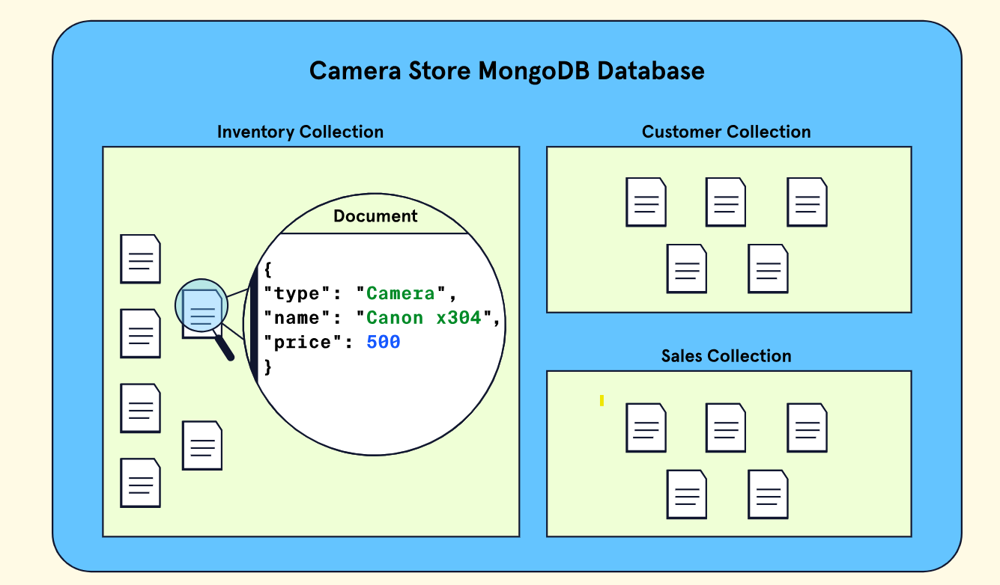

> How data is stored in MongoDB

## Intro
By now, we know that MongoDB is a NoSQL document database and that databases like these have some distinct differences relative to relational databases. In this article, we will dive deeper into the technical aspects of the data that is stored inside of a MongoDB database.

Specifically, we will:

- Dive deeper into how MongoDB stores data via collections and documents
- Gain familiarity with two data file formats: JSON and BSON
- Examine how these data formats are related to data stored in MongoDB

Let’s get started!

## Collections and Documents

- Recall that MongoDB uses the document model i.e., that data stored in a MongoDB database resides in a `document` within a `collection`.

❓**But what does that actually look like**

To help better visualize the document model, let’s imagine we are using MongoDB to run our camera store. Naturally, we need to keep track of `purchases`, our `customers`, etc. Let’s break down each layer of the store’s database.

- At the highest level, we have our database – an instance of MongoDB that contains all the various data our store needs to operate.

- Within this instance of MongoDB are `collections`. `Collections` are subsets of our data.

- So, assuming our database contains three types of data – purchase data, inventory, and customer info – each of these would have its own collection.

- Within each collection, we store `individual records` called `documents`. These documents all belong to that particular subset of our data.

So, for example, within the customer collection, we could store personal information about each of our customers. Every customer would have their own document within the collection.

To summarize,

- A `document` is simply a record that stores information about a particular entity.
- A `collection`, in turn, is just a group of documents containing similar information.
- A `MongoDB database` is just a number of collections assembled together to store data for a specific use case – in this case running our camera store.

This is what the hierarchy would look like visually:


Now that we have a general idea of how data is stored in a MongoDB database, let’s take a closer look at documents and how the information they contain is formatted for flexible storage.

❓**Which of the following correctly describes the structure of a MongoDB database**

> A database contains collections; these collections contain documents that store individual records of data.

## Data as JSON

- One of the main advantages of using a `document database` is the flexibility it provides with respect to how data is stored.
- In the case of MongoDB, this flexibility comes partly from a data format called **J**ava**S**cript **O**bject **N**otation aka `JSON`. JSON is simply a text format for storing data.
  Here is what JSON looks like:

```json
{
  "name": "Rodney",
  "occupation": "photographer",
  "years_of_experience": 7
}
```

In the above example, we have JSON that stores information about a job applicant for a position at our camera store.

✏️:that JSON stores data as what is known as “key-value” pairs, which are always within a pair of curly braces (“{ }“).

MongoDB and various online resources also refer to these pairs as `field-value` or `name-value` pairs. For simplicity, we will refer to them as “field-value” pairs. Here is a breakdown of what fields and values mean in the context of JSON:

### Fields

> A field is a unique identifier for a data point; it tells us what kind of data is being stored.

In the job application JSON we just examined, the fields are `"name"`, `"occupation"`, and `"years_of_experience"`. Note that JSON field names must be double-quoted (""). There are a number of opinions with respect to how these names should be formatted.

### Values

> Every field has an associated value. The values are the data points themselves.

In our camera store applicant example, the values are `"Rodney"`, `"photographer"`, and `7`, each of which corresponds to their respective field. Note that JSON can host a variety of data types in value fields such as `strings`, `numbers`, `arrays`, or even `nested data`. Additionally, each of these field-value pairs must be separated by a comma `,`.

- The primary advantage of JSON is readability and flexibility. Data is stored in an easily editable format that is totally comprehensible to humans as well as our computers.

However, convenience ultimately comes at a price. There are three main drawbacks to storing data as JSON:

- JSON is inefficient from a computational perspective as text is time-consuming to parse.

- Its readability as text also means that it is not efficient storage-wise. For example, it might be helpful for us to have descriptive names of fields, but they tend to be longer and, for that reason, take up more space.

- JSON only supports a very limited number of data types – dates, for instance, are not supported natively.

> While there are some clear advantages to using JSON to format data, these drawbacks make JSON a poor choice as a primary storage format inside databases. i.e., why MongoDB invented BSON.

## Data as BSON

**B**inary Java**S**cript **O**bject **N**otation, aka `BSON`, is the format that MongoDB uses to store data.

`BSON` is different than JSON in three fundamental ways:

- `BSON` is not human-readable.
- `BSON` is far more efficient storage-wise.
- `BSON` supports a number of data formats that JSON does not like dates.

Our same JSON object from earlier looks like this in BSON:

```bson
\x00\x00\x00\x02name\x00\a\x00\x00\x00Rodney\x00\x02occupation\x00\r\x00\x00\x00photographer\x00\x10year_of_experience\x00\a\x00\x00\x00\x00
```

- While it may not be legible, MongoDB wrote the [BSON specification](https://bsonspec.org/) and invented the format to _bridge the gap between_ JSON’s **flexibility** and **readability** and the **required performance** of a large database.
- MongoDB **stores data** as `BSON` internally but allows users to **create and manipulate data** as `JSON`. i.e., `efficient data storage` and a `great developer experience`!

## IQ

We learned some of the basics of how data is stored in MongoDB. Specifically, we learned:

- A `MongoDB instance` can contain many `database(s)`,

  - `database` are `collection(s)` of similar data.
  - `collection` contain `individual record(s)`
  - `individual record` aka `document` that are stored as field-value pairs.

- `JSON` is a **human-readable** but **inefficient format for storing data**; conversely, `BSON` is **not human-readable** but is **highly efficient**.

- MongoDB **users** can **easily store and manipulate data as JSON** – **even though internally, that data is stored as BSON**.

- MongoDB’s use of the document model, combined with its dual use of `JSON` and `BSON`, makes it a highly efficient and usable option for storing data. To continue learning and get a more in-depth overview of MongoDB data, check out the following two guides on JSON/BSON from MongoDB:

  - [JSON and BSON Guide](https://www.mongodb.com/json-and-bson)
  - [Explaining BSON with Examples](https://www.mongodb.com/basics/bson)
