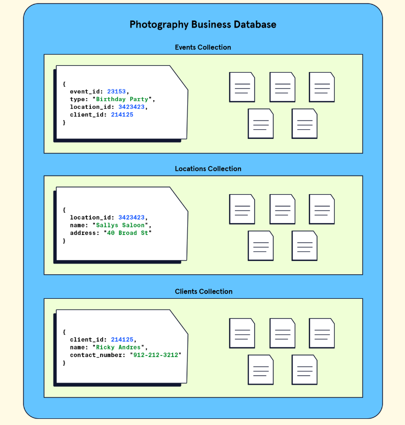
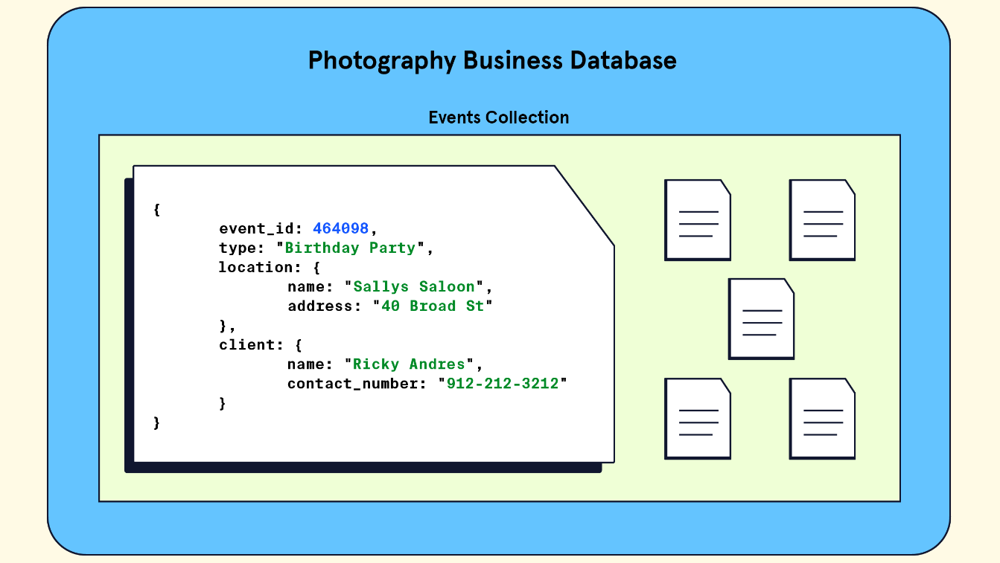

> In MongoDB, [database](https://www.mongodb.com/docs/manual/reference/glossary/#std-term-database) stores one or more collections of [documents](https://www.mongodb.com/docs/manual/reference/glossary/#std-term-document).

❓ **To select a database to use** issue the `use <db>` statement

```py
use myDB
```

❓ **To create a database**
- If a database does not exist, MongoDB creates the database when you first store data for that database. As such, you can switch to a non-existent database and perform the following operation in mongosh:

```py
use myNewDB

db.myNewCollection1.insertOne( { x: 1 } )
```
✏️: Be sure that both the database and collection names follow MongoDB [Naming Restrictions](https://www.mongodb.com/docs/manual/reference/limits/#std-label-restrictions-on-db-names).

> MongoDB stores data records as [documents](https://www.mongodb.com/docs/manual/reference/glossary/#std-term-document) (specifically [BSON documents](https://www.mongodb.com/docs/manual/core/document/#std-label-bson-document-format)) which are gathered together in [collections](https://www.mongodb.com/docs/manual/reference/glossary/#std-term-collection) in a [database](https://www.mongodb.com/docs/manual/reference/glossary/#std-term-database). 


❓ **To create a collection implicitly**

If a collection does not exist, MongoDB creates the collection when you first store data for that collection.

```py
db.myNewCollection2.insertOne( { x: 1 } )
db.myNewCollection3.createIndex( { y: 1 } )
```
Both the `insertOne()` and the `createIndex()` operations create their respective collection if they do not already exist

❓ **To create a collection explicitly**

MongoDB provides the `db.createCollection()` method to explicitly create a collection with various options, such as setting the maximum size or the documentation validation rules. If you are not specifying these options, you do not need to explicitly create the collection since MongoDB creates new collections when you first store data for the collections.


## Intro

- When working with databases, we typically are given a blank slate with regards to what data we want to store. However, one of our most important decisions is not just the data we store but also how the data will be organized.
- Recall that with MongoDB, as opposed to a relational database, we have the flexibility to organize our data without the constraint of a predefined schema.
- The absence of a schema-based structure means **we will have to think even more deeply about how we will structure our data**. This concept is called `data modeling`.

### Data modeling

> process of developing and choosing a way to structure our data and its relationships.

The way we choose to organize our data has long-lasting implications on a database’s `scalability`, `maintainability`, and `performance`.

We will explore the techniques and processes behind data modeling in MongoDB. Specifically, we will:

- Discuss what it means to model data in a database and why it is important.
- Explore the two fundamental ways of representing relationships between data in MongoDB: embedded documents and references.
- Think through three data modeling case studies.

Let’s get started!

### The Importance of Data Modeling

> A data model is like a blueprint for our data.

- A good data model can provide structure and organization to what might be a diverse and complex set of information.
- A bad model can make even simple data challenging to work with.

Imagine, for instance, that we decide to use MongoDB to store information about our photography business. We want to store a few things: the name of the event we’re photographing, the location, and the client’s name. This data is relatively simple, but consider how two different ways of modeling it could change our database’s usability and efficiency.

First, let’s examine Model A:



In this model, we have three collections, one for the event details, one for the locations, and one for our clients. Each event corresponds to three documents in three separate collections. Our events document has a record of which location and client are related to the event via the `location_id` and `client_id` fields.

Alternatively, we have Model B:



In this model, we have one collection, an `events` collection, which has documents each containing three fields corresponding to the `event`, the `location`, and the `client`. The data is all nested into a single document.

Take a moment to think about these two models. What might be the implications of choosing each model?

- **Model A**:

  - This model might offer **better data integrity**. i.e., because data can be shared across multiple collections instead of being duplicated.
  - For e.g., we have a single location record in the location collection that multiple events can reference
  - Additionally, because we are not duplicating records, the overall usage of storage can be lower compared to Model B.
  - However, as previously mentioned, this model will likely take longer to query because we need to query three different collections to gather data.

- **Model B**:
  - This model might offer **performance benefits**. Any query for a single event will take less time (and likely developer effort) than **Model A** since we only have to query one collection.
  - As more and more documents get added, this model would see positive performance implications.
  - However, this model would have a higher occurrence of duplicated data. This is because each of the fields (e.g., location) is not shared across multiple collections. - So, for example, if we had a popular location (e.g. “Niagara Falls”) that was used across multiple events, we might have multiple copies of that value across multiple documents.

## Modeling Relationships in MongoDB

In addition to deciding the overall structure of our collections, another consideration is how to represent relationships between data. First, let’s think about why relationships between data are important. Take the example of a database that stores data about cars.

A document containing information about a car will likely have information like the color and size, which are attributes of the car itself. However, it may also contain information about the car’s engine.

The engine, being its own entity, possesses attributes separate from the overall car. If we want to store data about how powerful the engine is, it wouldn’t then seem quite right to make `engine_power` an attribute of the car since it is an attribute of the engine instead. In addition, we would have to ponder what the relationship between the car data and the engine are in the context of our whole database. We might ask, “Is the engine being shared amongst other cars in our database, or does it belong to only a single car?”

Our data modeling challenge would be to decide how best to represent the engine as a separate entity, its relationship to the car, and it’s relationship across the collection. To establish these types of relationships in MongoDB, we have two options: embedded documents or references. Let’s explore each of these options!

### Embedded documents

- One way to establish a relationship in MongoDB is to use embedded documents.
- This method allows us to nest data related to a document directly inside of it!
- These **nested documents** are called `sub-documents`. We already saw an example of this style when we looked at **Model B** of the photography database (feel free to pause and take a look again). Here is our car and engine example, modeled with an embedded document:

```json
// Car Document
{
  car_id: 48273
  model_name: "Corvette",
  engine: {
    engine_power: 490,
    engine_type: "V8",
    acceleration: "High"
  }
}
```

In the above example, notice how the engine data is nested inside the car document.

> This type of data model where we find related data lumped together into a single collection is known as a **denormalized data model**.

Additionally, the following scenarios are good use-cases for embedded documents:

- Modeling relationships where one entity contains another, also known as a **one-to-one relationship**. For eg., we can think of a database storing data with a relationship between a car and its unique license plate. Each record of a car has only one license plate.

- Modeling relationships that map one entity to many sub-entities, also known as an **one-to-many relationship**. For eg, we can think of a database storing data with a relationship between a car owner and their multiple-owned cars. Each record of a car owner can own multiple instances of a car.

### References

- In addition to embedded documents, we can define relationships by creating links between data. These links are called references.
- Using references, we can split our data into multiple documents and maintain their relationships.
- We already saw an example of this style when we looked at **Model A** of the photography database (feel free to pause and take a look again). Here is our car and engine example, modeled with references:

```json
//Car Document
{
  car_id: 48273
  model_name: "Corvette",
  engine_id: 2165
}

// Engine Document
{
  id: 2165
  engine_power: 490,
  engine_type: "V8",
  acceleration: "High"
}
```

In the above illustration, notice how the engine data is in a separate collection but is linked (via `engine_id`) into the `car` collection.

> This type of data model where we find related data via a link is known as a **normalized data model** and typically mimics how a relational database creates relationships between data.

Additionally, the following scenario is a good use case for references:

- Modeling relationships where many instances of one entity can be mapped to many instances of another entity, also known as **many-to-many relationships**.
- For eg, we can think of the relationship between car rentals and individuals renting the cars. A car can be rented by multiple individuals, and an individual can rent multiple cars.

### Choosing The Right Model

Choosing between `references` and `embedded` documents can be tricky.

Let’s consider three cases where we have to choose between an embedded or a reference-based model. For each case, try to first consider whether we would use references or embedded documents to model the relationships between the data.

**Case A**

A time management application that stores one user per task. We want to store details about the task, such as the task name, the task due date, and the user assigned to the task (and their associated details). There can only be one person assigned to each task.

- In this case, since we can only have one person assigned to each task, we are modeling a one-to-one relationship. Assuming we will often need the data for the user in addition to the task details, it might be preferable to use an embedded document since the information can be retrieved together in one query. Here is what our document might look using an embedded document:

```json
{
  "task": "Review Rough Outline",
  "due": "2022/09/03 09:00",
  "assignee": {
    "name": "Alex",
    "role": "SME",
    "contact": "alex@example.com"
  }
}
```

**Case B**:

A contact information management application that can store multiple addresses per user. The application would store important details for the person such as their name, as well as their associated addresses.

- In this case, since a single user can have multiple associated addresses, we are modeling a one-to-many relationship. There are two distinct ways we can implement the data model.
- First, we could use embedded documents. Our documents might look something like this:

```json
{
  "first_name": "Alex",
  "last_name": "Smith",
  "addresses": [
    {
      "label": "home",
      "value": {
        "address": "123 4th Street",
        "city": "Toronto",
        "region": "ON",
        "country": "Canada",
        "postcode": "M1S 2J8"
      }
    },
    {
      "label": "work",
      "value": {
        "address": "1633 Broadway 38th floor",
        "city": "New York",
        "region": "NY",
        "country": "USA",
        "postcode": "10019"
      }
    }
  ]
}
```

- The embedded documents model above would be preferable if we are making many queries on the addresses field since we would only need to query a single document to receive our results. However, if we later down the line had many instances of users sharing an address, we might end up with the following collection:

```json
{
	"first_name": "Alex",
	"last_name": "Smith",
	"addresses": [
		{
			"label": "home",
			"value": {
				"address": "123 4th Street",
				"city": "Toronto",
				"region": "ON",
				"country": "Canada",
				"postcode": "M1S 2J8"
			}
		},
		{
			"label": "work",
			"value": {
				"address": "1633 Broadway 38th floor",
				"city": "New York",
				"region": "NY",
				"country": "USA",
				"postcode": "10019"
			}
		}
	]
},
{
	"first_name": "Josh",
	"last_name": "Gold",
	"addresses": [
		{
			"label": "home",
			"value": {
				"address": "123 4th Street",
				"city": "Toronto",
				"region": "ON",
				"country": "Canada",
				"postcode": "M1S 2J8"
			}
		}
	]
},
{
	"first_name": "Timbo",
	"last_name": "Gray",
	"addresses": [
		{
			"label": "home",
			"value": {
				"address": "123 4th Street",
				"city": "Toronto",
				"region": "ON",
				"country": "Canada",
				"postcode": "M1S 2J8"
			}
		}
	]
}
```

- In this situation, where we notice that embedded documents are starting to repeat, we may consider using references instead. By using references, our collection could look like this instead:

Addresses Collection:

```json
// Addresses Collection
{
  "_id": 123456789,
  "address": {
    "street": "123 4th Street",
    "city": "Toronto",
    "region": "ON",
    "country": "Canada",
    "postcode": "M1S 2J8"
  }
},
{
  "_id": 9292944,
  "address": {
    "street": "1633 Broadway 38th floor",
    "city": "New York",
    "region": "NY",
    "country": "USA",
    "postcode": "10019"
  }
}

```

```json
// User Collection
{
  "first_name": "Alex",
  "last_name": "Smith",
  "addresses": [ 123456789, 9292944 ]
},
{
  "first_name": "Josh",
  "last_name": "Gold",
  "addresses": [ 123456789 ]
},
{
  "first_name": "Timbo",
  "last_name": "Gray",
  "addresses": [ 123456789 ]
}
```

- Notice how the user documents include an array field named `addresses` that stores the unique id of the address document thus avoiding the repetition of each individual address. While the above example shows one case where we might use references, its important to note that we need to consider how frequently we are accessing the address information and how large it is before making a data modeling decision.

**Case C**:

A school registration application that manages multiple students. Each student can be in multiple classes. Each class record can easily identify which students are registered and each student record can quickly find any associated classes.

- In this application, we have many students sharing a relationship with many classes. Here, we need to model a many-to-many relationship. In this case, references might be preferred. Our collections would look similar to this:

```json
// Students Collection
{
  "_id": 1,
  "name": "Alex",
  "average_grade": 3.9,
  "course_ids": [ 1, 2, 4 ]
},
{
  "_id": 2,
  "name": "Bob",
  "average_grade": 2.4,
  "course_ids": [ 3, 4 ]
}
```

```json
// Classes Collection
{
  "_id": 1,
  "name": "Intro to MongoDB",
  "student_ids": [ 1 ]
},
{
  "_id": 2,
  "name": "Programming 101",
  "student_ids": [ 1 ]
 },
{
  "_id": 3,
  "name": "Networking Concepts",
  "student_ids": [ 2 ]
 },
{
  "_id": 4,
  "name": "Understanding Distributed Systems",
  "student_ids": [ 1, 2 ]
}
```

## IQ

We learned about the importance of data modeling. We also touched on two ways to model relationships with our MongoDB data. Let’s take a moment to review what we’ve learned:

- `Data modeling` is the practice of developing an organizational structure for the data in our database.
- `Choosing a data model` can have lasting implications on the database and its long-term performance, maintainability, and usability.
- `Embedded documents` and references are two of the most common ways to model data. These two methods help define the relationships between the data in collections.
- `Reference-based data models` are normalized; they use links inside of the data (typically via the \_id field) to create relationships.
- Embedded data models are denormalized; they use nested documents inside of collections to create relationships.

Properly modeling our data can ensure our database stores information efficiently, keeping our data organized and usable. If you’d like to learn more about data modeling in MongoDB, check out these helpful resources:

- Article: [Data Modeling Introduction](https://www.mongodb.com/docs/manual/core/data-modeling-introduction)
- Documentation: [Model One-to-One Relationships with Embedded Documents](https://www.mongodb.com/docs/manual/tutorial/model-embedded-one-to-one-relationships-between-documents)
- Documentation: [Model One-to-Many Relationships with Embedded Documents](https://www.mongodb.com/docs/manual/tutorial/model-embedded-one-to-one-relationships-between-documents)
- Documentation: [Model One-to-Many Relationships with References](https://www.mongodb.com/docs/manual/tutorial/model-referenced-one-to-many-relationships-between-documents/)
- Course: [MongoDB University Data Modeling Course](https://university.mongodb.com/courses/M320/about)

<a  href="https://enterprise.codecademy.com/learn/emodules/emod-introduction-to-mongodb/cheatsheet" target="_blank">Cheetsheet ↗️</a>


**❓**

**How Data is Stored in MongoDB:**

1. What is a document in MongoDB?
2. What is a collection in MongoDB, and how does it differ from a document?
3. How is data organized in a MongoDB database?
4. Can you explain the structure of a MongoDB database?
5. What are some advantages of using JSON for data storage in MongoDB?
6. What are the drawbacks of JSON as a data storage format in MongoDB?
7. What is BSON, and how does it differ from JSON?
8. Why does MongoDB use BSON internally instead of JSON?
9. What are the primary advantages of BSON over JSON?
10. Can you explain the relationship between JSON and BSON in MongoDB?

**How MongoDB Creates Relationships Between Data:**

1. What is data modeling, and why is it important in MongoDB?
2. How does MongoDB differ from relational databases in terms of data organization?
3. Can you explain the two fundamental ways to represent relationships between data in MongoDB?
4. What is an embedded document in MongoDB, and when would you use one?
5. What is a reference in MongoDB, and how does it differ from an embedded document?
6. What is the difference between a normalized and denormalized data model?
7. In which scenarios would you use an embedded document in MongoDB?
8. In which scenarios would you use references in MongoDB?
9. What are the pros and cons of using embedded documents vs. references in MongoDB?
10. Can you describe a one-to-one, one-to-many, and many-to-many relationship in MongoDB and how to model them?
11. In what situations would you prefer a denormalized data model over a normalized one in MongoDB?
12. How does MongoDB handle many-to-many relationships using references?
13. Can you provide examples of use cases where embedded documents are more suitable than references?
14. When is it better to use references instead of embedded documents for data relationships in MongoDB?