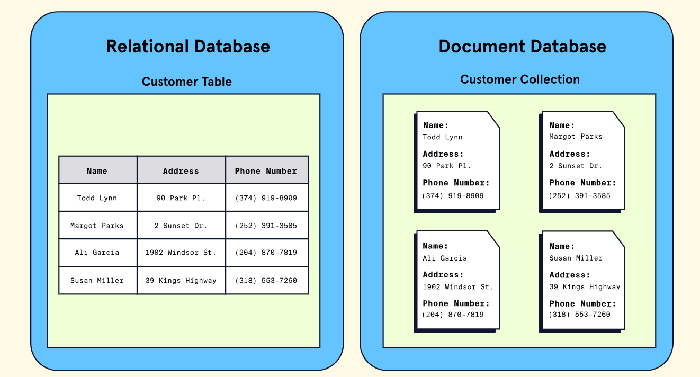

## Introduction

- By this point, we know that modern databases are systems that allow us to store, organize, and retrieve data.
- We have examined the characteristics of two main classes of databases: relational `SQL` and non-relational `NoSQL`.
- To recap, at their most basic level,
  - `Relational databases` store data using tables (via rows and columns) and typically **work best for heavily organized data**.
  - On the other hand, `non-relational databases` can store data in various ways (e.g., graphs, JSON) and typically **work best for unstructured data**.

We will examine a specific type of non-relational database – a **document database** (aka **document-oriented database** or a **document store**).

More specifically, we will look at [MongoDB](https://www.mongodb.com/), one of the most popular document databases. As we start to explore MongoDB, we will learn:

- The key characteristics of MongoDB as a document database
- The benefits of using MongoDB

Let’s get started!

## What is MongoDB?

> MongoDB is a document database designed for ease of application development and scaling.

- First released in 2009 and updated regularly with new releases, MongoDB is a database system that allows users to store data using the document model.
- The document model is a term used to describe a database that primarily stores data in documents and collections.
- The data stored inside documents is typically stored in hierarchical structures like JSON, BSON, and YAML.

❓**So what exactly do collections and documents look like**

Well, take a look over this visualization of the difference between a MongoDB document database and a relational database (e.g., PostgreSQL):

- In the above image, the customer information stored in the **relational database** is stored **row by row**, **inside a table**, with each customer possessing the same fields (name, address, phone number).
- In contrast, the document database has **individual documents for each customer**. Each of the documents contains a set of fields that may or may not be unique to that customer. Documents are stored **inside of a collection**.

The document model and several other features we will discuss, make MongoDB a `flexible`, `developer-friendly database` used all across the technology landscape. Let’s learn about some more of the unique advantages of using MongoDB.

## Advantages of Using MongoDB

MongoDB is a top choice for developers and technology companies working with NoSQL databases. While some of the benefits of using MongoDB are inherent to all document databases, MongoDB also provides a suite of other features that help distinguish it as a unique option. Let’s examine some of these benefits!

### Flexibility and Scalability

One of the main advantages of using MongoDB, and most other document databases, is the **flexible way data can be stored**.

For eg.,

- with a relational database, changing the column of a single table, impacts every entry inside of it. This can mean one change to a single table can impact thousands if not millions of entries.
- With document databases, we avoid this entirely. Changes to a single document have no effect on any other document in the collection. So, as application requirements change, a document model provides the flexibility to adapt our databases to accommodate them.

Additionally, **as our applications grow**, the **database we store information with must be able to grow as well**. In technical terms, we call this `scalability`. MongoDB offers multiple easy-to-use options for users to scale their database to accommodate growth.

### Developer-Friendly

MongoDB has a number of different traits, which make it incredibly developer-friendly.

- MongoDB databases support a variety of different use-cases. To name a few, MongoDB can be used to build **web**, **mobile**, and **desktop** applications. MongoDB also has features that support [data analytics](https://www.mongodb.com/atlas/data-lake) and [data visualization](https://www.mongodb.com/products/charts).

- Given MongoDB’s popularity, a large community has formed around the technology. This means there are a plethora of resources (e.g., forums, articles, conferences) available for developers at any level.

- MongoDB has a significant amount of detailed documentation and educational tools like [MongoDB University](https://university.mongodb.com/) to help developers learn about all of MongoDB’s unique features.

### Diverse Cloud Tooling

A third major advantage of using MongoDB is the wide array of cloud tools. These cloud tools help provide solutions for a variety of different use cases. Let’s look at two popular cloud tools: `Atlas` and `Realm`.

[MongoDB Atlas](https://www.mongodb.com/atlas) is MongoDB’s multi-cloud database service. Atlas allows developers to create, manage, and deploy MongoDB databases with just a few clicks. All of the databases are stored in the cloud, and Atlas does not require developers to have MongoDB set up on their computers to use it. Developers can interface with a database using an online dashboard.

[MongoDB Realm](https://www.mongodb.com/docs/realm/introduction) is another cloud offering that helps developers rapidly build various applications that are fully integrated with MongoDB. Potential uses for Realm range from mobile, to internet-of-things, to standard desktop applications. For example, if we were building a mobile app, we could use Realm to create a database on each of the phones that the app is installed on and seamlessly synchronize data between devices and the database. Realm can also facilitate complex tasks like authentication (e.g., login functionality) for us!

### SQL to Mongo mapping of terms/concepts

| **SQL**                                                                       | **MONGO**                                        |
| ----------------------------------------------------------------------------- | ------------------------------------------------ |
| database                                                                      | `database`                                       |
| table                                                                         | `collection`                                     |
| row                                                                           | `document`/`BSONdocument`                        |
| table joins                                                                   | `$lookup`                                        |
| primary key\n Specifiy any unique column or column combination as primary key | `primary key`\n automatically set to `_id` field |
| aggregation (eg. group by )                                                   | aggregation pipeline                             |
| SELECT into TABLE                                                             | `$out`                                           |
| MERGE into TABLE                                                              | `$merge`                                         |
| UnionAll                                                                      | `$unionWith`                                     |
| transactions                                                                  | `transactions`                                   |

## IQ

We’ve now learned some of the basics of MongoDB as a NoSQL document database. Let’s take a moment to review what we’ve learned:

- MongoDB is a NoSQL document database. This means that data entries in the database are stored inside documents within collections.
- Choosing to use MongoDB has some key benefits:
- Flexibility and Scalability
- Developer Friendly
- Diverse Cloud Tooling

MongoDB is a powerful tool developers can use to store data efficiently. Next time you need a database, consider MongoDB. If you would like to learn more, check out this [in-depth guide by MongoDB](https://www.mongodb.com/document-databases) on document databases.
