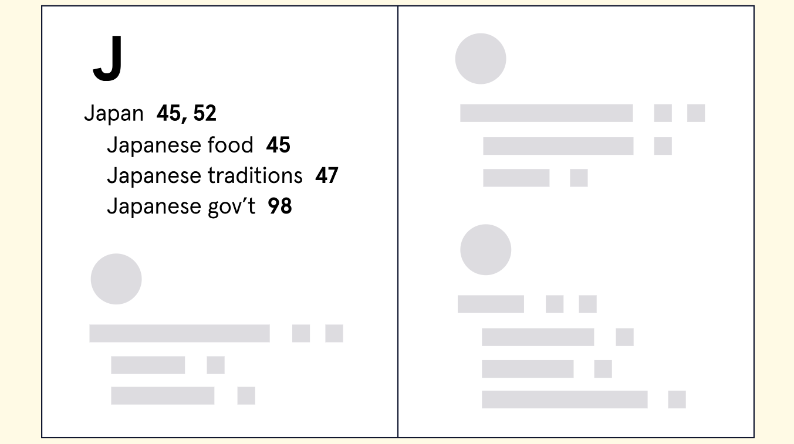

> Learn about the benefits of creating indexes to support your queries in MongoDB.

## What is Indexing?

Imagine if, for every query in MongoDB, we had to search the entire database to find our desired result. At scale, this would be a huge expenditure of time, computing power, and money. Fortunately, there’s a tool that can help make certain queries much more efficient - indexing.

> An index is a special data structure that stores a small portion of the collection’s data set in an easy-to-traverse form.

- Let’s use a real-world example to understand how indexing in MongoDB works. Suppose in your global history class your assignment is to write an essay about Japan. Naturally, you’ll want to find all references in your history textbook about the country. But how can you find all pages that mention Japan? One method would be to look meticulously through every page in the textbook. This method is tedious, exhausting, and a poor use of your time.

- Using an [index](https://www.masterclass.com/articles/how-to-write-a-book-index#what-is-a-book-index), however, you could go to the letter “J” in the index, locate Japan, and proceed to the corresponding pages listed.



Index of the letter "J" in a textbook reference section

Using an index to look up all references of the word “Japan” is a much more efficient way to search compared to a complete scan of the book.

- Indexes in MongoDB seek to capture that same efficiency and optimize query performance.
- Queries that don’t use indexes must **parse every document in a collection to find the appropriate matches**.

⚠️ For relatively small collections this is fine, but as a collection grows this can begin to weigh down performance.

## The Types of Indexes in MongoDB

MongoDB supports several different types of indexes.

### single-field

You can, for instance, create an index that references only one field of a document - also known as a `single-field` index.

- If, for example, a high school principal wanted to organize a reunion for alumni who studied abroad in Argentina, they would want to run a query on all alumni who studied internationally, specifically in Argentina.
- Rather than query the entire alumni collection, they could capture a subset of this data by creating a single-field index on a field that’s exclusive to these alumni, for example, `study_abroad_nation`. Let’s take a look at what this single field index might look like:


The principal can now use this single field index to query specific study abroad countries, like Argentina. This index makes our query more economical because it allows us to scan a subset of data rather than every document in the collection.

⭐ because indexes arrange data in ascending or descending order, our **queries are able to more quickly locate matching documents, making them more optimized for speed**.

### compound

You can also create indexes on multiple fields, called `compound` indexes, to support more specific queries.

- If that same high school principal wanted to organize these alumni based on the year they studied abroad, he or she could create a `compound` index that references the **country** where students studied abroad and **year** they studied abroad.

- The principal can now use this index to query specific countries, and, since indexes are ordered they can easily sort that subset of matching students chronologically.

✏️ the sorted nature of indexes can also improve the efficiency of range-based query operations, where we are seeking to match values that span a given range.

### multikey

- `multikey` indexes support optimized queries on array fields by indexing each element in the array.
- Conveniently, MongoDB automatically creates a multikey index for us whenever we create an index on a field whose value is an array.

✏️ Multikey indexes are compatible with both single field and compound indexes.

## Single Field Index with `.createIndex()`

- In MongoDB, indexes play an important role in making sure our database performs optimally.
- Recall, an [index](https://www.mongodb.com/docs/manual/indexes) is a special data structure that stores a small portion of the collection’s data in an easy-to-traverse form.
  We have already used indexes when we queried by the `_id` field since MongoDB creates a default index on the `_id` field for all our documents.

However, we can also create our own custom index by using the [.createIndex()](https://www.mongodb.com/docs/v5.3/reference/method/db.collection.createIndex) method. The syntax looks like this:

```
db.<collection>.createIndex({ <keys>, <options>, <commitQuorum>)}
```

We have three main parameters:

- `keys`: A document that contains the field and value pairs where the field is the index key and the value describes the type of index for that field.
- `options`: A document of various optional options that control index creation.
- `commitQuoroum`: A more advanced parameter that gives control over replica sets. We won’t be working with this parameter in this lesson.

In this lesson, we will mostly work with the `keys` parameter. To learn more about the various other parameters, visit the [official documentation](https://www.mongodb.com/docs/v6.0/reference/method/db.collection.createIndex). That said, our syntax will look closer to this:

```
db.<collection>.createIndex({ <field>: <type> });
```

- For the `keys` parameters, we must pass a document with field-type pairs. Fields can be assigned a value of 1 or -1.
  - A value of 1 will sort the index in ascending order, while a value of -1 would sort the index in descending order.
  - If the field contains a string value, 1 will sort the documents in alphabetical order (A-Z), and -1 will sort the documents in reverse order (Z-A).

To see `.createIndex()` in action, imagine as a university president, we have a collection of every student within your database, called `students`. A sample document from the `students` collection might look like this:

```
{
  _id: ObjectId(...),
  last_name: "Tapia",
  first_name: "Joseph",
  major: "architecture",
  birth_year: 1988,
  graduation_year: 2012,
  year_abroad: 2011
}
```

Perhaps we are organizing reunions for students who studied abroad and found ourselves frequently searching the database for students who studied internationally during a particular year. Rather than repeatedly querying the entire `students` collection by the `year_abroad` field, it would be beneficial to create an index based on this particular field, also known as a single field index. We could run the following command:

```
db.students.createIndex({ year_abroad: 1 });
```

The above command would create an index on all the documents in the student’s collection based on the `year_abroad` field, sorted in ascending order.

We can run a query on the indexed field to utilize the indexed year_abroad field. Here’s an example query that uses this new index to search for students who have studied abroad from 2020 onward:

```
db.students.find({ year_abroad: { $gt: 2019 }});
```

Creating a single field index can save us significant time in our query since we’d only be scanning the index for ordered values of the year_abroad field rather than browsing the entire collection and examining every document.

Let’s practice creating indexes using the .createIndex() method!

```python
# We want to create an index that arranges the restaurants according to boroughs. Connect to the restaurants database, and then using the listingsAndReviews collection, create an index based on the single field borough so that the results will be in alphabetical order.
> use restaurants
switched to db restaurants

restaurants> db.listingsAndReviews.createIndex({borough:1})
borough_1

# Now we want to create an index that lists the different types of cuisines. Create an index based on the single field cuisine so that the index references will be organized in reverse alphabetical order.
restaurants> db.listingsAndReviews.createIndex({cuisine:-1})
borough_-1
```

## Performance Insights with `.explain()`

Since indexing in MongoDB is tied closely to database performance, it would be ideal to have a way to see how our indexes impact our queries. The [.explain()](https://www.mongodb.com/docs/manual/reference/method/cursor.explain) method can offer us insight into the performance implications of our indexes. The method has the following syntax:

```
db.<collection>.find(...).explain(<verbose>)
```

✏️ that the method is appended to the `.find()` method.

- It also takes one string parameter named verbose that specifies what the method should explain. The possible values are:
  - "queryPlanner"
  - "executionStats"
  - "allPlansExecution".

Each value offers meaningful insights on a query. To gain insights regarding the execution of the winning query plan for a query, we can use the **"executionStats"** option.

To see `.explain()` in action, let’s refer back to our study abroad example from the previous exercise. Let’s examine how to use this method by appending the `.explain()` method to our query from the previous exercise:

```
db.students.find({ year_abroad: { $gt: 2019 }}).explain('executionStats');
```

Running our query with **"executionStats"** outputs a series of objects containing detailed information about our operation. We won’t include the entire output below, but rather we’ll focus on a specific object, called [executionStats](https://www.mongodb.com/docs/manual/reference/explain-results).

If we were to execute the `.explain()` method before creating our index on the `year_abroad` field, the output might look something like this:

```
executionStats: {
  executionSuccess: true,
  nReturned: 1336,
  executionTimeMillis: 140,
  totalKeysExamined: 0,
  totalDocsExamined: 5555,
  executionStages: {
    …
  }
}
```

Examine the `nReturned`, `totalDocsExamined`, and `executionTimeMillis` fields.

✏️ that out of 5555 total documents, only 1336 were returned by our query, which took approximately 140 milliseconds.

Now let’s look at what the output of our query might look like after we index the `year_abroad` field:

```
executionStats: {
  executionSuccess: true,
  nReturned: 1336,
  executionTimeMillis: 107,
  totalKeysExamined: 1336,
  totalDocsExamined: 1336,
  executionStages: {
   …
  }
}
```

Check out the `nReturned` and `totalDocsExamined` fields again. Notice anything?

When we ran our query after creating our index, we still returned `1336` documents, but instead of examining the entire collection, `5555` documents, we only examined the `1336` we returned. This is **because our query first scanned the index to identify documents that matched our filter, then returned only the corresponding documents** without browsing every document in the collection.

Take a look at the **executionTimeMillis** for each query. You’ll also notice that our query after creating the index took `107` milliseconds, while our query before creating the index took a bit longer, `140` milliseconds. This might not seem like much, but if we were **working with a collection containing tens or hundreds of thousands of documents, the time difference would likely be much more significant**.

Let’s practice using the `.explain()` method to see the power of indexing!

```python
# First, query the listingsAndReviews collection for a restaurant named "Osaka Japanese Fusion". Use the .explain() method with the "executionStats" argument to see the execution stats for your query without using an index. Take note of the nReturned and totalDocsExamined fields.

> use restaurants
switched to db restaurants

restaurants> db.listingsAndReviews.find({name:"Osaka Japanese Fusion"}).explain("executionStats")
{
    executionStats: {
        executionSuccess: true,
        nReturned: 1,
        executionTimeMillis: 2,
        totalKeysExamined: 0,
        totalDocsExamined: 50,
        executionStages: {
            …
        }
    }
}

# Let’s create an index on the name field for documents in the listingsAndReviews collection

restaurants> db.listingsAndReviews.createIndex({name:1})
name_1

# compare the execution stats of a query with and without the index to ensure the index is performing efficiently.

restaurants> db.listingsAndReviews.find({name:"Osaka Japanese Fusion"}).explain("executionStats")
{
    executionStats: {
        executionSuccess: true,
        nReturned: 1,
        executionTimeMillis: 0,
        totalKeysExamined: 1,
        totalDocsExamined: 1,
        executionStages: {
            …
        }
    }
}

```

## Compound Indexes

In addition to single field indexes, MongoDB gives us the ability to create compound indexes. [Compound indexes](https://www.mongodb.com/docs/v5.0/core/index-compound/) contain references to multiple fields within a document and support queries that match on multiple fields.

Let’s have a look at the syntax for creating a compound index:

```
db.<collection>.createIndex({
  <field>: <type>,
  <field2>: <type>,
  …
})
```

- Similar to single field indexes, MongoDB will scan our index for matching values, then return the corresponding documents.

- With compound indexes, the **order of fields is important**. To understand why, let’s return to our example from the first exercise about the university president.

Imagine that as president we wanted to plan reunions not just for students who studied abroad during a particular year, but also for students who studied abroad in a particular country. We could create a compound index on two fields: `study_abroad_nation` and `year_abroad`, like so:

```
db.students.createIndex({
  study_abroad_nation: 1,
  year_abroad: -1
});
```

- This creates a single index that references two fields: `study_abroad_nation` in **ascending/alphabetical** order, and `year_abroad` in **descending/reverse chronological** order.

- Because of how the fields are ordered, references within this index will be sorted first by the `study_abroad_nation` field. Within each value of the `study_abroad_nation` field, references will be sorted by the `year_abroad` field. This is an **important consideration in determining how well our indexes will be able to support sort operations in our queries**.

Now that we’ve created this compound index, anytime we query on these two fields, MongoDB will automatically employ this index to support our search.

The below query would be a use case for our compound index:

```
db.students.find({
  study_abroad_nation: "Brazil",
  year_abroad: 2012
});
```

Compound indexes can also support queries on any [prefix](https://www.mongodb.com/docs/v5.0/core/index-compound/#prefixes), or a beginning subset of the indexed fields. For example, consider the following compound index:

```
db.students.createIndex({
  study_abroad_nation: 1,
  year_abroad: -1,
  graduation_year: 1
});
```

In addition to supporting a query that matches on the `study_abroad_nation`, `year_abroad` and `graduation_year` fields, this index would also be able to support queries on the following fields:

`study_abroad_nation`
`study_abroad_nation` and `year_abroad`

This index would not, however, be able to support queries on the following fields:

- `year_abroad`
- `graduation_year`
- `year_abroad` and `graduation_year`

As each index must be updated as documents change, unnecessary indexes can affect the write speed to our database. Make sure to consider if a compound index would be more efficient than creating multiple distinct single-field indexes to support your queries.

Let’s practice creating and using compound indexes!

```python
# We’ve realized that creating one compound index would be more efficient than two single field indexes. Using the same listingsAndReviews collection, create an index based on the fields borough and cuisine so that the results would be in ascending order for borough and descending order for cuisine.
> use restaurants
switch to db restaurants

restaurants> db.listingsAndReviews.createIndex({borough:1, cuisine:-1})
borough_1_cuisine_-1

# Using the new compound index, we want to query only Chinese restaurants with a restaurant_id greater than "42000000". Create a query that satisfies these parameters.

restaurants> db.listingsAndReviews.find({restaurant_id :{$gt:"42000000"}})
[
    {
        _id : ObjectId("a098s234rsafikno878"),
        address:{
            building:'2099',
            coord:[-73.122343455, 40.3452123451],
            street:'36 street',
            zipCode:'11231'
        },
        borough:"Rhode Island"
        cuisine:"Chinese"
        grades:[
            {
                date:IsoDate("2014-07-11T00:00:00.000Z"),
                grade: 'A'
                score: 37
            },
            {
                date:IsoDate("2014-09-11T00:00:00.00Z"),
                grade: 'C'
                score: 8
            },
            {
                date: IsoDate("2024-09-11T00:00:00.00Z"),
                grade: "B",
                score: 81
            }
        ],
        michelen_stars:[2008, 2009, 2010, 2020],
        name:"Tasty House",
        restaurant_id:"42561796"
    }
    ...
]
```

## Multikey Index on Single Fields

❓ **How do MongoDB indexes handle fields whose values are arrays**

- Conveniently, MongoDB automatically creates what’s known as a [multikey index](https://www.mongodb.com/docs/manual/core/index-multikey) whenever an index on a array field is created.
- Multikey indexes provide an index key for each element in the indexed array.

Suppose we had a document within the `students` collection that had a field, `sports` with an array as its value:

```
{
  _id: ObjectId(...),
  last_name: "Tapia",
  first_name: "Joseph",
  major: "architecture",
  birth_year: 1988,
  graduation_year: 2012 ,
  sports: ["rowing", "boxing"]
}
```

We could create a multikey index on this field in the same way we would create any other single-field index:

```
db.students.createIndex({ sports : 1 });
```

This would create an index that references the sports field for every document in the collection. Since sports is an array field, the resulting multikey index would contain individual references to each element in the array. We specified ascending order for our index so the values would be organized in alphabetical order.

✏️ that this example discusses multikey single field indexes. Next we’ll learn about some important considerations to keep in mind when creating compound multikey indexes.

Let’s spend some time practicing creating and using multikey indexes!

```python
# Switch to the restaurants database. Inside the listingsAndReviews collection, create a multikey index on the grades field in ascending order

> use restaurants
switch to db restaurants

restaurants> db.listingsAndReviews.createIndex({grades:1})
grades_1
```

## Multikey Index on Compound Fields

❓ **Is it possible to create a compound multikey index in MongoDB**

- The answer is yes, with a very important caveat - only one of the indexed fields can have an array as its value.

For example, suppose we had a document within a students collection with two fields with arrays as their values: `sports` and `clubs`.

```
{
  _id: ObjectId(...),
  last_name: "Tapia",
  first_name: "Joseph",
  major: "architecture",
  birth_year: 1988,
  graduation_year: 2012 ,
  sports: ["rowing", "boxing"],
  clubs: [“Honor Society”, “Student Government”, “Yearbook Committee”]
}
```

A single compound index can not be created on both the `sports` and `clubs` fields. We could, however, successfully create a compound multikey index on `sports` or `clubs` along with any of the other fields.

For example, either of the following would successfully create a compound multikey index:

```
db.students.createIndex({ sports: 1, major: 1 });
db.students.createIndex({ clubs: -1, graduation_year: -1 });
```

⭐ If we wanted to index both the `sports` and `clubs` fields, we’d have to create two separate indexes for them.

Let’s practice creating a compound multikey index!

```python
# Connect to the restaurants database. Inside the listingsAndReviews collection, create a multikey index with the fields cuisine, in ascending order, and grades, in descending order.
> use restaurants
switch to db restaurants

restaurants> db.listingsAndReviews.createIndex({cusine:1, grades:-1})
cuisine_1_grades_-1

```

## Deleting an Index

- Each time we make changes to a collection, any indexes associated with that collection must also be updated. In this way, unnecessary indexes can slow down the performance of certain CRUD operations.

⭐ This is why it is important to review our indexes and remove any that are redundant or not being used.

Suppose, after some reflection, we discovered that a compound index can handle all the queries we need to make, instead of the single field indexes we originally were relying on. Once we’ve created the compound index, it would be a good idea to identify and remove any unnecessary indexes.

### `.getIndexes()`

First, we can use the [.getIndexes()](https://www.mongodb.com/docs/manual/reference/method/db.collection.getIndexes) method to see all of the indexes that exist for a particular collection.

Consider a collection called students that has multiple indexes:

```
db.students.getIndexes();
[
   {  v : 1,
      key : { _id : 1 },
      name : '_id_'
   },
   {
      v : 1,
      key : { sports : -1 },
      name : 'sports_-1'
   },
   {
      v : 1,
      key : { sports : -1, graduation year : -1 },
      name : 'sports_-1_graduation_year_-1'
   }
]
```

Now that we have a list of our indexes for the `students` collection, we can see that both the second and third indexes index the `sports` key in descending order. Since compound indexes can support queries on any of the prefixed fields, our third index, named **'sports*-1_graduation_year*-1'**, can support queries on both `sports` and `graduation_year`.

### `.dropIndex()`

This means that our second index, 'sports*-1', is redundant. MongoDB gives us another method, [.dropIndex()](https://www.mongodb.com/docs/manual/reference/method/db.collection.dropIndex/), that allows us to remove an index, without modifying the original collection. We can use it to delete the 'sports*-1' index:

```
db.students.dropIndex('sports_-1');
```

The above command would delete the index, and then we can confirm by running

```
db.students.getIndexes(); again:
[
   {  v : 1,
      key : { _id : 1 },
      name : '_id_'
   },
   {
      v : 1,
      key : { sports : -1, graduation year : -1 },
      name : 'sports_-1_graduation_year_-1'
   }
]
```

⭐ Getting rid of unnecessary indexes can

- free up disk space
- speed up the performance of write operations,

so as you start to use indexes more, it is worth regularly scrutinizing them to see which, if any, you can remove.

Let’s practice removing an index from our restaurants collection!

```python
# We’ve created several indexes throughout this lesson. Run the .getIndexes() method to take inventory of all the indexes we have so far.
> use restaurants
switch to db restaurants

restaurants> db.listingsAndReviews.getIndexes()
[
   {  v : 2,
      key : { _id : 1 },
      name : '_id_'
   },
   {
      v : 2,
      key : { cuisine : 1, grades:-1 },
      name : 'cuisine_1_grades_-1'
   },
   {
      v : 2,
      key : { grades : 1 },
      name : 'grades_1'
   },
   {
      v : 2,
      key : { borough : 1, cuisine : -1 },
      name : 'borough_1_cuisine_-1'
   },
   {
      v : 2,
      key : { name : 1 },
      name : 'name_1'
   },
   {
      v : 2,
      key : { borough : -1 },
      name : 'borough_-1'
   },
   {
      v : 2,
      key : { cuisine : -1 },
      name : 'cuisine_-1'
   },
]

# ince we have one compound index that references both borough and cuisine, the indexes named borough_1 and cuisine_-1 are now redundant. Use the .dropIndex() method to delete the borough_1 index from the listingsAndReviews collection.

restaurants> db.listingsAndReviews.dropIndex("borough_1")
{
    nIndexsWas: 7,
    ok: 1
}
```

## Summary

We’ve just learned how to create and manage indexes in MongoDB. Let’s recap some key takeaways from this lesson:

- An index is a data structure that captures a subset of a collection’s data in an easy-to-traverse form. We can use the `.createIndex()` method to create an index.
- A single field index is an index that references one field from a document.
- We can use the `.explain()` method with the **"executionStats"** argument to gain insight into the performance implications of our index on our query.
- A compound index is an index that contains references to multiple fields within a document.
- Multikey indexes are **automatically created** whenever we create an index on a field that contains an array value. Multikey indexes create an index key for each element in the array.
- A compound index cannot support two multikey indexes.
- The `.dropIndex()` method deletes an index without modifying the original collection.

In addition to the syntax we’ve learned throughout this lesson, MongoDB offers us other syntax and commands that can be useful when indexing collections:

- [Partial Indexes](https://www.mongodb.com/docs/manual/core/index-partial) only index documents in a collection that meet specific filter criteria. By indexing a subset of a collection’s documents, partial indexes consume less storage and have improved performance.
- [Sparse Indexes](https://www.mongodb.com/docs/manual/core/index-sparse) only index documents that include the specified index field. Any documents that do not have the field will be excluded from the index. Much like partial indexes, these indexes can use significantly less storage and have relatively improved performance compared to non-sparse indexes.
- [TTL Indexes](https://www.mongodb.com/docs/manual/core/index-ttl) are special single-field indexes that MongoDB can use to automatically remove documents from a collection after a certain amount of time or at a specific clock time.
- [Unique Indexes](https://www.mongodb.com/docs/manual/indexes/#unique-indexes/) enforce unique values for the indexed fields. Creating a unique index on a collection will restrict the insertion or update of documents where the indexed field’s value matches an existing value in the index.

Before moving on, spend some time creating and deleting indexes using what you’ve learned in this lesson!

**Optional Tasks**

- Create a **partial index** for `restaurants` inside of the `listingsAndReviews` collection that captures only restaurants that have at least one grade of "A".
- Create a **TTL index** for the restaurants `grades` field to expire after a grade’s date field elapses a certain amount of time. 


<a  href="https://enterprise.codecademy.com/learn/emodules/emod-mongodb-indexing/cheatsheet" target="_blank">Cheetsheet ↗️</a>
