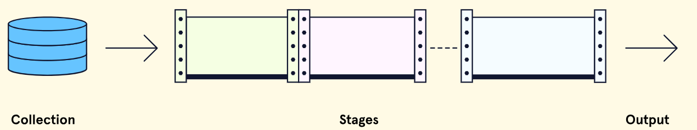

> Learn what `aggregation` is and how to use it in MongoDB!

## Introduction

When working with MongoDB, we will likely need to perform various operations on our data. At some point, we may decide that we want to perform some form of analytics. Take, for example, a database that stores sales data for an online store. We can use the methods we have learned so far (e.g., `find()`) to perform CRUD operations related to the data, but maybe we want to answer questions related to trends like:

- What kind of products are selling the best over a six-month period?
- What product is making the most sales on Wednesdays?
- Is there a specific geographic location that tends to order more products than others?

These questions are best answered by performing more complex analytical operations on our database. With some databases, we might have to use a completely separate tool set to perform analytics.

However, with MongoDB, the ability to perform these types of queries is already built-in! This process is known as `aggregation` and is one of the core features of a MongoDB database. In this article, we will explore `aggregation` and how it works in MongoDB.

Specifically, we will:

- Explore the basics of how the `aggregation` pipeline works in MongoDB.
- Build an `aggregation` pipeline together using multiple stages and operators.
- Consider the right situations to use aggregation.

Let’s get started!

## Aggregation Basics

> aggregate means to combine out of several parts.

- When we apply this concept to a MongoDB database, `aggregation` is the process by which we can sift through large amounts of data one step at a time and, at each step, perform some form of filtering or computation on the data. Then, after multiple steps, we return a final result. This process can help us to see our data in a new way and provide valuable insights.

- So, how do we actually perform aggregation? One of the primary ways to accomplish `aggregation` in MongoDB is to use an `aggregation` pipeline.

An `aggregation` pipeline is a channel through which data passes from **point A** (the start of the pipeline) to **point B** (the end of the pipeline). Imagine, though, that the pipe is split into a number of segments. Each of these segments in the `aggregation` pipeline is called a `stage`, and each stage performs a specific operation on the data, such as sorting or filtering. Take a look at the following visual to help paint a picture of the pipeline:



If we use the above image as a guide, we can note that at the start of our pipeline, we will have our original dataset (a collection). Then, at the first stage and at successive stages, an operation is performed on the data, and the result is either sent to the next stage or returned if there are no more stages. There can be many stages involved depending on what we might be trying to accomplish with our pipeline.

Now that we know what `aggregation` and an `aggregation` pipeline is, let’s see how we can create our own in MongoDB.

## Getting Started with Aggregation

To start using `aggregation` via an `aggregation` pipeline in MongoDB, we can use the following [.aggregate()](https://www.mongodb.com/docs/manual/reference/method/db.collection.aggregate/#mongodb-method-db.collection.aggregate) method like so:

```
db.<collection>.aggregate()
```

MongoDB requires that inside of the `aggregate()` method, our first argument is an array containing the pipeline stages we use. To see a pipeline stage in action, let’s imagine we had the following small collection called `movies`, with each record having a field with the movie name and an associated rating (using the USA-based [MPA rating](https://en.wikipedia.org/wiki/Motion_Picture_Association_film_rating_system) system):

```
{
  name: "Star Wars: Clone Wars"
  rating: "PG"
},
{
  name: "Indiana Jones and the Temple of Doom"
  rating: "PG"
},
{
  name: "Despicable Me"
  rating: "PG"
},
{
  name: "The Godfather"
  rating: "R"
}
```

We saw earlier, that in order to build a pipeline, we will need to define the stages we want to use. There are [many](https://www.mongodb.com/docs/manual/reference/operator/aggregation-pipeline/#stages) stages in MongoDB that help accomplish various tasks in aggregation. For now, let’s use a common stage called [$match](https://www.mongodb.com/docs/manual/reference/operator/aggregation/match/) that returns all the documents containing the specified field and value. This is similar to when we used the `find()` method and provided a query argument to filter a document based on a specific criteria.

The syntax to accomplish this `aggregation` would be the following:

```
db.movies.aggregate([
  {
    $match: {rating: "R"}
  }
])
{
  name: "The Godfather",
  rating: "R"
}
```

Building stages into the pipeline will be the **bread and butter of working with aggregation**. Now that we have the basics down and have seen how we can start to build a pipeline, let’s start to walk through how to build a more complex multi-stage pipeline. Along the way, we will explore new stages and deepen our understanding of aggregation!

## Building a Multi-Stage `Aggregation` Pipeline

Imagine we had a large data set (thousands of records) of `students` in a school. Each student document has the following structure:

```
{
  student_id: 94204,
  first_name: "Sun",
  last_name: "Ko",
  grade_level: 6,
  test_scores: [99, 97. 96, 99],
  average_test_score: 98.65
}
```

We are tasked with gaining insights on students that might qualify for a prestigious scholarship. We need to produce a new collection in our database called `candidates` that has the following criteria:

The collection must only contain students in the 6th grade with an average test score above **97**.
The students in the new collection must be sorted by their first name (`first_name` field).
We also want the records in the new collection to have a new field called `highest_score` with the value of the highest score in the `test_scores` array field. This type of task would be a great candidate for using the `aggregation` framework!

We can start our `aggregation` pipeline with a first stage that filters out only students in the 6th grade with an average test score above 97. Just like before, we can use the `$match` stage:

```
db.students.aggregate([
  {
    // First stage
    $match: {grade_level: 6, average_test_score: {$gt: 97}}
  }
])
```

This first stage with `$match` should give us all the students that meet the conditions to qualify.

Next, we want to sort our result. Thankfully, MongoDB provides a stage named [$sort](https://www.mongodb.com/docs/manual/reference/operator/aggregation/sort/). Similar to how the `.sort()` method works, we can specify -1 or 1 to sort in ascending or descending order for a field. Here is what our pipeline would look like if we added a sorting stage:

```
db.students.aggregate([
  {
    // First stage
    $match: {grade_level: 6, average_test_score: {$gt: 97}}
  },
  {
    // Second Stage
    $sort: { first_name: 1}
  }
])
```

This new stage would take the resulting collection from the first stage (where we used `$match`) and sort the documents in ascending order by the `first_name` field.

At this point, we might think, “Why use an `aggregation` pipeline when I can accomplish the same goal with `find()` and `sort()` much quicker?”. That is a valid point, and if you likely had to just do those two stages, using `find()` and `sort()` likely would be quicker. However, the next two stages are where `aggregation` would start to shine as a better alternative.

First, let’s accomplish adding a new field to our records called `highest_score` with the value of the student’s highest test score. We can do so using the [$addFields](https://www.mongodb.com/docs/manual/reference/operator/aggregation/addFields/) stage. Before we add it to our pipeline, let’s examine the syntax of this operator:

```
{ $addFields: { <newField>: <expression>, …}}
```

✏️ that this stage uses what is known as a [expression](https://www.mongodb.com/docs/manual/meta/aggregation-quick-reference/#std-label-aggregation-expressions).
`Aggregation` expressions are commonly used in stages to perform some type of logic such as arithmetic or comparisons. There are many types of expressions including: [literals](https://www.mongodb.com/docs/manual/meta/aggregation-quick-reference/#std-label-agg-quick-ref-literals), [system variables](https://www.mongodb.com/docs/manual/meta/aggregation-quick-reference/#std-label-agg-quick-ref-variables), [expression objects](https://www.mongodb.com/docs/manual/meta/aggregation-quick-reference/#std-label-agg-quick-ref-expression-objects), and [expression operators](https://www.mongodb.com/docs/manual/meta/aggregation-quick-reference/#std-label-agg-quick-ref-operator-expressions). Here is what our pipeline looks like if we needed to get the highest score and create a new field:

```
db.students.aggregate([
  {
    // First stage
    $match: {grade_level: 6, average_test_score: {$gt: 97}}
  },
  {
    // Second Stage
    $sort: { first_name: 1}
  },
  {
    // Third Stage
    $addFields:  {
      highest_score: { $max: "$test_scores" }
    }
  }
])
```

Here, we are using the `$addFields` stage with the [$max](https://www.mongodb.com/docs/manual/reference/operator/aggregation/max/) expression operator, a specific type of expression, which allows us to pull the max value of the `test_scores` field so we can use it in our new `highest_score` field.

✏️ that our test_scores field is prefixed with a $ to indicate it is a [field path](https://www.mongodb.com/docs/manual/meta/aggregation-quick-reference/#field-paths).

Field paths are used to access a document’s fields inside of an expression. We will have to use field paths often when working with aggregation. In this case, it allows us to access the `test_scores` field from our documents to use with the` $max` expression operator.

If we left it as is, our result from our `aggregation` pipeline would have documents like this:

```
{
  student_id: 94204,
  first_name: " Sun",
  last_name: "Ko",
  grade_level: 5,
  test_scores: [99, 97. 96, 99],
  average_test_score: 87.5,
  highest_score: 99
}
```

So far, so good! We just have one final task in our pipeline: creating a new collection. Creating a new collection can be accomplished by using the [$out](https://www.mongodb.com/docs/manual/reference/operator/aggregation/out/#mongodb-pipeline-pipe.-out) stage. Here’s how our pipeline would look after adding the `$out` stage:

```
db.students.aggregate([
  {
    // First stage
    $match: {grade_level: 6, average_test_score: {$gt: 97}}
  },
  {
    // Second Stage
    $sort: { first_name: 1}
  },
  {
    // Third Stage
    $addFields:  {
      highest_score: { $max: "$test_scores" }
    }
  },
  {
    // Fourth Stage
    $out : "candidates"
  }
])
```

The `$out` stage can output the final result of an `aggregation` pipeline to a new database, a new collection, or both! For this reason, it is required that it is the last stage in a pipeline. In this case, our `aggregation` result would be plopped into a new collection named `candidates`.

Whew! We did it. We went through a general overview of how to build a multistage pipeline, step by step, with a few common `aggregation` stages. Note that the order of the `aggregation` stages is important since data will flow in the order we supply our operators.

Now that we have had a chance to build a pipeline, it’s worth thinking about when we actually need to use `aggregation` and build our own pipelines.

## When to Use Aggregation

When we compare the ways we can manipulate data with methods like `find()` and `updateOne()` to an `aggregation` pipeline, we can start to see a major difference.

- Most of the CRUD methods that MongoDB offers are operational in nature. Their role is to perform some specific operation on our data and that’s it.
- With `aggregation` pipelines, we are able to perform multiple operations together to curate data that is more analytical in nature. This **helps us see our data in a bigger picture**.

A good way to picture the difference is to return to a web application that makes sales of some product.

- The application needs to give users the ability to perform common CRUD operations like adding a product to their cart or increasing the quantity they want to purchase. These types of operations are best handled with the functions we already know (e.g, find(), updateOne()).
- However, if we had an option to have a seller dashboard that can give insights on product sales or trends, our CRUD methods wouldn’t be as helpful since they’re not able to manipulate any of the data. That’s where we can see `aggregation` really shine!

In essence, consider using `aggregation` when:

- There are no CRUD methods (or a combination of methods) that accomplishes the query that needs to be performed easily.
- We need to perform analysis on datasets such as grouping values from multiple documents, computations on data, and analyzing data changes over time.

### review

In this article, we learned about what makes `aggregation` a powerful tool for searching and filtering data in MongoDB. Let’s take a moment to review what we’ve learned:

In MongoDB, we can perform `aggregation` as an alternative way to query data.
One way of accomplishing `aggregation` is by using an `aggregation` pipeline via the .aggregate() method.
Aggregation pipelines allow us to incrementally filter data through the use of stages, where each stage filters/modifies the data in a specific way and then passes that data to the next stage.
We can build a pipeline using stages such as $match or $sort.
Some stages can utilize different types of expressions such as expression operators like $max.
To reference fields from the documents in our collections inside of expressions, we must use a field path.
Aggregation is particularly useful when we have tasks that can’t be accomplished with common CRUD methods easily or when we are looking to perform complex analytics on datasets.
Using the `aggregation` framework will open new doors to how we can query and analyze large datasets. To learn more about `aggregation` in MongoDB, check out these helpful resources:

[MongoDB: `Aggregation` Basics](https://www.mongodb.com/basics/aggregation)
[MongoDB: `Aggregation` Pipeline Introduction](https://www.mongodb.com/basics/aggregation-pipeline)
[MongoDB University: M121 `Aggregation` Course](https://university.mongodb.com/courses/M121/about/)

<a  href="https://enterprise.codecademy.com/learn/emodules/emod-explore-mongo-db/cheatsheet" target="_blank">Cheetsheet ↗️</a>
