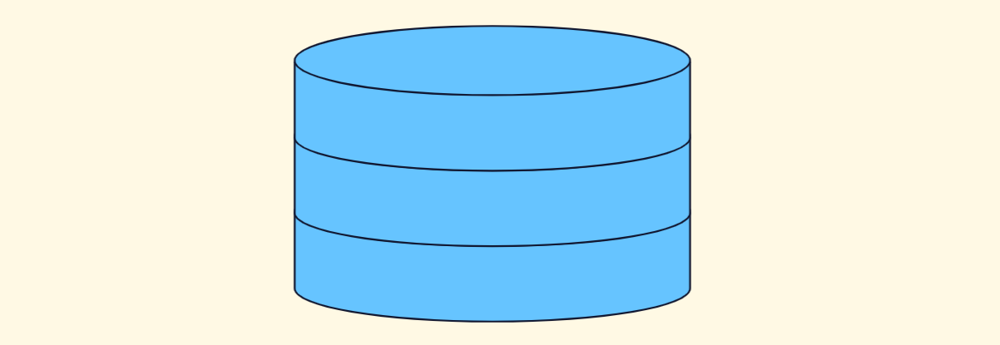
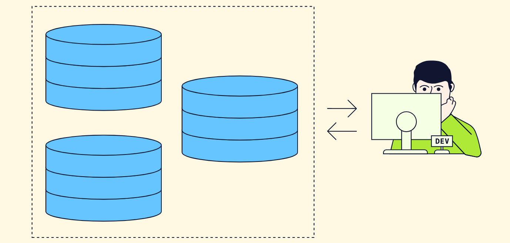
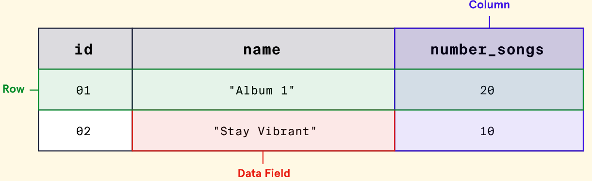
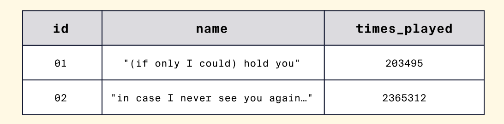
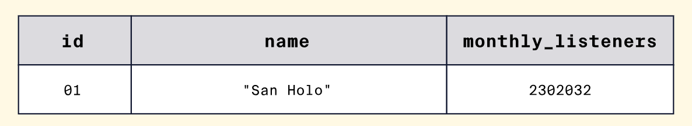
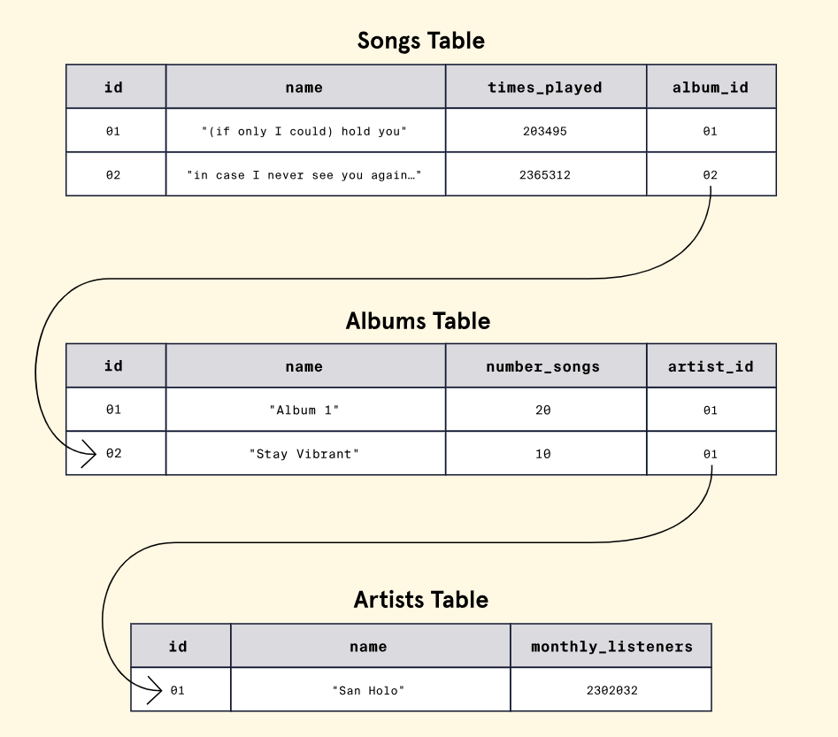
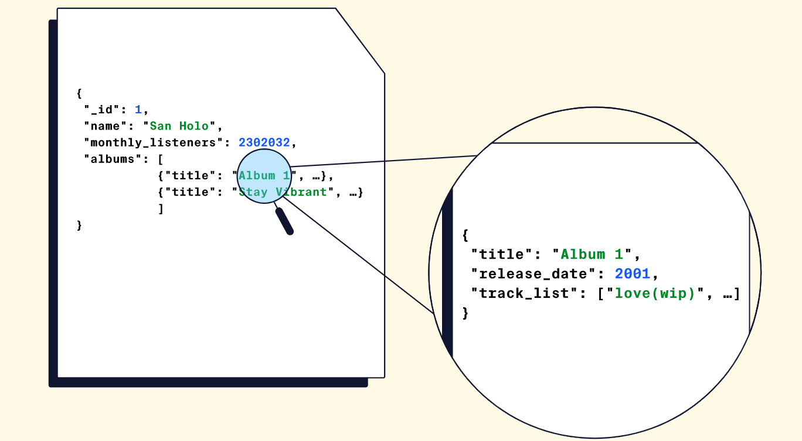
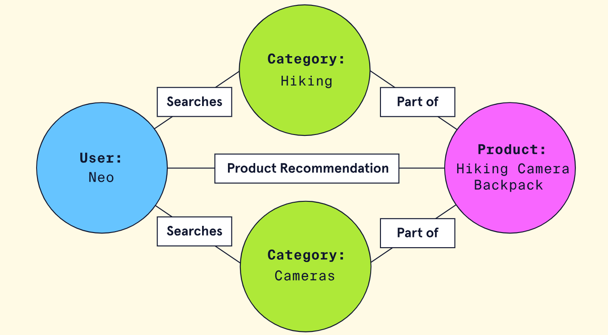
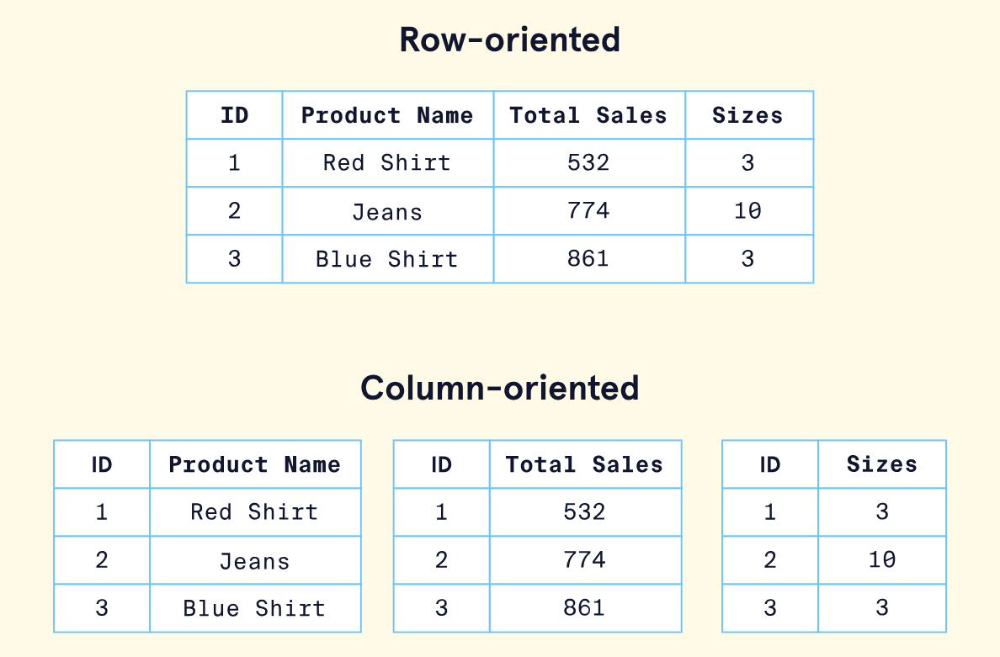

## Intro to DB

> Get familiar with what a database is, the types of information a database can store, and two common classifications of databases.

### What is a Database?

Each time you log into Codecademy.com, you’re met with an abundance of content organized into courses, articles, projects, and more. You can also see a dashboard, customized for you, with shortcuts to your courses and projects. How can the Codecademy site, or any site, retain and retrieve such large amounts of information in an organized and consistent manner? Enter databases!

In software engineering, databases are systems that store, modify, and access collections of information electronically. To better understand the different database classifications and how they can be useful to us as developers, in this article, we will:

- Discuss why we use databases in software development and their benefits for our end users.
- Examine the various types of data a database can store.
- Consider the features, advantages, and disadvantages of the two most common classes of databases: relational and non-relational.

### Why Databases?

Almost any type of software application needs a way of storing data. Whether it is user account information for social media websites like Twitter or entire user-generated videos on websites like YouTube, databases are a crucial component of any application we use today. Without them, developers would have no way to meaningfully persist information that is important for the application’s functionality. To paint a picture, we can think of a database as a bucket that can store any type of information we want. Here is how most resources on the internet depict a database:



But, how do the applications we use (or build) interact with a database? When we are looking to interact with a database, we are actually looking to interact with a database management system.

### Database Management Systems (DBMS)

Suppose a database is a bucket that stores our data. In that case, a DBMS is the software that encapsulates said bucket (our database(s)) and lets us work with the database using a programming language or easy-to-use graphical interface (GUI). Here is the same image from before, but now illustrating how a DBMS fits into the picture:



✏️: _Most information on the internet doesn’t do a great job distinguishing between a database and a DBMS. In this article, when we talk about a database, we also inherently refer to its associated DBMS_.

When working with a DBMS, we won’t only have the ability to store multiple databases but also will be able to capitalize on its unique features for maintaining data. Additionally, each DBMS allows the database it manages to store different types of data. This means we can store a variety of data types such as strings of text, numeric data (integers, decimals, and floating-point numbers), date and time types, and booleans. We can also store more unique data like images and audio files (although it’s worth noting a database transforms all data into binary and won’t natively know its an image or audio file). The ability to store this variety of data allows DBMSs to have a variety of use cases. Whether we need to store simple data like user information (e.g., email, name, password) or more complex data like videos, a DBMS can likely handle it!

Since each DBMS is unique, they vary in their implementation and, as such, provide different advantages and disadvantages. Let’s get familiar with two of the most common types of databases (and their associated DBMS) we’re likely to encounter and examine the greatest distinctions in how they store data and operate.

### Relational Databases

One of the most common classes of databases is a relational database. Relational databases, commonly referred to as SQL databases (more on this later), structure data in tabular form. This means data is grouped into tables, using rows and columns to organize and store individual records of data. Here is what the general structure looks like:



Let’s apply the idea of a relational database to a concrete example. Imagine we launched a music streaming website where users find information about artists and their catalog of songs. How might we organize and store this content in a relational database?

We’d probably have one table that stores information about albums. Within the albums table, we’d have several columns to store specific information about each album, such as its title and release year. Additionally, we could store songs, and artist information in separate tables. Here is what our tables might look like:





Relational databases are unique because they are based on presenting data in terms of relationships. To accomplish this, relational databases enable associations between tables to be defined, the most common associations being “one-to-one”, “one-to-many”, and “many-to-many”. For example, in our music database, we could establish the following relationships between our data:



In the above image, we have established two relationships:

- A relationship between the Songs and Albums table. A song “belongs” to an album via the `album_id` field.
- A relationship between the Albums and Artists table. An album “belongs” to an artist via the `artist_id` field.

Lastly, note the following important properties of relational databases:

- **Pre-defined Schema**: Relational databases are unique because the **database schema** - the “blueprint” of the database structure - is typically determined before any data is ever inserted. This would mean we would likely decide the specific tables, and their associated relationships, before even inserting any data into them.

- **SQL Use**: Developers communicate with a relational database using SQL (Structured Query Language). SQL is an industry-standard database language that has been used for decades. Extensive documentation and readable syntax make it approachable for beginners. The dependence of relational databases on SQL is why some developers and documentation sometimes refer to relational databases as SQL databases.

- **Relational Database Management System**: Any relational database is managed by a relational database management system (RDBMS). This type of DBMS allows the data to follow a relational model (e.g., setup relationships) and manage the data using SQL. Two of the most popular RDBMSs are [PostgreSQL](https://www.postgresql.org/) and [MySQL](https://www.mysql.com/).

- **Unique Disadvantages**: At the enterprise level, where data sets are massive, setting up a relational database can be costly, and the expenses required to maintain and scale it can compound significantly over time. Furthermore, rows and columns consume a great deal of physical space which can lead to implications for performance and cost.

### Non-Relational Databases

The second most common class of databases is non-relational databases. A non-relational database, commonly referred to as a NoSQL database, is any database that does not follow the relational model. This means these types of databases typically don’t store data in tables, but more importantly, data isn’t strictly represented with relationships. Under the umbrella of non-relational databases are many different types of databases, each with its own framework for organizing data. Some examples are [document databases](https://en.wikipedia.org/wiki/Document-oriented_database), [graph databases](https://en.wikipedia.org/wiki/Graph_database), and [key-value databases](https://en.wikipedia.org/wiki/Key%E2%80%93value_database). Collectively, non-relational databases specialize in storing unstructured data that doesn’t fit neatly into rows and columns.

To visualize the difference, let’s return to our music database and examine what the data would look like in a NoSQL format. Here is the same database but stored inside of a document database - a special category of NoSQL database where data is stored as JSON:



Additionally, note the following properties of non-relational databases:

- **Flexibility and Scalability**: Non-relational database’s unstructured nature facilitates the design of flexible schemas (schemas that do not need to be defined beforehand) and makes these types of databases highly adaptable to the changing needs of an application. Additionally, non-relational databases are well suited for expansion or scalability and are relatively inexpensive to maintain compared to relational databases.

- **Custom Query Language**: Unlike relational databases that all use SQL as a standard query language, most NoSQL databases have their own custom language.

- **Unique Disadvantages**: Since the data in non-relational databases is mainly unstructured, data can often become hard to maintain and keep track of. Additionally, since every NoSQL database uses its own custom query language, there is a new learning curve for each one we choose to work with.

### Summary

**Databases**

- Databases are systems that store, modify, and access structured collections of information electronically.
- Database Management Systems (DBMS) allow developers to communicate via code or a graphical user interface with a database.
- Databases can store a wide range of data types, including text, numbers, dates and times, and files of various types.

**Relational Databases**

- Relational databases, a common database class, organize data into tables of rows and columns of information and rely on relationships to organize data.
- A relational database schema is typically pre-defined before data is entered.
- All relational databases use SQL to allow developers to communicate with the database using a common language.
- Relational databases can be costly to set up and scale. - Performance and cost are big factors in using a relational database in an application.

**Non-Relational Databases**

- Non-relational databases, another common database class, refer to any database that does not follow the relational model.
- Non-relational databases typically have a more flexible schema and are more easily scaled than relational databases. However, the unstructured nature of the data can make it difficult to maintain, and each non-relational database has its own query language.

## Intro to NoSQL

In the world of databases, there are many different ways to organize and store data. At this point, we are familiar with the concept of relational databases that store data in rows, form relationships between the tables, and query the data using SQL. However, a new type of database, NoSQL, started to rise in popularity in the early 21st century.

NoSQL is short for “not-only SQL”, but is also commonly called “non-relational” or “non-SQL”. Any database technology that stores data differently from relational databases can be categorized as a NoSQL database. To get a good grasp on NoSQL, in this article, we will:

- Cover a brief overview of how we arrived at NoSQL technology.
- Examine some of the distinct reasons to choose or not choose a NoSQL database.
- Explore common types of NoSQL databases and how each type structures data.

Let’s dive in!

### Arriving at NoSQL

The need to store and organize data records dates back to way before the term “database” was coined. It wasn’t until around the late 1960s (although there were [methods of data storage](https://en.wikipedia.org/wiki/Punched_card) long before then) that the first implementation of a computerized database came into existence. Relational databases gained popularity in the 1970s and have remained a staple in the database world ever since. However, as datasets became exponentially larger and more complex, developers began to seek a flexible and more scalable database solution. This is where NoSQL came in. Let’s examine some of the notable reasons developers may choose a NoSQL database.

### Is NoSQL the Right Option?

When considering what database suits an application’s needs, it’s important to note that relational and non-relational (NoSQL) databases each offer distinct advantages and disadvantages. While not an exhaustive list, here are some notable benefits that a NoSQL database may provide:

- **Scalability**: NoSQL was designed with scalability as a priority. NoSQL can be an excellent choice for massive datasets that need to be distributed across multiple servers and locations.
- **Flexibility**: Unlike a relational database, NoSQL databases don’t require a schema. This means that NoSQL can handle unstructured or semi-structured data in different formats.
- **Developer Experience**: NoSQL requires less organization and thus lets developers focus more on using the data than on figuring out how to store it.

While these are important benefits, NoSQL databases do have some drawbacks:

- **Data Integrity**: Relational databases are typically [ACID](https://en.wikipedia.org/wiki/ACID) compliant, ensuring high data integrity. NoSQL databases follow BASE principles (basic availability, soft state, and eventual consistency) and can often sacrifice integrity for increased data distribution and availability. However, some NoSQL databases do offer ACID compliance.
- **Language Standardization**: While some NoSQL databases do use the Structured Query Language (SQL), typically, each database uses its unique language to set up, manage, and query data.

Now that we have a better idea about why we may choose or not choose a NoSQL solution, let’s explore our choices for data organization by exploring a few different types of NoSQL databases.

### Types of NoSQL Databases

There are four common types of NoSQL databases that store data in slightly different ways. Each type will provide distinct advantages and disadvantages depending on the dataset. In the examples below, we will be using an e-commerce website to illustrate how each database may store the data.

#### Key-Value

A key-value database consists of individual records organized via key-value pairs. In this model, keys and values can be any type of data, ranging from numbers to complex objects. However, keys must be unique. This means this type of database is best when data is attributed to a unique key, like an ID number. Ideally, the data is also simple, and we are looking to prioritize fast queries over fancy features. For example, let’s say we wanted to store shopping cart information for customers who shop in an e-commerce store. Our key-value database might look like this:

| Key          | Value                                             |
| ------------ | ------------------------------------------------- |
| customer-123 | { “address”: “…”, name: “…”, “preferences”: {…} } |
| customer-456 | { “address”: “…”, name: “…”, “preferences”: {…} } |

Amazon [DynamoDB](https://aws.amazon.com/dynamodb/) and [Redis](https://redis.com/) are popular options for developers looking to work with key-value databases.

#### Document

A document-based (also called document-oriented) database consists of data stored in hierarchical structures. Some supported document formats include JSON, BSON, XML, and YAML. The document-based model is considered an extension of the key-value database and provides querying capabilities not solely based on unique keys. Documents are considered very flexible and can evolve to fit an application’s needs. They can even model relationships!

For example, let’s say we wanted to store product information for customers who shop in our e-commerce store. A products document might look like this:

```json
[
    {
        "product_title": "Codecademy SQL T-shirt",
        "description": "SQL > NoSQL",
        "link": "https://shop.codecademy.com/collections/student-swag/products/sql-tshirt"
        "shipping_details": {
            "weight": 350,
            "width": 10,
            "height": 10,
            "depth": 1
        },
        "sizes": ["S", "M", "L", "XL"],
        "quantity": 101010101010,
        "pricing": {
            "price": 14.99
        }
    }
]
```

[MongoDB](https://www.mongodb.com/?utm_campaign=academia_partners&utm_source=codecademy&utm_medium=referral) is a popular option for developers looking to work with a document database.

#### Graph

A graph database stores data using a [graph structure](<https://en.wikipedia.org/wiki/Graph_(abstract_data_type)>). In a graph structure, data is stored in individual nodes (also called vertices) and establishes relationships via edges (also called links or lines). The advantage of the relationships built using a graph database as opposed to a relational database is that they are much simpler to set up, manage, and query. For example, let’s say we wanted to build a recommendation engine for our e-commerce store. We could establish relationships between similar items our customers searched for to create recommendations.



In the graph above, we can see that there are four nodes: “Neo”, “Hiking”, “Cameras”, and “Hiking Camera Backpack”. Because the user, “Neo”, searched for “Hiking” and “Cameras”, there are edges connecting all 3 nodes. More edges are created after the search, linking a new node, “Hiking Camera Backpack”.

[Neo4j](https://neo4j.com/) is a popular option for developers looking to work with a graph database.

#### Column Oriented

A column-oriented NoSQL database stores data similar to a relational database. However, instead of storing data as rows, it is stored as columns. Column-oriented databases aim to provide faster read speeds by being able to quickly aggregate data for a specific column. For example, take a look at the following e-commerce database of products:



If we wanted to analyze the total sales for all the products, all we would need to do is aggregate data from the sales column. This is in contrast to a relational model that would have to pull data from each row. We would also be pulling adjacent data (like size information in the above example) that isn’t relevant to our query.

Amazon’s [Redshift](https://aws.amazon.com/redshift/) is a popular option for developers looking to work with a column-oriented database.

### Summary

- NoSQL stands for “not-only SQL” (also called “non-relational”, or “non-SQL”) and refers to any database that stores data in any format other than relational tables.
- NoSQL database technology grew in popularity due to datasets growing in size and complexity.
- NoSQL databases may provide flexibility, scalability, and speed advantages.
- NoSQL databases experience disadvantages such as lack of data integrity and lack of language standardization across different NoSQL databases.
- Common types of NoSQL databases include key-value, document, graph, and column-oriented.

Next time a project requires a database, consider the tradeoffs between a relational and a NoSQL database and pick one that best suits your use case!

## IQ

**NoSQL Databases**

A NoSQL database is a type of database which uses different data models than the traditional relational model used with SQL.

**Relational Database Relationship Types**

Relational databases represent data in terms of its relationship to other data. These types of databases organize data into tables and establish relationships between them. The most common types of relationships between tables are: “one-to-one”, “one-to-many”, and “many-to-many”.

Let’s use books to illustrate examples of database relationships:

- The relationship between a book and it’s ISBN number can be represented as a “one-to-one” relationship. Each book has one ISBN number, and each ISBN number belongs to one book.
- The relationship between publisher and book titles can be represented as a “one-to-many” relationship. Each publisher has published many books but each book can only be released by one publisher.
- The relationship between book titles and authors can be represented as “many-to-many”. Each author may have written many books and each book can have multiple authors.

**Document-based NoSQL Database**

A document-based NoSQL database stores objects which contain data in standard encodings such as JSON, YAML, or XML.

**Key-Value NoSQL Database**

A key-value NoSQL database uses individual records consisting of:
- Name, which is the key
- Data, which is the value

The data is assigned to a name when stored.

**Relation Database: Predefined Schema**

Relational databases typically follow predefined schemas. Developers outline the tables and their associated relationships before inserting any data.