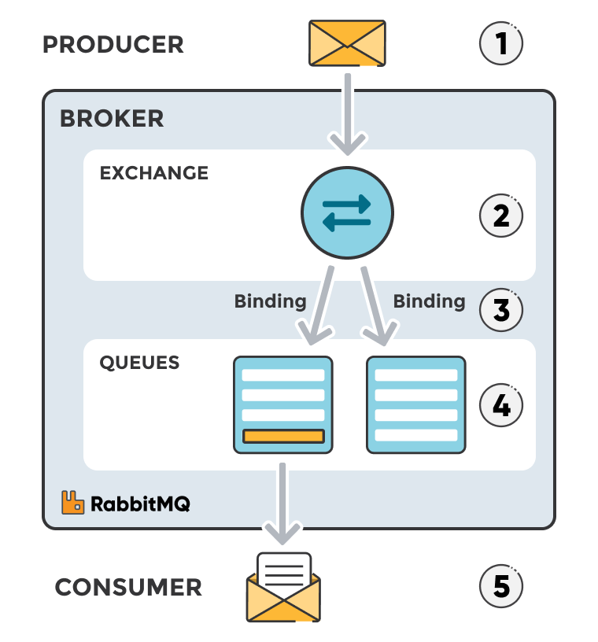
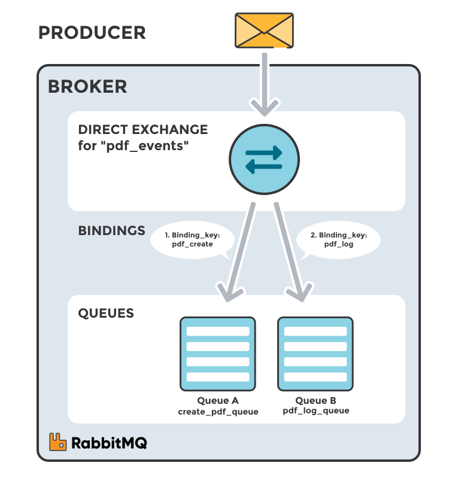
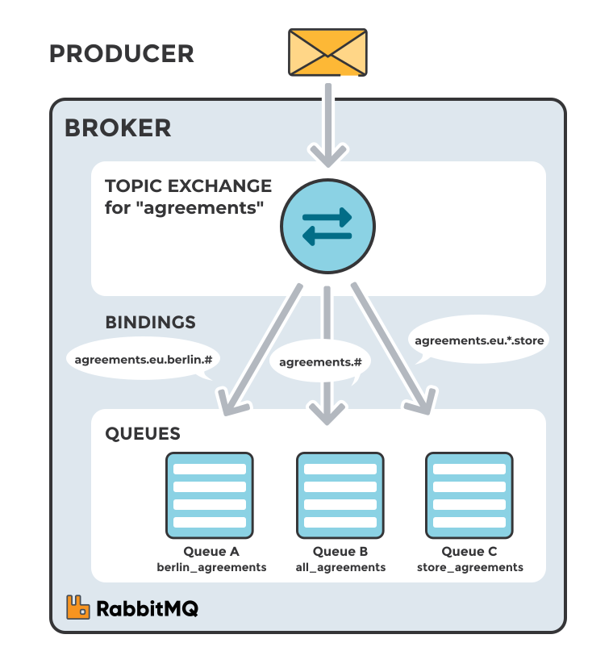
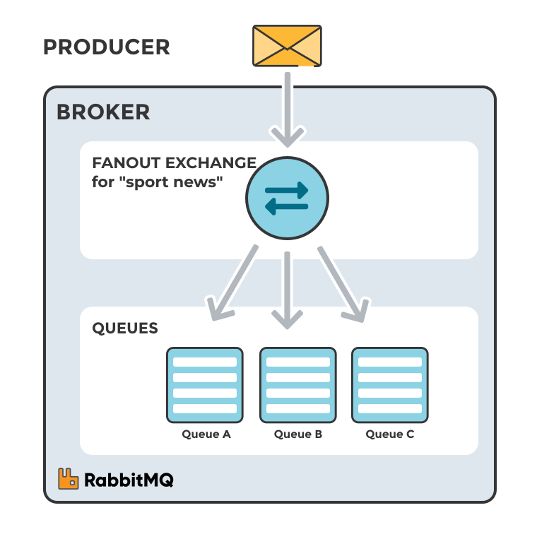
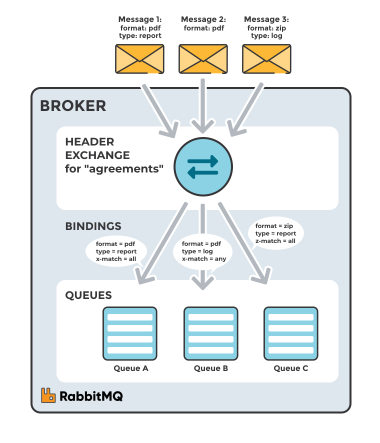

## What is RMQ Exchange ?

Messages are not published directly to a queue; instead, the producer sends messages to an exchange. 
- **An exchange is responsible for routing the messages to different queues with the help of bindings and routing keys**. 
- A binding is a link between a queue and an exchange.

**Standard RMQ Message flow**

1. The `producer publishes` a message to an exchange. When creating an exchange, the type must be specified. This topic will be covered later on.
2. The `exchange receives` the message and is now responsible for routing the message. The exchange takes different message attributes into account, such as the routing key, depending on the exchange type.
3. `Bindings must be created` from the exchange to queues. In this case, there are two bindings to two different queues from the exchange. The `exchange routes the message` into the queues depending on message attributes.
4. The messages stay in the queue until they are handled by a consumer
5. The `consumer handles` the message.

## Types of RMQ Exchange

- **Direct**: The message is routed to the queues whose binding key exactly matches the routing key of the message. For example, if the queue is bound to the exchange with the binding key pdfprocess, a message published to the exchange with a routing key pdfprocess is routed to that queue.
- **Fanout**: A fanout exchange routes messages to all of the queues bound to it.
- **Topic**: The topic exchange does a wildcard match between the routing key and the routing pattern specified in the binding.
- **Headers**: Headers exchanges use the message header attributes for routing.

### Direct Exchange

A direct exchange delivers messages to queues based on a message routing key. The routing key is a message attribute added to the message header by the producer. Think of the routing key as an "address" that the exchange is using to decide how to route the message. **A message goes to the queue(s) with the binding key that exactly matches the routing key of the message**.

#### Example

A message with routing key `pdf_log` is sent to the exchange pdf_events. The messages is routed to `pdf_log_queue` because the routing key `pdf_log` matches the binding key `pdf_log`.

If the message routing key does not match any binding key, the message is discarded.

**Scenario 1**

- _Exchange_: `pdf_events`
- _Queue A_ : `create_pdf_queue`
- Binding key between exchange `pdf_events` and Queue A `create_pdf_queue`: pdf_create

**Scenario 2**

- _Exchange_: `pdf_events`
- _Queue B_: `pdf_log_queue`
- Binding key between exchange `pdf_events` and Queue B pdf_log_queue: pdf_log

### Topic Exchange

Topic exchanges **route messages to queues based on wildcard matches between the routing key and the routing pattern**, which is specified by the queue binding. Messages are routed to one or many queues based on a matching between a message routing key and this pattern.

The routing key must be a list of words, delimited by a period `.`. Examples are `agreements.us` and `agreements.eu.stockholm` which in this case identifies agreements that are set up for a company with offices in lots of different locations.

- The routing patterns may contain an asterisk `*` to match a word in a specific position of the routing key (e.g., a routing pattern of `agreements.*.*.b.*` only match routing keys where the first word is `agreements` and the fourth word is `b`).
- A pound symbol `#` indicates a match of zero or more words (e.g., a routing pattern of `agreements.eu.berlin.#` matches any routing keys beginning with `agreements.eu.berlin`).

The consumers indicate which topics they are interested in (like subscribing to a feed for an individual tag). The consumer creates a queue and sets up a binding with a given routing pattern to the exchange. All messages with a routing key that match the routing pattern are routed to the queue and stay there until the consumer consumes the message.

The default exchange AMQP brokers must provide for the topic exchange is "amq.topic".

#### Example

A message with routing key `agreements.eu.berlin` is sent to the exchange `agreements`. The messages are routed to the queue `berlin_agreements` because the routing pattern of `agreements.eu.berlin.#` matches the routing keys beginning with `agreements.eu.berlin`. The message is also routed to the queue `all_agreements` because the routing key `agreements.eu.berlin` matches the routing pattern `agreements.#`.

**Scenario 1** The image to the right shows an example where consumer A is interested in all the agreements in Berlin.

- **Exchange**: `agreements`
- **Queue A**: `berlin_agreements`
- Routing pattern between exchange (agreements) and Queue A (berlin_agreements): `agreements.eu.berlin.#`
- E.g. of message routing key that matches: `agreements.eu.berlin` and `agreements.eu.berlin.store`

**Scenario 2** Consumer B is interested in all the agreements.

- **Exchange**: `agreements`
- **Queue B**: `all_agreements`
- Routing pattern between exchange (agreements) and Queue B (all_agreements): `agreements.#`
- e.g. of message routing key that matches: `agreements.eu.berlin` and `agreements.us`

**Scenario 3**
Consumer C is interested in all agreements for European head stores.

- **Exchange**: agreements
- **Queue C**: store_agreements
- Routing pattern between exchange (`agreements`) and Queue C (`store_agreements`): `agreements.eu.*.store`
- e.g. of message routing keys that will match: `agreements.eu.berlin.store` and `agreements.eu.stockholm.store`

### Fanout Exchange

A fanout exchange copies and routes a received message to all queues that are bound to it regardless of routing keys or pattern matching as with direct and topic exchanges. The keys provided will simply be ignored.

Fanout exchanges can be useful when the same message needs to be sent to one or more queues with consumers who may process the same message in different ways.

The image to the right (Fanout Exchange) shows an example where a message received by the exchange is copied and routed to all three queues bound to the exchange. It could be sport or weather updates that should be sent out to each connected mobile device when something happens, for instance.

The default exchange AMQP brokers must provide for the topic exchange is "amq.fanout".

#### Exmaple

A message is sent to the exchange `sport_news`. The message is routed to all queues (`Queue A`, `Queue B`, `Queue C`) because all queues are bound to the exchange. Provided routing keys are ignored.

**Scenario 1**

- **Exchange**: `sport_news`
- **Queue A**: Mobile client queue A
- **Binding**: Binding between the exchange `sport_news` and `Queue A` (Mobile client queue A)

### Header Exchange

A headers exchange routes messages based on arguments containing headers and optional values. Headers exchanges are very similar to topic exchanges, but route messages based on header values instead of routing keys. A message matches if the value of the header equals the value specified upon binding.

A special argument named "x-match", added in the binding between exchange and queue, specifies if all headers must match or just one. Either any common header between the message and the binding count as a match, or all the headers referenced in the binding need to be present in the message for it to match. The "x-match" property can have two different values: "any" or "all", where "all" is the default value. A value of "all" means all header pairs (key, value) must match, while value of "any" means at least one of the header pairs must match. Headers can be constructed using a wider range of data types, integer or hash for example, instead of a string. The headers exchange type (used with the binding argument "any") is useful for directing messages which contain a subset of known (unordered) criteria.

The default exchange AMQP brokers must provide for the topic exchange is "amq.headers".

#### Example

- **Exchange**: Binding to Queue A with arguments (key = value): format = pdf, type = report, x-match = all
- **Exchange**: Binding to Queue B with arguments (key = value): format = pdf, type = log, x-match = any
- **Exchange**: Binding to Queue C with arguments (key = value): format = zip, type = report, x-match = all

**Scenario 1**

- Message 1 is published to the exchange with header arguments (key = value): "format = pdf", "type = report".

- Message 1 is delivered to Queue A because all key/value pairs match, and Queue B since "format = pdf" is a match (binding rule set to "x-match =any").

**Scenario 2**

- Message 2 is published to the exchange with header arguments of (key = value): "format = pdf".

- Message 2 is only delivered to Queue B. Because the binding of Queue A requires both "format = pdf" and "type = report" while Queue B is configured to match any key-value pair (x-match = any) as long as either "format = pdf" or "type = log" is present.

**Scenario 3**

- Message 3 is published to the exchange with header arguments of (key = value): "format = zip", "type = log".

- Message 3 is delivered to Queue B since its binding indicates that it accepts messages with the key-value pair "type = log", it doesn't mind that "format = zip" since "x-match = any".

Queue C doesn't receive any of the messages since its binding is configured to match all of the headers ("x-match = all") with "format = zip", "type = pdf". No message in this example lives up to these criterias.

It's worth noting that in a header exchange, the actual order of the key-value pairs in the message is irrelevant.

### Dead Letter Exchange

If no matching queue can be found for the message, the message is silently dropped. RabbitMQ provides an AMQP extension known as the "Dead Letter Exchange", which provides the functionality to capture messages that are not deliverable.
