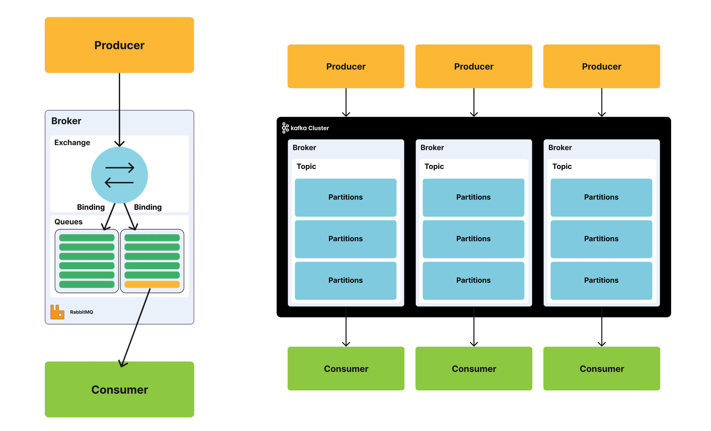
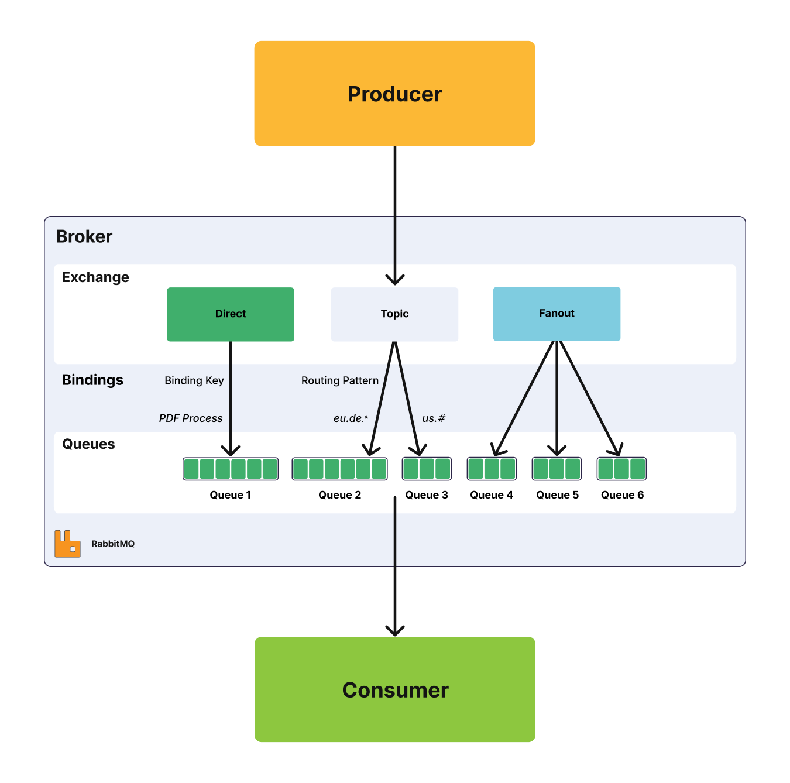

https://www.cloudamqp.com/blog/when-to-use-rabbitmq-or-apache-kafka.html

**Terminology**

> A `message queue` is a queue in RabbitMQ, and this “queue” in Kafka is referred to as a log, but to simplify the information in the article, I will refer to queues instead of switching to ‘log’ all the time.

> A message in Kafka is often called a `record`, but again, I will refer to messages in order to simplify the information here.

> When I write about a `topic` in Kafka, you can think of it as a categorization inside a message queue. Kafka topics are divided into partitions which contain records in an unchangeable sequence.

Let's view from broader perspective and focus on the functionality offered by both systems. This will guide you to make a good decision regarding which system to use

Both systems pass messages between producers and consumers through queues or topics. A message can include any kind of information. It could, for example, have information about an event that has happened on a website or it could be a simple text message that triggers an event on another application.

This kind of system is ideal for connecting different components, building microservices, real-time streaming of data or when passing work to remote workers.

## When to use Kafka and when to use RabbitMQ ?

- RabbitMQ is a solid, mature, general-purpose message broker that supports several protocols such as AMQP, MQTT, STOMP, and more. RabbitMQ can handle high throughput. A common use case for it is to

  - handle background jobs / Long-running tasks.
  - to act as a message broker(middleman) between microservices.

- Kafka is a message bus optimized for high-ingress data streams and replay. Kafka can be seen as a durable message broker where applications can process and re-process streamed data on disk
  - Real-time processing
  - Data analytics: Tracking Ingestion, Logging, Security
  - Original use case for Kafka was to track website activity including page views, searches, uploads or other actions users may take.

✏️: all above possible through RabbitMQ Streams

|                       | RabbitMQ                                                                                                                                                                                                          | Apache Kafka                                                                                   |
| --------------------- | ----------------------------------------------------------------------------------------------------------------------------------------------------------------------------------------------------------------- | ---------------------------------------------------------------------------------------------- |
| **What it is?**       | RabbitMQ is a solid, mature, general purpose message broker                                                                                                                                                       | Apache Kafka is a message bus optimized for high-ingress data streams and replay               |
| **Primary use**       | Message queue for communication and integration within, and between applications. For long-running tasks, or when you need to run reliable background jobs. Can also be used for message streaming.               | A framework for storing, reading (re-reading), and analyzing streaming data.                   |
| **Written in**        | Erlang                                                                                                                                                                                                            | Scala (JVM)                                                                                    |
| **Persistence**       | Persist messages in traditional queues until they are dropped on the acknowledgement of receipt. Persists messages in Streams for as long as they are needed - with an option to delete after a retention period. | Persists messages with an option to delete after a retention period                            |
| **Replay**            | Yes, via RabbitMQ Streams                                                                                                                                                                                         | Yes                                                                                            |
| **Routing**           | Supports flexible routing which can return information to a consumer node                                                                                                                                         | Does not support flexible routing, must be done through separate topics                        |
| **Message Priority**  | Supported                                                                                                                                                                                                         | Not Supported                                                                                  |
| **Monitoring**        | Available through a built-in UI                                                                                                                                                                                   | Available through third-party tools such as when deployed on CloudKarafka or through Confluent |
| **Secure Authentication** | Supports standard authentication and OAuth2                                                                                                                                                                       | Supports Kerberos, OAuth2, and standard authentication                                         |

## Intro to [RMQ Stream](https://www.cloudamqp.com/blog/rabbitmq-streams-and-replay-features-part-1-when-to-use-rabbitmq-streams.html)
THe inherent nature of queues in RabbitMQ made them unsuitable for scenarios requiring long term data persistence or replay of messages. But all that changed with RabbitMQ v3.9 …

Stream Queues were introduced in RabbitMQ v3.9. They are persistent and replicated, and like traditional queues, they buffer messages from producers for consumers to read. However, Streams differ from traditional queues in two ways:

- How producers write messages to them
- And how consumers read messages from them

Under the hood, Streams model an append-only log that's immutable. In this context, this means messages written to a Stream can't be erased, they can only be read. To read messages from a Stream in RabbitMQ, one or more consumers subscribe to it and read the same message as many times as they want.

## Message handling (message replay)
With both Kafka and RabbitMQ Streams, the data sent is stored until a specified retention period has passed, either a period of time or a size limit

The message stays in the queue until the retention period/size limit is exceeded, meaning the message is not removed once it’s consumed. Instead, it can be replayed or consumed multiple times, which is a setting that can be adjusted

If you are using replay in both RabbitMQ and Apache Kafka, ensure that you are using it in the correct way and for the correct reason. Replaying an event multiple times that should just happen a single time; e.g. if you happen to save a customer order multiple times, is not ideal in most usage scenarios. Where a replay does come in handy is when you have a bug in the consumer that requires deploying a newer version, and you need to re-processing some or all of the messages

## Protocol

I also mentioned that “RabbitMQ supports several standardized protocols such as `AMQP`, `MQTT`, `STOMP`, etc.”, where it natively implements `AMQP 0.9.1`. Native support for `AMQP 1.0` is coming in RabbitMQ v4.0. In fact, RabbitMQ currently supports `AMQP` 1.0 via a plugin, but not natively.

Kafka uses a custom protocol, on top of TCP/IP for communication between applications and the cluster. Kafka can’t simply be removed and replaced, since its the only software implementing this protocol.

The ability of RabbitMQ to support different protocols means that it can be used in many different scenarios.

## Routing

RabbitMQ’s benefits is the ability to flexibly route messages. Direct or regular expression-based routing allows messages to reach specific queues without additional code. RabbitMQ has four different routing options: direct, topic, fanout, and header exchanges. Direct exchanges route messages to all queues with an exact match for something called a routing key. The fanout exchange can broadcast a message to every queue that is bound to the exchange. The topics method is similar to direct as it uses a routing key but allows for wildcard matching along with exact matching.

Kafka does not support routing; Kafka topics are divided into partitions which contain messages in an unchangeable sequence. You can make use of consumer groups and persistent topics as a substitute for the routing in RabbitMQ, where you send all messages to one topic, but let your consumer groups subscribe from different offsets.

An offset is a unique ID given to each message that shows the order of the message in the list of messages (log)

## Message Priority
RabbitMQ supports something called priority queues, meaning that a queue can be set to have a range of priorities. The priority of each message can be set when it is published. Depending on the priority of the message it is placed in the appropriate priority queue. So, when could priority queues be used? Here follow a simple example: We are running database backups every day. Thousands of backup events are added to RabbitMQ without order. A customer can also trigger a backup on demand, and if that happens, a new backup event is added to the queue, but with a higher priority.

A message cannot be sent with a priority level or delivered in priority order in Apache Kafka. All messages in Kafka are stored and delivered in the order they are received, regardless of how busy the consumer side is.