## What is Queue ?

A queue in RMQ is a named First In First Out `FIFO` **buffer that stores messages for consumer** applications. These applications can create, use, and delete queues.

Queues in RMQ can be `durable`, `temporary`, or `auto-deleted`.

- **Durable** queues remain until they are deleted.
- **Temporary** queues exist until the server shuts down.
- **Auto-deleted** queues are removed when they are no longer in use.

## Types of Queue

To cater for different use-cases, RMQ offers a variety of queue types:

### [Classic Queues](https://www.cloudamqp.com/blog/rabbitmq-queue-types.html#classic-queues)

Classic Queues are the original queue type in RabbitMQ, they use a `non-replicated` `FIFO` implementation.

There are two implementations(versions 1 & 2) of Classic Queues. These versions only differ in how data is stored and retrieved from disk, but all features are available in both implementations.

#### Use-cases

By virtue of being non-replicated, Classic Queues are ideal for applications where high availability and data safety are less critical. They are the default queue type unless configured otherwise.

#### Features

Some of the key features supported in Classic Queues are, but not limited to:

**Message and Queue TTL**: Supports Time-To-Live settings for both messages and queues.
**Queue Length Limits**: Allows setting limits on the number of messages in the queue.
**Message and Consumer Priority**: Supports prioritisation of messages and consumers.
**Dead Letter Exchanges**: Supports dead-lettering, except for at-least-once dead-lettering.
**QoS Prefetch**: Supports both per-consumer and global QoS prefetch — global QoS prefetch will be removed in RabbitMQ 4.0

#### Queue Exclusivity

- Classic Queues storage implementation
- Classic Queues in RabbitMQ use an on-disk message store to persist actual message payloads. Alongside the message store, there's an on-disk index for each queue. This index tracks the location of messages in the message store and their position in the queue.

In version 2 of Classic Queues, RabbitMQ introduces a per-queue message store. Smaller messages are typically written to this store, while larger messages go to the shared message store.

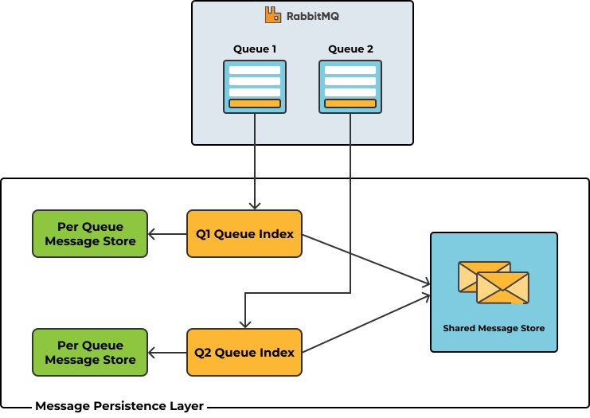

#### Limitation

As stated earlier, by virtue of being non-replicated, Classic Queues fall short in scenarios requiring high availability and data safety. Classic Mirrored Queues were introduced to address these limitations by replicating data across multiple nodes. Regardless, Classic Mirrored Queues come with their own set of challenges:

Performance is slower than it should be because messages are replicated using a very inefficient algorithm.
Furthermore, there are issues with Classic Queues’s data synchronisation model:
The basic problem is that when a broker goes offline and comes back again, any data it had in mirrors gets discarded. Now that the mirror is back online but empty, the administrators have a decision to make: to synchronise the mirror or not. "Synchronise" means replicate the current messages from the leader to the mirror.
But here is the catch: Synchronisation is blocking, causing the whole queue to become unavailable.

### [Quorum Queues](https://www.cloudamqp.com/blog/rabbitmq-queue-types.html#quorum-queues)

The RabbitMQ Quorum Queue is a modern queue type, which implements a `durable`, `replicated FIFO` queue based on the **Raft consensus algorithm**.

Quorum Queues in RabbitMQ are **designed for high availability and data safety**. They replicate data across multiple nodes to ensure that messages are not lost, even if some nodes fail.

#### Use-cases

Quorum Queues are ideal for critical applications where data loss is unacceptable. They prioritise fault tolerance and data safety over minimal latency and advanced queueing features present in Classic Queues.

#### Features

Some of the key features supported in Quorum Queues are, but not limited to:

- **Data Safety and Replication**: Quorum Queues ensure messages are replicated across multiple nodes, providing strong guarantees against data loss.
- **Durability**: Quorum Queues are always durable, meaning they persist data to disk, unlike classic queues, which can be non-durable.
- **Dead Letter Exchanges**: They support dead lettering with at-least-once dead-lettering.
- **Poison Message Handling**: Quorum Queues can handle poison messages, automatically managing repeated message redeliveries.

#### Implementation

In Quorum Queues, a shared Write-Ahead-Log `WAL`, also called a journal file, is used on each node to persist all operations, including new messages. This log captures actions as they happen.

The operations stored in the `WAL` are kept in memory and simultaneously written to disk. When the current `WAL` file reaches a certain size (default 512 MiB), it's flushed to a segment file on disk, and the memory used by those log entries is released. These segment files are compacted over time, especially as consumers acknowledge deliveries.

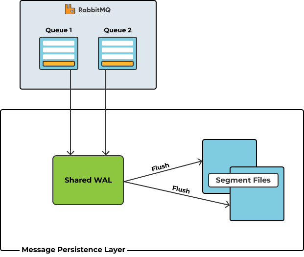

#### Limitations

Classic and Quorum Queues are great! In fact, Quorum Queues simplify the replication issues around Classic Mirrored Queues profoundly. That notwithstanding, there are scenarios where Classic and Quorum Queues crawl on their knees:

- They deliver the same message to multiple consumers by binding a dedicated queue for each consumer. Clearly, this could create a scalability problem.
- They erase read messages making it impossible to re-read(replay) them or grab a specific message in the queue.
- They perform poorly when dealing with millions of messages because they are optimised to gravitate towards an empty state.

✏️: The RabbitMQ team introduced Stream Queues in RabbitMQ 3.9 to mitigate the above-listed challenges.

### [Stream Queues](https://www.cloudamqp.com/blog/rabbitmq-queue-types.html#stream-queues)

Stream queues in RabbitMQ are a persistent and replicated data structure that, like traditional queues, buffer messages from producers for consumers to read. However, Streams differ from queues in two ways:

- How producers write messages to them
- And how consumers read messages from them

Under the hood, Streams model an append-only log that's immutable. In this context, this means messages written to a Stream can't be erased, they can only be read. To read messages from a Stream in RabbitMQ, one or more consumers subscribe to it and read the same message as many times as they want.

#### Use-cases

The use cases where streams shine include:

- **Fan-out architectures**: Where many consumers need to read the same message.
- **Replay & time-travel**: Where consumers need to reread the same message or start reading from any point in the stream.
- **Large Volumes of Messages**: Streams are great for use cases where large volumes of messages need to be persisted.
- **High Throughput**: RabbitMQ Streams process relatively higher volumes of messages per second.

#### Features

Some of the key features supported in Stream Queues are, but not limited to:

- **Persistent and Replicated**: Stream queues always save data to disk and replicate it across nodes, ensuring high data durability.
- **Non-Destructive Read**: Consumers can read the same messages repeatedly without removing them from the queue.
- **High Throughput**: Stream-specific features and a dedicated binary protocol plugin provide optimal performance.
- **Inherent Lazy Behaviour**: Messages are stored directly on disk and do not consume memory until read.
- **No Non-Durable or Exclusive Queues**: Stream queues are always durable and cannot be exclusive or temporary.
- **No TTL or Queue Length Limits**: Instead of TTL and length limits, streams use retention policies to manage data lifecycle.

#### Implementation

Stream queues persist messages using fixed-size segment files on disk. Each message published to a stream queue goes into these segment files.

Once a segment file reaches its predefined size limit (default 500,000,000 bytes), it's closed in favour of a new one. This approach keeps file sizes manageable and optimises access and retrieval times. Each stream queue maintains an index, tracking the location of messages within these segment files.

[read more in detail](https://www.cloudamqp.com/blog/rabbitmq-streams-and-replay-features-part-1-when-to-use-rabbitmq-streams.html)

### [MQTT QoS 0 Queue](https://www.cloudamqp.com/blog/rabbitmq-queue-types.html#mqtt-qos-0-queue)

RabbitMQ supports the MQTT protocol via the MQTT Plugin. By default, the MQTT plugin creates Classic Queues and it could be configured to create Quorum Queues as well.

These traditional queues write data to disk and sometimes replicate it across nodes, potentially causing bottlenecks in message flow. In certain MQTT scenarios, the requirement is to just send messages to online subscribers without the overhead of persistence and/or replication.

This begs the question: how can we eliminate this bottleneck— can we have no queues at all? This is exactly why the MQTT QoS 0 queue type was introduced in RabbitMQ 3.12.

Unlike classic queues, quorum queues, and streams, the MQTT QoS 0 queue type functions as a “pseudo” queue, paradoxically eliminating the underlying queue process. In other words, it does not operate as a separate Erlang process, nor does it store messages on disk. Instead, it uses the subscribing client's connection process mailbox.

This means that messages are sent directly to the MQTT connection process of the subscribing client, bypassing the traditional queue mechanism and ensuring immediate delivery to any “online” MQTT subscribers. This approach significantly reduces latency and resource usage.

#### Use-cases

This queue type is more ideal for the following MQTT use-cases:

- **Large Fan-Out Architectures**: Efficiently broadcasts messages to millions of devices.
- **Low-Latency Messaging**: Perfect for situations where minimal end-to-end latency is crucial.
- **Ephemeral Messaging**: Suitable when message persistence is not needed, and occasional message loss is acceptable.

❓ **How do Stream Queues differ from Classic and Quorum Queues**

- **Stream Queues** - Optimized for high-throughput, long-term message storage and replay, making them ideal for real-time applications. They efficiently handle large-scale data streams and allow for message replay, enabling you to reprocess events whenever needed.

- **Classic Queues** - Provide basic, temporary message storage suited for general or low-priority tasks. They are lightweight and efficient, but offer less resilience compared to Quorum Queues and Stream Queues.

- **Quorum Queues** - High-reliability, fault-tolerant queues designed for critical, durable message processing. They ensure strong message consistency through replication, making them ideal for high-availability systems that require data preservation even in the event of node failures.

## Queue Parameters

### Name

Name of the queue which we can reference in the application. The name must be unique and it must not be any system defined queue name.

### Durability

Durability is a property of queue which tells that a message can survive server

restarts (broker restart).

There are two types of durability options:

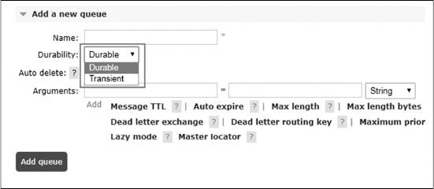

1. **Durable**: If you mark queue as durable then it will survive server restarts

2. **Transient `Non-Durable`**: If you mark exchange as Transient then it will not survive server restarts

### Auto Delete

There are two options in auto delete:

1. Yes
2. No

If the queue is exclusive, the durability attribute has no effect because the queue will be deleted as soon as client disconnects (or its connection is lost). Auto-deleted queues are deleted when the last consumer is canceled (or its channel is closed, or its connection is lost).

If there never was a consumer it won't be deleted.

## Arguments

Arguments (optional; used by plugins and broker-specific features such as message TTL, queue length limit, etc)

### Time-to-Live

In this part, you can set timespan to a queue which will discard if it reaches its lifespan which is set.

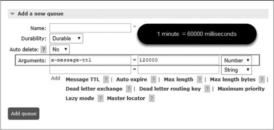

Time will be in milliseconds.

### Auto Expire

In this part, you can set expiry to a queue by setting this property.

> This controls for how long a queue can be unused before it is automatically deleted.

Unused means the queue has no consumers, the queue has not been redeclared, and **basic.get** has not been invoked for a duration of at least the expiration period.

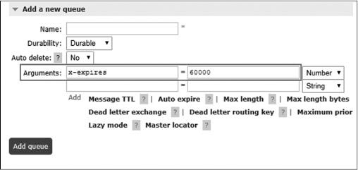

### Max Length

How many (ready) messages a queue can contain before it starts to drop them from its head.

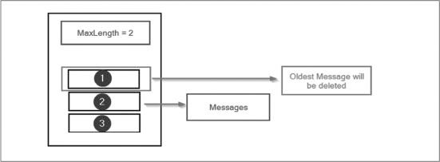

A maximum number of messages can be set by supplying the `x-max-length` queue declaration argument with a non-negative integer value.

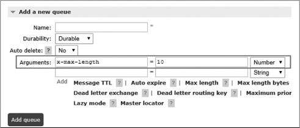

For example, If you set value `x-max-length` = 2 and if you publish three messages in the queue then only two messages will be there, the oldest will be deleted from the queue.

### Max Length Bytes

Total body size for ready messages a queue can contain before it starts to drop them from its head.

Maximum length in bytes can be set by supplying the x-max-length-bytes queue declaration argument with a non-negative integer value.

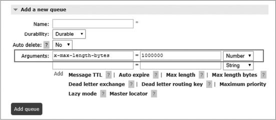

For example, If you set value `x-max-length-bytes` = 1000000
(1000000 bytes = 1MB) and if you publish messages in queue and the queue size increase more than 1 MB then the oldest will be deleted from the queue (drop them from its head).

### Overflow Behaviour

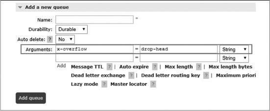

Sets the queue overflow behavior. This determines what happens to messages when the maximum length of a queue is reached. Valid values are drop-head or reject-publish.

### Dead Letter Exchange

Optional name of an exchange to which messages will be republished if they are rejected or expire.

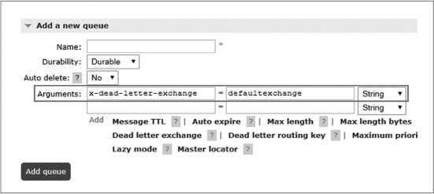

### Dead Letter Routing Key

Optional replacement routing key to use when a message is dead-lettered. If this is not set, the message's original routing key will be used.

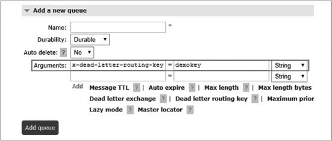

For example, if you publish a message to an exchange with routing key foo, and that message is dead-lettered, it will be published to its dead letter exchange with routing key foo. If the queue the message originally landed on had been declared with x-dead-letter-routing-key set to bar, then the message will be published to its dead letter exchange with routing key bar.

### Maximum Priority

A maximum number of priority levels for the queue to support; if not set, the queue will not support message priorities.

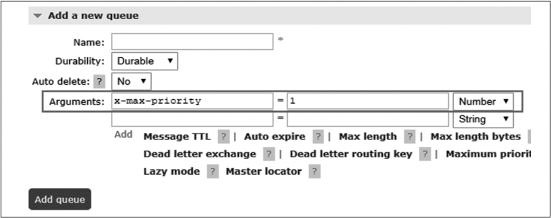

To declare a priority queue, use the x-max-priority optional queue argument. This argument should be a positive integer between 1 and 255, indicating the maximum priority the queue should support .

### Lazy Mode

Set the queue into the lazy mode, keeping as many messages as possible on disk to reduce RAM usage; if not set, the queue will keep an in-memory cache to deliver messages as fast as possible.

