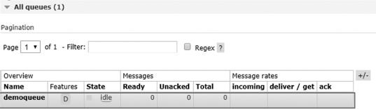
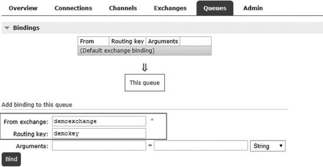
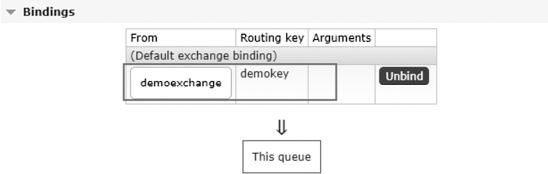
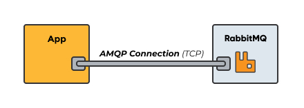
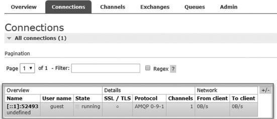
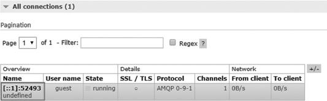
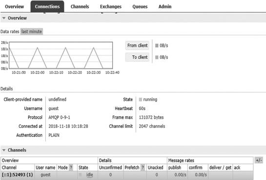
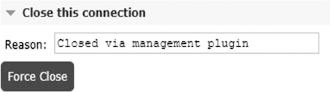
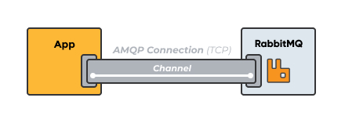
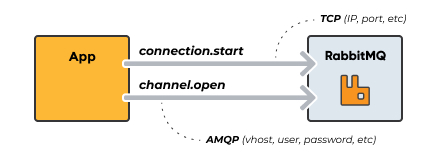

## Bindings

> A **binding** is a connection which we can configure between a queue and an exchange.

✏️ : A binding is a relationship between an exchange and a queue.

In this part, we are going to bind exchange with queue using routing key and this will be used for direct type exchange. The exchange will route the request to particular queue on basis of routing key.

For binding, click on queue name which you have entered "demoqueue", after that click on it, bindings panel will expand, next it will ask for exchange name, enter exchange name which we have created "demoexchange" and routing key "demokey" and click on bind button.

✏️ : After binding if you want to unbind it then you can click on `Unbind` button to remove binding.

## Connection

> A **connection** (TCP) is a link between the client and the broker, that performs underlying networking tasks including initial authentication, IP resolution, and networking.

In connection tab it will show live connections of both producer of message and consumer of the message along with that it will show usernames of each connection with the state of connection if you are using SSL/TLS then it will indicate in the connection it will mark with a dark dot "." It will also show which protocol is been used after that in the network it will show from the client and to client network utilization.

If you want to see details of each connection, then click on connection name.

### Connections

After clicking on connection name, it will show all details of connection along with data rates, channels, client properties, runtime metric, and finally close connection.

If you want to close connection, then you can open **Close this connection** tab type reason and click on Force Close button.

## Channel

Connections can multiplex over a single TCP connection, meaning that an application can open "lightweight connections" on a single connection. This "lightweight connection" is called a channel. Each connection can maintain a set of underlying channels.

Many applications needs to have multiple connections to the broker, and instead of having many connections an application can reuse the connection, by instead, create and delete channels. Keeping many TCP connections open at the same time is not desired, as they consume system resources. The handshake process for a connection is also quite complex and requires at least 7 TCP packets or more if TLS is used.

A channel acts as a virtual connection inside a TCP connection. A channel reuses a connection, forgoing the need to reauthorize and open a new TCP stream. Channels allow you to use resources more efficiently (more about this later in this article).

Every AMQP protocol-related operation occurs over a channel.

A connection is created by opening a physical TCP connection to the target server. The client resolves the hostname to one or more IP addresses before sending a handshake. The receiving server then authenticates the client.

To send a message or manage queues, a connection is created with the broker before establishing a channel through a client. The channel packages the messages and handles protocol operations. Clients send messages through the channel’s basic_publish method. Queue creation and maintenance also occur here, such as AMQP commands like queue.create and exchange.create are all sent over AMQP, on a channel.

Closing a connection closes all associated channels.

## Configuration `recommended`

#### # of channels

We recommend to use the operator limit for connections and channels.

- Use `channel_max` to configure the max amount of allowed channels on a connection. This variable corresponds to `rabbit.channel_max` in the new config format. Exceeding this limit results in a fatal error.
- Use `connections_max` to configure the max amount of allowed connections

❓**How many channels is optimal**

Ideally, you should establish one connection per process with a dedicated channel given to each new thread.

#### Use long-lived connection

- Each channel consumes a relatively small amount of memory on the client, compared to a connection.
- Too many connections can be a heavy burden on the RabbitMQ server memory usage.
- Try to keep long-lived connections and instead open and close channels more frequently, if required.

✏️ : Each process only creates one TCP connection and uses multiple channels in that connection for different threads.

#### Separate the connections for publishers and consumers

RabbitMQ can apply back pressure on the TCP connection when the publisher is sending too many messages for the server to handle. If you consume on the same TCP connection, the server might not receive the message acknowledgments from the client, thus affecting the consumer performance. With a lower consume speed, the server will be overwhelmed.

✏️ : Use at least one connection for publishing and one for consuming for each app/service/process.

#### Don’t share channels between threads

Use one channel per thread in your application, and make sure that you don’t share channels between threads as most clients don’t make channels thread-safe.
