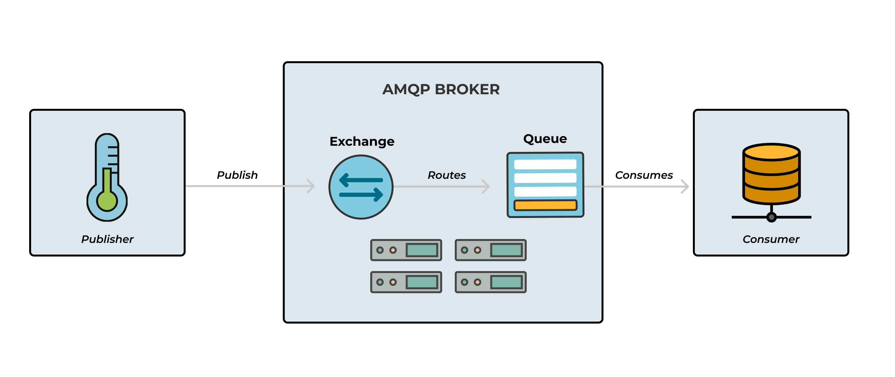
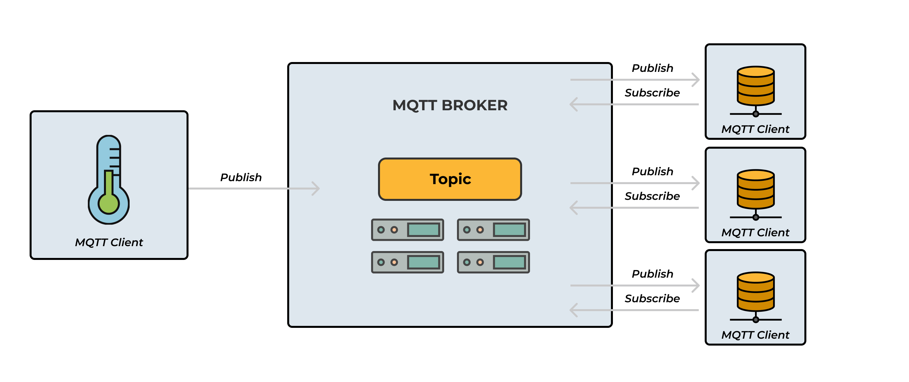
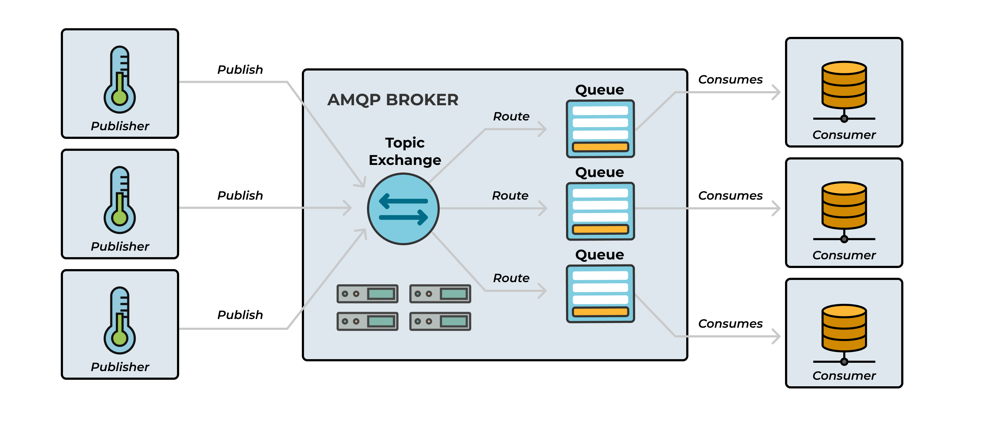

## What is RMQ ?

RabbitMQ is an AMQP message broker, it is the most popular open source and cross-platform message broker.

It is built on Erlang which is also used by WhatsApp for messaging.

RabbitMQ is also a way to exchange data between applications such as a message sent from .Net application can be read by a Node.js application or Java application.

RabbitMQ is lightweight and easy to deploy on premises and in the cloud. It supports multiple messaging protocols. RabbitMQ can be deployed in distributed and federated configurations to meet high-scale, high-availability requirements.

## Why and When Should We Use RabbitMQ?

We should use RabbitMQ because it is open source and easy to use with many languages such as .Net, Java, Python, Ruby, Node Js.

We can use RabbitMQ to remove some heavy work from our web application such as sending Reports in Emails, in Excel or Pdf format's or sending email, SMS or another task such as a trigger to some other applications to start processing.

Nowadays most people do all this task into single application sending emails or SMS, reports which bit heavy task which is also handled by IIS if you separate this task then IIS will get more space (memory) to serve more request.

RabbitMQ is a message broker that can be used in a variety of scenarios, including:

- **Web servers**: RabbitMQ can help web servers respond quickly to requests by offloading resource-intensive tasks.
- **Load balancing**: RabbitMQ can share the load between workers when there are high volumes of messages.
- **Long-running tasks**: RabbitMQ can handle long-running tasks like file scanning, PDF conversion, or image scaling.
- **Microservices**: RabbitMQ can be used to integrate and communicate between microservices.
- **Legacy protocols**: RabbitMQ can support legacy protocols like STOMP, MQTT, AMQP, and 0-9-1.
- **Complex routing**: RabbitMQ can perform complex routing to consumers.
- **Publish/subscribe**: RabbitMQ can support a variety of publish/subscribe and point-to-point request/reply messaging capabilities.

RabbitMQ is considered a simple, traditional pub-sub message broker that scales well

Sure! Let's compare AMQP (Advanced Message Queuing Protocol) and MQTT (Message Queuing Telemetry Transport) with a focus on their key differences and use cases.

## Message Protocals : AMQP vs MQTT

### Advanced Message Queuing Protocol `AMPQ`

- **Client A** sends a message to the **Broker**.
- The **Broker** routes the message to **Queue A**.
- **Client B** retrieves the message from **Queue A**.

- **Purpose**: Designed for reliable, secure, and interoperable messaging between applications.
- **Architecture**: Client-server model with message orientation, queuing, routing, reliability, and security.
- **Complexity**: More complex and feature-rich, suitable for enterprise-level applications.
- **Use Cases**: Ideal for business environments requiring high reliability and sophisticated message routing.

### Message Queuing Telemetry Transport `MQTT`

- **Publisher** sends a message to the **Broker**.
- The **Broker** forwards the message to all **Subscribers** interested in that topic.

- **Purpose**: Lightweight messaging protocol designed for low-bandwidth, high-latency, or unreliable networks.
- **Architecture**: Publish-subscribe model, which is simpler and more efficient for constrained environments.
- **Complexity**: Lightweight and straightforward, making it suitable for IoT applications.
- **Use Cases**: Commonly used in IoT, M2M (machine-to-machine) communication, and scenarios with limited network resources.

### MQTT With AMQP Architecture

#### Key Differences

1. **Messaging Patterns**:

   - `MQTT` protocol primarily supports the publish/subscribe messaging pattern more efficiently (optimized).
   - Even though `AMQP` also supports this messaging pattern, the `MQTT` which supports a more sophisticated routing mechanism (Messages first go to an exchange that then routes the messages to the correct queue using some predefined rules).

2. **Message Model**:

   - **AMQP**: Uses a more complex message model with queues and exchanges.
   - **MQTT**: Uses a simpler publish-subscribe model.

3. **Overhead**:

   - **AMQP**: Higher overhead due to its rich feature set.
   - **MQTT**: Lower overhead, making it suitable for resource-constrained environments.

4. **Use Cases**:
   - **AMQP**: Best for enterprise applications requiring robust messaging features.
   - **MQTT**: Ideal for `IoT` and `M2M` communications where simplicity and low bandwidth are crucial.

## RabbitMQ and server concepts
Some important concepts need to be described before we dig deeper into RabbitMQ. The default virtual host, the default user, and the default permissions are used in the examples, so let’s go over the elements and concepts:

- **Producer**: Application that sends the messages.
- **Consumer**: Application that receives the messages.
- **Queue**: Buffer that stores messages.
- **Message**: Information that is sent from the producer to a consumer through RabbitMQ.
- **Connection**: A TCP connection between your application and the RabbitMQ broker.
- **Channel**: A virtual connection inside a connection. When publishing or consuming messages from a queue - it's all done over a channel.
- **Exchange**: Receives messages from producers and pushes them to queues depending on rules defined by the exchange type. To receive messages, a queue needs to be bound to at least one exchange.
- **Binding**: A binding is a link between a queue and an exchange.
- **Routing key**: A key that the exchange looks at to decide how to route the message to queues. Think of the routing key like an address for the message.
- **AMQP**: Advanced Message Queuing Protocol is the protocol used by RabbitMQ for messaging.
- **Users**: It is possible to connect to RabbitMQ with a given username and password. Every user can be assigned permissions such as rights to read, write and configure privileges within the instance. Users can also be assigned permissions for specific virtual hosts.
- **Vhost, virtual host**: Provides a way to segregate applications using the same RabbitMQ instance. Different users can have different permissions to different vhost and queues and exchanges can be created, so they only exist in one vhost.
